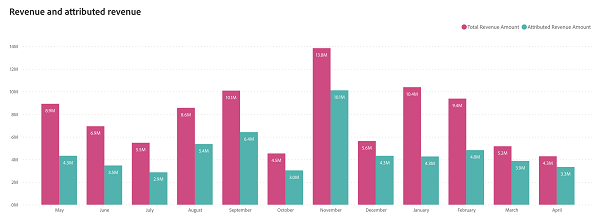

# 收入概览仪表板 {#revenue-overview-dashboard}

收入概述仪表板提供从CRM派生的总收入的分析，从而揭示营销策略的角色。 它概述了营销如何影响您的整体收入以及如何促进交易的成功完成。

讨论区回答的问题：

* 我们的营销活动占我们收入的百分比是多少？
* 我们的营销活动影响了多少百分比的“非赢交易”？

<table style="table-layout:auto"> 
<tbody>
  <tr> 
   <th>组件</th> 
   <th>描述</th>
   <th>穿透钻取字段</th>
   <th>日期类型</th>
   <th>过滤器</th>
  </tr>
  <tr>
    <td>“总收入”拼贴</td>
    <td>来自CRM的总收入，包括归因收入。</td>
    <td rowspan="6"><li>机会 ID</li>
<li>机会名称</li>
<li>机会创建日期</li>
<li>商机结束日期</li>
<li>为已关闭(Y/N)</li>
<li>获胜(Y/N)</li>
<li>当前阶段</li>
<li>收入</li></td>
    <td rowspan="6">关闭日期</td>
    <td rowspan="6">日期</td>
  </tr>
  <tr>
    <td>“总交易”拼贴</td>
    <td>CRM中标记为“已结束的获胜”的交易总数。</td>
  </tr>
  <tr>
    <td>已归因的收入拼贴</td>
    <td>来自具有已记录接触点的“已结束的赢家”机会的总应占收入。</td>
  </tr>
  <tr>
    <td>归因交易拼贴</td>
    <td>归因商机的“已结束的赢家”交易总数。</td>
  </tr>
  <tr>
    <td>收入和归因收入图表</td>
    <td>此并排时间序列条形图通过将总收入与已归因收入并置，提供了归因覆盖率的全面视图。
     </td>
  </tr>
  <tr>
    <td>归因覆盖率图表</td>
    <td>此饼图提供了已归因收入与未归因收入之间的清晰可视化比较。 饼图涵盖了总收入。
     
    </td>
  </tr>
</tbody>
</table>

>[!MORELIKETHIS]
>
>[了解功能板基础知识](/help/marketo-measure-discover-ui/dashboards/discover-dashboard-basics.md){target="_blank"}
