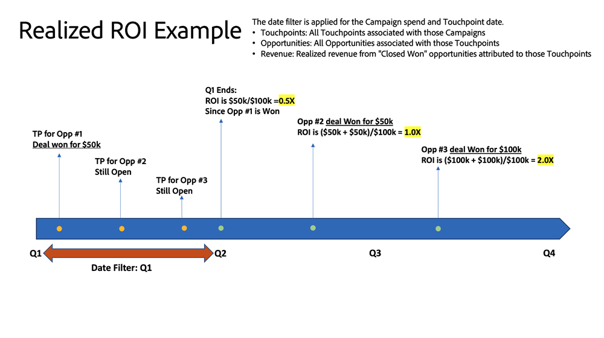

# ROI仪表板 {#roi-dashboard}

ROI仪表板为营销人员提供了跨渠道、子渠道和营销活动的投资回报的精细视图。 它仔细地划分成本和收入模式，同时重点列出每个商机的成本、交易和机会等指标，以确保全面了解营销归因。

讨论区回答的问题：

* 每个渠道、子渠道和营销活动的ROI值如何？
* 成本和收入如何在每个渠道、子渠道和营销活动中分布？
* 每个潜在客户的成本、每个交易的成本和每个机会的成本是多少？

<table style="table-layout:auto"> 
<tbody>
 <tr> 
   <th>组件</th> 
   <th>描述</th>
   <th>日期类型</th>
   <th>穿透钻取字段</th>
   <th>过滤器</th>
  </tr>
  <tr>
    <td>成本拼贴</td>
    <td>产生的总成本</td>
    <td>成本发生日期</td>
    <td><li>营销活动ID</li>
<li>营销活动名称</li>
<li>渠道</li>
<li>子渠道</li>
<li>日期</li>
<li>支出</li></td>
    <td rowspan="15"><li>日期</li>
<li>归因模型（设置）</li>
<li>渠道</li>
<li>子渠道</li>
<li>营销活动</li></td>
  </tr>
  <tr>
    <td>已归因的收入拼贴</td>
    <td>总归因收入</td>
    <td>关闭日期</td>
    <td><li>机会 ID</li>
<li>机会名称</li>
<li>机会创建日期</li>
<li>商机结束日期</li>
<li>为已关闭(Y/N)</li>
<li>获胜(Y/N)</li>
<li>归因模型</li>
<li>已归因收入</li>
<li>已实现收入</li></td>
  </tr>
  <tr>
    <td>简单ROI图块</td>
    <td>旧版ROI：给定时间范围内的收入除以成本。 
    <li>成本：在筛选日期期间发生的成本。</li>
    <li>收入：在该时间范围内来自“成功的已关闭”商机的收入。</li></td>
    <td>关闭日期</td>
    <td>不适用</td>
  </tr>
  <tr>
    <td>已实现ROI图块</td>
    <td>实现的ROI：表示活动在指定时间段内生成的接触点的实际结果。
    <li>成本：在筛选日期期间发生的成本。</li>
    <li>收入：在规定的时间范围内实现所有“成功交易”的收入，尤其是受接触点影响的交易。</li>
     </td>
    <td>成本发生日期</td>
    <td>不适用</td>
  </tr>
  <tr>
    <td>“新潜在客户总数”拼贴</td>
    <td>在指定时间段内生成的新潜在客户总数（完整计数），包括接触和未接触的潜在客户。</td>
    <td>创建日期</td>
    <td rowspan="2">
    <li>商机ID</li>
    <li>潜在客户电子邮件</li>
    <li>LC日期</li></td>
  </tr>
  <tr>
    <td>每个新潜在客户磁贴的成本</td>
    <td>新Lead总数（全数）除以成本。</td>
    <td>创建日期</td>
  </tr>
  <tr>
    <td>“新机会总数”拼贴</td>
    <td>在指定时间段内生成的新商机（全计数）总数，包括接触的和未接触的潜在客户。</td>
    <td>创建日期</td>
    <td rowspan="2">
    <li>机会 ID</li>
    <li>机会名称</li>
    <li>机会创建日期</li>
    <li>商机结束日期</li>
    <li>为已关闭(Y/N)</li>
    <li>获胜(Y/N)</li>
    <li>当前阶段</li></td>
  </tr>
  <tr>
    <td>每个新机会图块的成本</td>
    <td>新机会总数（整数）除以成本。</td>
    <td>创建日期</td>
  </tr>
  <tr>
    <td>“总交易”拼贴</td>
    <td>在指定时间段内完成的交易总数，包括那些没有关联接触点的交易。</td>
    <td>关闭日期</td>
    <td><li>机会 ID</li>
<li>机会名称</li>
<li>机会创建日期</li>
<li>商机结束日期</li>
<li>为已关闭(Y/N)</li>
<li>获胜(Y/N)</li>
<li>当前阶段</li>
<li>货币</li>
<li>归因模型</li>
<li>已归因收入</li>
<li>已实现收入</li></td>
  </tr>
  <tr>
    <td>按渠道列出的成本和收入图表</td>
    <td>同时显示成本和收入的条形图，旨在比较各个渠道、子渠道和促销活动在成本中所占的比例。
     </td>
    <td>关闭日期</td>
    <td>成本：
 
<li>营销活动ID</li>
<li>营销活动名称</li>
<li>渠道</li>
<li>子渠道</li>
<li>成本发生日期</li>
<li>货币</li>
<li>支出</li>

收入：
 
<li>机会 ID</li>
<li>机会名称</li>
<li>机会创建日期</li>
<li>商机结束日期</li>
<li>为已关闭(Y/N)</li>
<li>获胜(Y/N)</li>
<li>已归因收入</li>
<li>归因模型</li>
<li>已归因收入</li>
<li>已实现收入</li></td>
  </tr>
  <tr>
    <td>随时间推移实现的与简单的ROI</td>
    <td>显示已实现ROI与简单ROI之间比较的时间系列折线图，跟踪其随时间变化的进度。
     </td>
    <td>简单ROI：成本发生日期和结束日期
    
已实现ROI：发生成本日期和接触点日期</td>
    <td>不适用</td>
  </tr>
  <tr>
    <td>随时间变化的成本图表</td>
    <td>显示季度/每月总成本的栈叠条形图，按各个渠道进行分段，以查看详细细分。
     </td>
    <td>成本发生日期</td>
    <td rowspan="2"><li>营销活动ID</li>
<li>营销活动名称</li>
<li>渠道</li>
<li>子渠道</li>
<li>成本发生日期</li>
<li>货币</li>
<li>支出</li></td>
  </tr>
  <tr>
    <td>按渠道成本图表</td>
    <td>显示按渠道分段的营销支出的条形图。
     </td>
    <td>成本发生日期</td>
  </tr>
  <tr>
    <td>ROI摘要表</td>
    <td>该表显示按各个渠道划分的归因收入、成本和ROI，以进行详细细分。

<b>列:</b>

<li>渠道/子渠道/营销活动</li>
<li>成本</li>
<li>已归因收入</li>
<li>简单ROI</li>
<li>已实现ROI</li>
<li>未实现的管道</li>
<ul style="padding-left: 30px;"><li>在给定时间范围内从与活动关联的接触点（开放机会）进行管道</li></ul></td>
    <td>简单ROI：成本发生日期和结束日期
    
已实现ROI：发生成本日期和接触点日期</td>
    <td>不适用</td>
  </tr>
  <tr>
    <td>营销支出表</td>
    <td>该表按各个渠道显示成本、新销售线索、商机和已结束的交易并细分。

<b>列:</b>

<li>渠道/子渠道/营销活动</li>
<li>成本</li>
<li>新潜在客户</li>
<li>每个新商机的成本</li>
<li>新机会</li>
<li>每个新机会的成本</li>
<li>已结束交易</li>
<li>每笔交易完成的成本</li></td>
    <td><li>成本：成本发生日期</li>
<li>新潜在客户：创建日期</li>
<li>新业务机会：创建日期</li>
<li>交易已结束：结束日期</li></td>
    <td>不适用</td>
  </tr>
</tbody>
</table>
