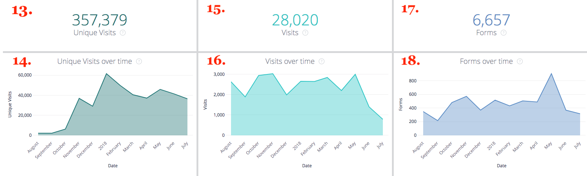

# 穿透钻取 {#drill-throughs}

此 [!DNL Marketo Measure Discover] experience允许客户深入了解他们最关心的数据集。 在整个期间采取某些措施 [!DNL Marketo Measure Discover]，客户可以单击进入图块并浏览有关该量度的更多信息。

以下是包含穿透钻取功能的功能板和图块的列表，以及用户在穿透钻取时应当期待的体验。 请记住，穿透钻取时，仪表板中的全局过滤器会保留。

## 概述 {#overview}

**收入**

定义：通过条形图和表格按月列出的总收入。 从那里，可以钻取到单个月或按周、日或时间划分一个月。

**收入（图表）**

定义：通过条形图和表格按月列出的总收入。 由于父平铺已经是条形图，因此深入到显示详细信息将仅显示一个月。

_深入分析：按月划分的总收入，按周或日期细分。_

**支出**

定义：通过条形图和表格按月列出的总支出。 从那里，可以钻取到单个月或按周、日或时间划分一个月。

**交易**

定义：通过条形图和表格按月列出的交易总数。 从那里，可以钻取到单个月或按周、日或时间划分一个月。

**管道收入**

定义：通过条形图和表格按月列出的管道总收入。 从那里，可以钻取到单个月或按周、日或时间划分一个月。

**ROI摘要**

定义：通过条形图和表格按月显示每个渠道的总收入或支出。 从那里，可以钻取到行中一个月，或按周、日或时间划分一个月。

**每笔交易的成本**

定义：总支出除以交易总数，从而提供获得已结束的成功机会所需的平均成本。 从那里，可以钻取到行中一个月，或按周、日或时间划分一个月。

**按收入显示的渠道**

定义：通过条形图和表格按月显示来自每个渠道的总收入。 从那里，可以钻取到行中一个月，或按周、日或时间划分一个月。

**按收入显示的子渠道**

定义：通过条形图和表格按月显示每个子渠道的总收入。 从那里，可以钻取到行中一个月，或按周、日或时间划分一个月。

**按收入列出的营销活动**

定义：通过条形图和表格按月显示每个促销活动的总收入。 从那里，可以钻取到行中一个月，或按周、日或时间划分一个月。

**交易摘要**

定义：通过条形图和表格按月显示每个渠道的总支出或交易计数。 从那里，可以钻取到行中一个月，或按周、日或时间划分一个月。

## 增长 {#growth}

**总收入**

定义：通过条形图和表格按月列出的总收入。 从那里，可以钻取到单个月或按周、日或时间划分一个月。

**随时间变化的收入**

定义：通过条形图和表格按月列出的总收入。 由于父图块已经是图表，因此深入到显示详细信息将仅显示一个月。

_按月划分的总收入，按周或日期划分。_

**交易总数**

定义：通过条形图和表格按月列出的交易总数。 从那里，可以钻取到单个月或按周、日或时间划分一个月。

**随时间变化的交易**

定义：通过条形图和表格按月列出的交易总数。 由于父图块已经是图表，因此深入到显示详细信息将仅显示一个月。

_按月按周或日期细分的交易总数。_

**总管道收入**

定义：通过条形图和表格按月列出的管道总收入。 从那里，可以钻取到单个月或按周、日或时间划分一个月。

**随时间变化的管道收入**

定义：通过条形图和表格按月列出的管道总收入。 由于父图块已经是图表，因此深入到显示详细信息将仅显示一个月。

_按月划分的总管道收入，按周或日期划分。_

**潜在客户总数**

定义：通过条形图和表格按月列出的潜在客户总数。 从那里，可以钻取到单个月或按周、日或时间划分一个月。

**随时间变化的潜在客户**

定义：通过条形图和表格按月列出的潜在客户总数。 由于父图块已经是图表，因此深入到显示详细信息将仅显示一个月。

_按月列出的潜在客户总数，按周或日期细分。_

**联系人总数**

定义：通过条形图和表格按月列出的联系人总数。 从那里，可以钻取到单个月或按周、日或时间划分一个月。

**随时间变化的联系人**

定义：通过条形图和表格按月列出的联系人总数。 由于父图块已经是图表，因此深入到显示详细信息将仅显示一个月。

_按月份划分的联系人总数，按周或日期划分。_

**机会总数**

定义：通过条形图和表格按月列出的机会总数。 从那里，可以钻取到单个月或按周、日或时间划分一个月。

**随时间变化的机会**

定义：通过条形图和表格按月列出的机会总数。 由于父图块已经是图表，因此深入到显示详细信息将仅显示一个月。

_按月份划分的总商机，按周或日期划分。_

**独特访问**

定义：通过条形图和表格按月查看页面总数。 从那里，可以钻取到单个月或按周、日或时间划分一个月。

**一段时间的独特访问**

定义：显示特定时间段内趋势的独特访问总数。 使用按过滤器分组，可按渠道、子渠道、促销活动、帐户、广告组、广告、广告商、创意、关键字、版面和网站更改栈叠。 如果禁用了此功能，则此项将显示为空。

**访问**

定义：通过条形图和表格按月显示的网站访问总数。 从那里，可以钻取到单个月或按周、日或时间划分一个月。

**一段时间内的访问次数**

定义：显示特定时间段内趋势的跟踪网站访问总数。 使用按过滤器分组，可按渠道、子渠道、促销活动、帐户、广告组、广告、广告商、创意、关键字、版面和网站更改栈叠。 如果禁用了此功能，则此项将显示为空。

**Forms**

定义：通过条形图和表格按月提交表单的总数。 从那里，可以钻取到单个月或按周、日或时间划分一个月。

**随时间变化的Forms**

定义：显示特定时间段内趋势的已提交表单总数。 使用按过滤器分组，可按渠道、子渠道、促销活动、帐户、广告组、广告、广告商、创意、关键字、版面和网站更改栈叠。 如果禁用了此功能，则此项将显示为空。

## 支出 {#spend}

**支出**

定义：通过条形图和表格按月列出的总支出。 从那里，可以钻取到单个月或按周、日或时间划分一个月。

**支出（图表）**

定义：通过条形图和表格按月列出的总支出。 由于父图块已经是图表，因此深入到显示详细信息将仅显示一个月。

_按周、日期或时间划分的按月总支出。 时间可以花在 [!DNL Marketo Measure] 从我们的广告连接中按分钟划分的实际下载支出。_

**按渠道支出**

定义：通过条形图和表格按月显示每个渠道的总支出。 从那里，可以钻取到行中一个月，或按周、日或时间划分一个月。

**按子渠道支出**

定义：通过条形图和表格按月显示每个子渠道的总支出。 从那里，可以钻取到行中一个月，或按周、日或时间划分一个月。

**按营销活动支出**

定义：通过条形图和表格按月显示每个促销活动的总支出。 从那里，可以钻取到行中一个月，或按周、日或时间划分一个月。

## 销售周转率 {#sales-velocity}

**速度（天）**

定义：从第一次匿名接触到业务机会关闭，业务机会在其销售周期中的平均天数。

**活跃商机**

定义：任何未结业务机会的业务机会总数，这意味着它不是“已结丢失”或“已结成功”。

**交易规模**

定义：已结束的成功机会的平均金额。

**获胜率**

定义：“已关闭的成功的业务机会”的总数除以“已关闭的失败”和“已关闭的成功的业务机会”的总数。

**按渠道列出的机会周转率**

定义：机会在每个阶段的周期中的平均天数，按营销渠道分组，并显示进入下一阶段所需的时间。 此处显示的阶段是里程碑阶段(FT、LC、OC)和自定义阶段。

**按渠道列出的销售线索周转率**

定义：在将Lead转化为Contact/Opportunity/Amount之前，Lead在每个阶段的周期中所处的平均天数，按营销渠道分组，并显示进入下一个阶段所需的时间。 此处显示的阶段是里程碑阶段(FT、LC)和自定义阶段。

**平均机会周转率**

定义：每个阶段机会在其周期中的平均天数，显示进入下一阶段所需的时间。 此处显示的阶段是里程碑阶段(FT、LC、OC)和自定义阶段。 此处的数字通过Channel图表反映了Opportunity Velocity中每个阶段的时间。

**平均潜在客户周转率**

定义：在将Lead转化为Contact/Opportunity/Amount之前，他们每个阶段处于周期的平均天数，显示进入下一阶段所需的时间。 此处显示的阶段是里程碑阶段(FT、LC)和自定义阶段。 此处的数字通过渠道图表反映潜在客户周转率中每个阶段的时间。

**随时间变化的机会周转率**

定义：业务机会在每个阶段的周期中的平均天数，并具有一段时间的趋势。

**一段时间内的提前周转率**

定义：Lead在每个阶段的周期中的平均天数，随时间呈趋势。

## 基于帐户的营销 {#account-based-marketing}

**总收入**

定义：通过条形图和表格按月列出的总收入。 从那里，可以钻取到单个月或按周、日或时间划分一个月。

**总管道收入**

定义：通过条形图和表格按月列出的管道总收入。 从那里，可以钻取到单个月或按周、日或时间划分一个月。

**匹配的潜在客户**

定义：与帐户成功匹配的潜在客户总数。

**接触的帐户**

定义：接收任何接触点的帐户总数。

**接触的机会**

定义：机会ID及其相应帐户ID的列表

**接触的联系人**

定义：联系人ID及其相应帐户ID的列表

**随时间变化的接触点（图表）**

定义：选定月份中的接触点列表。

_按周、日期或时间划分的接触点数量。_

**随时间变化的帐户（图表）**

定义：选定月份中的帐户ID列表。

_按周、日期或时间细分的帐户数。_

## Web 分析 {#web-analytics}

**独特访问**

定义：通过条形图和表格按月显示的独特网站访问总数。 从那里，可以钻取到单个月或按周、日或时间划分一个月。

**每次独特访问的成本**

定义：总支出除以独特访问总数。 从那里，可以钻取到单个月或按周、日或时间划分一个月。

**按登陆页面显示的独特访问次数**

定义：根据每个URL中的独特访客数列出的登陆页面。

**按来源显示的独特访问次数**

定义：网站独特访客源视图。

**一段时间的独特访问**

定义：跟踪的唯一访问总数，显示特定时间范围内的趋势。

**访问**

定义：通过条形图和表格按月显示的网站访问总数。 从那里，可以钻取到单个月或按周、日或时间划分一个月。

**每次访问的成本**

定义：总支出除以访问总数。

**按登陆页面显示的访问量**

定义：登陆页面的列表，基于每个URL的访问次数。

**按来源显示的访问次数**

定义：您网站的访客来源。 可以按渠道、子渠道、营销活动、帐户、广告组、广告、广告商、创意、关键字、版面和网站进行更改。

**一段时间内的访问次数**

定义：跟踪的访问总数，显示特定时间范围内的趋势。 从那里，可以钻取到单个月或按周、日或时间划分一个月。

**页面查看次数**

定义：通过条形图和表格按月查看页面总数。 从那里，可以钻取到单个月或按周、日或时间划分一个月。

**每页面查看成本**

定义：总支出除以跟踪的页面查看总数。

**按URL显示的页面查看次数**

定义：页面URL的列表，基于每个URL的页面查看次数。

**随时间变化的页面查看次数**

定义：通过条形图和表格按月显示的页面查看总数。 由于父图块已经是图表，因此深入到显示详细信息将仅显示一个月。

_按月、周、日期或时间划分的页面查看总数。_

**随时间变化的Forms**

定义：跟踪的表单总数，显示特定时间范围内的趋势。

**Forms**

定义：通过条形图和表格按月提交表单的总数。 从那里，可以钻取到单个月或按周、日或时间划分一个月。

**每个表单的成本**

定义：总支出除以提交的表单总数。

**按表单URL提交的表单**

定义：表单URL的列表，基于在每个URL上提交的编号。

**按登陆页面列出的潜在客户**

定义：根据从每个登陆页面生成的潜在客户数的登陆页面列表。

**按表单URL排列的潜在客户**

定义：根据从每个URL生成的潜在客户数的表单URL列表。

## CMO {#cmo}

**收入**

定义：通过条形图和表格按月列出的总收入。 从那里，可以钻取到单个月或按周、日或时间划分一个月。

**收入（图表）**

定义：通过条形图和表格按月列出的总收入。 由于父平铺已经是条形图，因此深入到显示详细信息将仅显示一个月。

_按月划分的总收入，按周或日期划分。_

**支出**

定义：通过条形图和表格按月列出的总支出。 从那里，可以钻取到单个月或按周、日或时间划分一个月。

**ROI**

定义：从总收入和总支出计算出的投资回报（基于归因模型）。

**交易**

定义：通过条形图和表格按月列出的交易总数。 从那里，可以钻取到单个月或按周、日或时间划分一个月。

**每笔交易的成本**

定义：总支出除以交易总数，得出获得一个成功的机会所需的平均成本。

**管道收入**

定义：通过条形图和表格按月列出的管道总收入。 从那里，可以钻取到单个月或按周、日或时间划分一个月。

**交易规模**

定义：已结束的成功机会的平均金额。

**按收入显示的渠道**

定义：通过条形图和表格按月显示来自每个渠道的总收入。 从那里，可以钻取到行中一个月，或按周、日或时间划分一个月。

**按收入显示的子渠道**

定义：通过条形图和表格按月显示每个子渠道的总收入。 从那里，可以钻取到行中一个月，或按周、日或时间划分一个月。

**按收入列出的营销活动**

定义：通过条形图和表格按月显示每个促销活动的总收入。 从那里，可以钻取到行中一个月，或按周、日或时间划分一个月。

**ROI摘要**

定义：通过条形图和表格按月显示每个渠道的总收入或支出。 从那里，可以钻取到行中一个月，或按周、日或时间划分一个月。

**交易摘要**

定义：通过条形图和表格按月显示每个渠道的总支出或交易计数。 从那里，可以钻取到行中一个月，或按周、日或时间划分一个月。

## 内容营销 {#content-marketing}

**总收入**

定义：通过条形图和表格按月列出的总收入。 从那里，可以钻取到单个月或按周、日或时间划分一个月。

**按收入划分的登陆页面**

定义：通过条形图和表格从每个登陆页面得出的总收入。 从那里，可以钻取到行中一个月，或按周、日或时间划分一个月。

**总管道收入**

定义：通过条形图和表格按月列出的管道总收入。 从那里，可以钻取到单个月或按周、日或时间划分一个月。

**按管道收入划分的登陆页面**

定义：通过条形图和表格从每个登陆页面得出的总管道收入。 从那里，可以钻取到行中一个月，或按周、日或时间划分一个月。

**机会总数**

定义：通过条形图和表格按月列出的机会总数。 从那里，可以钻取到单个月或按周、日或时间划分一个月。

**按机会计数划分的登陆页面**

定义：通过条形图和表从每个登陆页面获得的机会总数。 从那里，可以钻取到行中一个月，或按周、日或时间划分一个月。

**Forms合计**

定义：通过条形图和表格按月显示的表单总数。 从那里，可以钻取到单个月或按周、日或时间划分一个月。

**按表单提交次数排名靠前的表单URL**

定义：每个表单URL中通过条形图和表的表单总数。 从那里，可以钻取到行中一个月，或按周、日或时间划分一个月。

**表单URL（按渠道）**

定义：通过条形图和表格按月从表单URL提交的表单总数。 从那里，可以钻取到行中一个月，或按周、日或时间划分一个月。

**独特访问**

定义：跟踪的所有已知访客和匿名访客的唯一网站访问总数。 深入查看按月跟踪的独特网站访问。

**按独特访问次数排名靠前的登陆页面**

定义：登陆页面的列表，基于每个登陆页面的独特访问次数。 深入查看所选URL按月显示的独特访问次数。

**访问**

定义：跟踪的所有已知访客和匿名访客的网站访问总数。 深入查看按月跟踪的网站访问。

**按访问次数排名靠前的登陆页面**

定义：登陆页面的列表，基于每个登陆页面的初始访问次数。 深入查看所选URL按月显示的访问次数。

**潜在客户总数**

定义：通过条形图和表格按月列出的潜在客户总数。 从那里，可以钻取到单个月或按周、日或时间划分一个月。

**按商机计数划分的登陆页面**

定义：通过条形图和表格从每个登陆页面得出的潜在客户总数。 从那里，可以钻取到行中一个月，或按周、日或时间划分一个月。

## 付费媒体 {#paid-media}

**展示次数**

定义：通过条形图和表格按月列出的展示总数。 从那里，可以钻取到单个月或按周、日或时间划分一个月。

**CPM**

定义：提供的展示次数中的总支出除以总展示次数。

**点击次数**

定义：通过条形图和表格按月显示的点击总数。 从那里，可以钻取到单个月或按周、日或时间划分一个月。

**CPC**

定义：跟踪点击的总支出除以总点击量。

**潜在客户**

定义：基于归因模型的潜在客户总数。

**CPL**

定义：所创建潜在客户的总支出除以总点击量，从而提供CPL率。

**访问**

定义：通过条形图和表格按月显示的网站访问总数。 从那里，可以钻取到单个月或按周、日或时间划分一个月。

**页面查看次数**

定义：通过条形图和表格按月查看页面总数。 从那里，可以钻取到单个月或按周、日或时间划分一个月。

**营销活动摘要**

定义：促销活动列表基于每个促销活动带来了多少收入/支出/交易/机会，按选定归因模型的最大值排序。

**广告摘要**

定义：基于每个广告对应的收入/渠道收入/支出/交易/商机的广告列表，基于所选的归因模型。

**关键词摘要**

定义：基于每个关键字对应的收入/管道收入/支出/交易/商机的关键字列表，基于所选的归因模型。

**按ROI列出的营销活动**

定义：根据每个促销活动的已计算ROI列出的促销活动列表，按最高ROI排序。 深入查看选定营销活动的收入或支出（按月）。

**按ROI显示的广告**

定义：根据每个广告的已计算ROI排列的广告列表，按最高ROI排序。 深入查看选定广告按月列出的收入或支出。

**按ROI列出的关键词**

定义：基于每个关键词计算的ROI的关键词列表，按最高ROI排序。 深入查看所选关键词按月列出的收入或支出。
