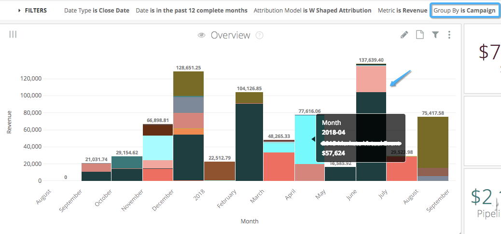

# 过滤器 {#filters}

详细了解Discover中可供您使用的不同筛选器以及如何使用它们。

>[!NOTE]
>
>发现筛选器中的“匹配用户属性”和“匹配（高级）”运算符是纯粹的管理运算符，可以安全地忽略。

**帐户ID**

_用于：基于帐户的营销_

从CRM中选择或粘贴一系列帐户ID以筛选结果。 帐户ID比帐户名称更具唯一性，因为名称可以相同。

**帐户名称**

_用于：基于帐户的营销_

从CRM中选择或粘贴一系列帐户名称以筛选结果。 字符串可以有重复项，因此可以有多个&#39;&#39;[!DNL Marketo Measure]”帐户为例。 如果在此情况下需要单个帐户，请改用帐户ID过滤器。

**归因模型**

_用于：概述、营销支出、广告ROI、基于帐户的营销、Web流量、CMO、付费媒体、内容营销、护照_

选择要应用于展示板的单个归因模型：首次接触、潜在客户创建接触、U形、W形、完整路径或自定义模型。 “完整路径”和“自定义模型”并非在所有层都可用。

**Campaign**

_用于：概述、增长、广告ROI、Web流量、CMO、付费媒体、内容营销、Passport_

按一个或多个营销活动名称筛选讨论区。 运算符为过滤器提供了额外的灵活性，例如使用“包含”或“开头为”运算符。 如果应用了渠道或子渠道过滤器，则显示的营销活动列表将是所应用过滤器的子集。

**类别1-10**

_用于：概述、增长、广告ROI、CMO、付费媒体、内容营销、Velocity、快照、同类群组漏斗、Passport_

使用您在中创建的类别和区段，将区段过滤器应用到展示板 [!DNL Marketo Measure] 设置。 您创建的类别列表将显示在筛选器菜单中，因此如果未设置类别，则菜单中将没有类别筛选器。 区段类别并非在所有层都可用，可用的类别数量也因层而异。

**渠道**

_用于：概述、增长、营销支出、广告ROI、Web流量、CMO、付费媒体、内容营销、Velocity、Passport_

按一个或多个渠道筛选讨论区。 运算符为过滤器提供了额外的灵活性，例如使用“包含”或“开头为”运算符。 输入渠道后，“子渠道”和“营销活动”过滤器中显示的值将来自应用的子渠道过滤器。

**同类群组阶段**

_用于：同类群组漏斗_

选择要查看同类群组的阶段。 您选择的舞台将显示在漏斗的顶部，所有转化都将从顶部向下流动。

**日期**

_用于：概述、增长、营销支出、广告ROI、基于帐户的营销、Web流量、CMO、付费媒体、内容营销、Velocity、快照、同类群组漏斗、Passport_

选择日期范围以筛选展示板中的数据，可使用灵活的日期运算符，例如“在范围中”、“在年份中”或“早于”。 快照例外，您将选择单个日期来查看数据的快照。

**日期类型**

_用于：概述、增长、营销支出、广告ROI、基于帐户的营销、Web流量、CMO、付费媒体、内容营销、护照_

选择要使用的日期类型，并将其绑定到日期过滤器。 默认日期类型因主板而异。 “接触点日期”是指进行营销活动的日期，“创建日期”是指CRM中创建Lead或Contact或Opportunity的日期，“关闭日期”是关闭Opportunity的日期。

**维度**

_使用位置：付费媒体_

Dimension功能与“分组依据”类似，只不过它在付费媒体展示板上的使用方式略有不同。 Dimension不会栈叠图表，而是会更改概述图表的线条以及表中的前导对象。

默认情况下，Dimension设置为子渠道，并且可以更改为：

* 无：汇总显示所有内容，不进行划分
* 渠道：按营销渠道列出数据
* 子渠道：按营销子渠道列出数据
* 促销活动：按促销活动列出数据
* 帐户：按帐户列出数据。 应用于 [!DNL AdWords]， [!DNL Bing]、和 [!DNL Facebook].
* 广告组：按广告组列出数据。 应用于 [!DNL AdWords]， [!DNL Bing]、和 [!DNL Facebook].
* 广告：按广告列出数据。 适用于Doubleclick广告，因此如果未使用Doubleclick，则不会显示任何结果
* 广告商：按广告商列出数据。 适用于Doubleclick广告商，因此如果未使用Doubleclick，则不会显示任何结果
* 创意：按创意列出数据。 应用于 [!DNL AdWords]， [!DNL Bing]、和 [!DNL Facebook].
* 关键字：按关键字列出数据。 应用于 [!DNL AdWords]， [!DNL Bing]、和 [!DNL Facebook].
* 版面：按版面列出数据。 适用于Doubleclick投放位置，因此如果未使用Doubleclick，则不会显示任何结果
* 站点：按站点列出数据。 适用于Doubleclick站点，因此如果不使用Doubleclick，将不会显示任何结果

**分组依据**

_用于：概述、增长、营销支出、基于帐户的营销、Web流量、CMO_

调整图表以更改正在栈叠和分组的维度。 默认情况下，“分组依据”设置为“渠道”，并可更改为：

* 无：汇总显示所有内容，不进行划分
* 渠道：按营销渠道对数据进行分组
* 子渠道：按营销子渠道对数据进行分组
* 促销活动：按促销活动对数据进行分组
* 帐户：按帐户对数据进行分组。 应用于 [!DNL AdWords]， [!DNL Bing]、和 [!DNL Facebook].
* 广告组：按广告组对数据进行分组。 应用于 [!DNL AdWords]， [!DNL Bing]、和 [!DNL Facebook].
* 广告：按广告对数据进行分组。 适用于Doubleclick广告，因此如果未使用Doubleclick，则不会显示任何结果
* 广告商：按广告商对数据进行分组。 适用于Doubleclick广告商，因此如果未使用Doubleclick，则不会显示任何结果
* 创意：按创意对数据进行分组。 应用于 [!DNL AdWords]， [!DNL Bing]、和 [!DNL Facebook].
* 关键字：按关键字对数据进行分组。 应用于 [!DNL AdWords]， [!DNL Bing]、和 [!DNL Facebook].
* 版面：按版面对数据分组。 适用于Doubleclick投放位置，因此如果未使用Doubleclick，则不会显示任何结果
* 站点：按站点对数据进行分组。 适用于Doubleclick站点，因此如果不使用Doubleclick，将不会显示任何结果

**登陆页面**

_用于：内容营销_

深入了解单个登陆页面的性能，或者可能包含特定词语的登陆页面，例如“博客”。

**量度**

_用于：概述、Web流量、CMO、付费媒体、内容营销_

有两个不同的量度选取器用于不同的展示板。 量度选取器会更改图表上的量度，例如，您可以在查看收入、支出或展示次数之间切换。

在概述和CMO展示板上，提供了与ROI指标相关的简短值列表：

* 收入
* 支出
* 交易
* 管道收入
* 机会
* 联系人
* 潜在客户

在“Web流量”、“付费媒体”和“内容营销”展示板上，有一个较长的ROI和漏斗指标相关值列表：

* 收入
* 支出
* 交易
* 管道收入
* 机会
* 联系人
* 潜在客户
* 点击次数
* 展示次数
* 访问
* 独特访问
* 页面查看次数
* Forms

**阶段**

_使用位置： Velocity_

默认情况下，“速度”板显示所有阶段的时间，但若要钻取到特定阶段，请使用“阶段”筛选器来选择阶段。

**子渠道**

_用于：概述、增长、营销支出、广告ROI、Web流量、CMO、付费媒体、内容营销、护照_

按一个或多个子渠道筛选讨论区。 运算符为过滤器提供了额外的灵活性，例如使用“包含”或“开头为”运算符。 如果应用了渠道过滤器，则显示的子渠道列表将是所应用过滤器的子集。 输入子渠道后，营销活动过滤器中显示的值将来自应用的子渠道过滤器。

**URL**

_用于： Web流量_

深入查看单个URL的流量，或者可能包含特定单词的URL（例如“product”）。

**韩元**

_使用位置： Velocity_

默认情况下， Velocity展示板仅报告已关闭的获胜销售机会，但请调整此筛选器以查看已关闭的获胜销售机会或已关闭的失败销售机会的周转率。
