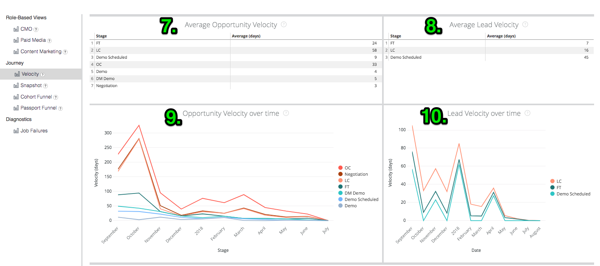

# 定义与百科全书 {#definitions-and-encyclopedia}

以下是Discover平台中存在的不同展示板和磁贴以及这些展示板中的过滤器的概述。 在每个讨论区的屏幕截图中有几个数字拼贴，其定义见下面该讨论区的部分。

**[!DNL Marketo Measure]讨论区**

概述

增长

广告ROI

基于帐户的营销

营销支出

网络流量

**基于角色的视图**

CMO

付费媒体

内容营销

营销运营

**历程**

速度

快照

护照漏斗

参与路径

## [!DNL Marketo Measure] 讨论区 {#marketo-measure-boards}

### 概述 {#overview}

“概述”功能可让用户从较高的层次了解营销团队的工作表现及其对收入、支出和ROI的影响。

**过滤器**

日期类型为关闭日期

日期在过去12个完整月内

归因模型为W型

量度就是收入

Dimension即渠道

渠道等于__

子渠道等于__

营销活动等于__

类别

**收入**

`1.` 基于归因模型的已结束成功的机会的总收入金额。

单击以显示详细信息，并通过将数据作为可视化和表格查看来深入查看数据。

**概述**

`2.` 使用过滤器菜单中的量度下拉列表，此图表显示收入/管道收入/支出/交易/机会/潜在客户/联系人归因于每个渠道，随时间变化显示。

**支出**

`3.` 从API成本和自报告成本累计到最高渠道级别的记录支出总数。

单击以显示详细信息，并通过将数据作为可视化和表格查看来深入查看数据。

**ROI**

`4.` 使用“过滤器”菜单中的“Dimension”下拉菜单，这会根据归因模型，显示在选定的整个日期范围内每个渠道/子渠道/促销活动/帐户/广告组/广告/广告商/创意/关键字/投放位置/网站的ROI归因量。

**ROI摘要**

使用“过滤器”菜单中的“Dimension”下拉菜单，这会显示在选定的整个日期范围内，根据归因模型，每个渠道/子渠道/促销活动/帐户/广告组/广告/广告商/创意/关键字/投放位置/网站可获得的收入、支出和ROI量。

**交易**

`5.` 基于归因模型计数的已结束的成功商机的总数。 如果选择日期类型“接触点日期”，则可以进行部分计数，因为可以使用此日期类型排除机会中的某些接触点。

单击以显示详细信息，并通过将数据作为可视化和表格查看来深入查看数据。

**每笔交易的成本**

`6.` 总支出除以交易总数，得出获得一个成功的机会所需的平均成本。

**管道收入**

`7.` 来自任何Open Opportunity的潜在总收入，这意味着它不是Closed Lost或Closed Won。 收入基于所选的归因模型。

单击以显示详细信息，并通过将数据作为可视化和表格查看来深入查看数据。

**交易规模**

`8.` 已结束的获胜商机的平均数量。

**渠道摘要**

`9`. 使用过滤器菜单中的量度下拉列表，这是一个基于收入/管道收入/支出/交易/商机/商机/商机/联系人（按选定归因模型的最高值排序）归因于每个渠道的渠道列表。

**子渠道摘要**

`10.` 使用过滤器菜单中的量度下拉列表，这是基于收入/管道收入/支出/交易/商机/商机/商机/联系人（按选定归因模型的最高值排序）归因于每个子渠道的子渠道列表。

**营销活动摘要**

`11.` 使用过滤器菜单中的量度下拉列表，这是一个基于收入/管道收入/支出/交易/商机/商机/商机/联系人（按选定归因模型的最高值排序）归因于每个促销活动的促销活动列表。

### 增长 {#growth}

增长使营销人员能够查看他们从商机、联系人、机会到收入等各个方面产生的结果。 它可快速查看所有管道以及一段时间内它们的执行情况。

**过滤器**

日期类型为接触点日期

日期在过去12个完整月内

归因模型为W型

按无分组

渠道等于__

子渠道等于__

营销活动等于__

类别

**收入**

`1.` 基于归因模型的已结束成功的机会的总收入金额。

单击以显示详细信息，并通过将数据作为可视化和表格查看来深入查看数据。

**随时间变化的收入**

`2.` 已结束的成功商机的总收入金额，基于显示特定时间范围内的趋势的归因模型。 使用“分组依据”筛选器可按渠道、子渠道、促销活动、帐户、广告组、广告、广告商、创意、关键字、版面、网站更改栈叠。

深入查看较小日期维的数据。

**交易**

`3.` 基于归因模型计数的已结束的成功商机的总数。

单击以显示详细信息，并通过将数据作为可视化和表格查看来深入查看数据。

**随时间变化的交易**

`4.` 已结束的成功商机的总数，基于显示特定时间范围内的趋势的归因模型。 使用“分组依据”筛选器可按渠道、子渠道、促销活动、帐户、广告组、广告、广告商、创意、关键字、版面、网站更改栈叠。

深入查看较小日期维的数据。

**管道收入**

`5.` 来自任何Open Opportunity的潜在总收入，这意味着它不是Closed Lost或Closed Won。 收入基于所选的归因模型。

单击以显示详细信息，并通过将数据作为可视化和表格查看来深入查看数据。

**随时间变化的管道收入**

`6.` 来自任何未完成销售机会的总潜在收入，基于显示特定时间范围内的趋势的归因模型。 使用“分组依据”筛选器可按渠道、子渠道、促销活动、帐户、广告组、广告、广告商、创意、关键字、版面、网站更改栈叠。

深入查看较小日期维的数据。

**潜在客户**

`7.` Lead的总数，基于归因模型。 如果选择日期类型“接触点日期”，则可以进行部分计数，因为可以使用此日期类型排除Lead记录中的某些接触点。 如果应用超出U形的归因模型，则U形计数将用于W形、W形和自定义模型。

单击以显示详细信息，并通过将数据作为可视化和表格查看来深入查看数据。

**随时间变化的潜在客户**

`8.` Lead的总数，基于显示特定时间段内趋势的归因模型。 使用“分组依据”筛选器可按渠道、子渠道、促销活动、帐户、广告组、广告、广告商、创意、关键字、版面、网站更改栈叠。

深入查看较小日期维的数据。

**联系人**

`9.` 基于归因模型的联系人总数。 如果选择日期类型“接触点日期”，则可以进行部分计数，因为可以使用此日期类型排除联系人记录中的某些接触点。 如果应用超出U形的归因模型，则U形计数将用于W形、W形和自定义模型。

单击以显示详细信息，并通过将数据作为可视化和表格查看来深入查看数据。

**随时间变化的联系人**

`10.` 联系人总数，基于显示特定时间段内趋势的归因模型。 使用“分组依据”筛选器可按渠道、子渠道、促销活动、帐户、广告组、广告、广告商、创意、关键字、版面、网站更改栈叠。

深入查看较小日期维的数据。

**机会**

`11.` 基于归因模型的机会总数。 如果选择日期类型“接触点日期”，则可以进行部分计数，因为可以使用此日期类型排除Opportunity记录中的某些接触点。

单击以显示详细信息，并通过将数据作为可视化和表格查看来深入查看数据。

**随时间变化的机会**

`12.` 机会总数，基于显示特定时间段内趋势的归因模型。 使用“分组依据”筛选器可按渠道、子渠道、促销活动、帐户、广告组、广告、广告商、创意、关键字、版面、网站更改栈叠。

深入查看较小日期维的数据。

**访问**

`13.` 跟踪的所有已知访客和匿名访客的网站访问总数。

单击以显示详细信息，并通过将数据作为可视化和表格查看来深入查看数据。

（如果禁用了此功能，则将显示为0。）

**一段时间内的访问次数**

`14.` 显示特定时间段内趋势的跟踪网站访问总数。 使用“分组依据”筛选器可按渠道、子渠道、促销活动、帐户、广告组、广告、广告商、创意、关键字、版面、网站更改栈叠。

深入查看较小日期维的数据。

（如果禁用了此功能，则此项将显示为空。）

**独特访问**

`15.` 跟踪的所有已知访客和匿名访客的唯一网站访问总数。

单击以显示详细信息，并通过将数据作为可视化和表格查看来深入查看数据。

（如果禁用了此功能，则将显示为0。）

**一段时间的独特访问**

`16.` 显示特定时间段内趋势的独特网站访问总数。 使用“分组依据”筛选器可按渠道、子渠道、促销活动、帐户、广告组、广告、广告商、创意、关键字、版面、网站更改栈叠。

深入查看较小日期维的数据。

（如果禁用了此功能，则此项将显示为空。）

**Forms**

`17.` 所有已知和匿名访客提交的表单总数。

单击以显示详细信息，并通过将数据作为可视化和表格查看来深入查看数据。

（如果禁用了此功能，则将显示为0。）

**随时间变化的Forms**

`18.` 显示特定时间段内趋势的已提交表单总数。 使用“分组依据”筛选器可按渠道、子渠道、促销活动、帐户、广告组、广告、广告商、创意、关键字、版面、网站更改栈叠。

深入查看较小日期维的数据。

（如果禁用了此功能，则此项将显示为空。）

### 广告ROI {#ads-roi}

广告ROI使付费媒体经理能够了解其营销工作，从而洞察其促销活动效果与关键词效果之间的关系。

**过滤器**

日期类型为关闭日期

日期在过去12个完整月内

归因模型为W型

渠道等于__

子渠道等于__

营销活动等于__

类别

**营销活动ROI摘要**

`1.` 基于每个营销活动的收入、支出和ROI的营销活动列表，按基于所选归因模型的最高收入排序。

**创意ROI摘要**

`2.` 创意内容列表，基于每个创意内容的收入、支出和ROI归因量，按选定归因模型得出的最高收入排序。

**关键词ROI摘要**

`3.` 基于每个关键字可获得的收入、支出和ROI的关键字列表，按基于所选归因模型的最高收入排序。

### 基于帐户的营销 {#account-based-marketing}

通过基于帐户的营销，使用ABM的公司能够跟踪其针对目标帐户所做的努力以及从其营销中看到的参与度。

**过滤器**

日期类型为接触点日期

日期在过去12个完整月内

归因模型为W形归因

分组依据是渠道

帐户等于__

**收入**

基于归因模型的已结束成功的机会的总收入金额。

单击以显示详细信息，并通过将数据作为可视化和表格查看来深入查看数据。

**管道收入**

来自任何Open Opportunity的潜在总收入，这意味着它不是Closed Lost或Closed Won。 收入基于所选的归因模型。

**每个帐户的平均接触次数**

按帐户ID计算的从每个CRM帐户生成的平均接触点数。

**匹配的潜在客户**

使用“ ”成功与帐户匹配的“潜在客户”总数 [!DNL Marketo Measure] 商机帐户功能，使用网站、公司名称和电子邮件域匹配算法。

**涉及的帐户**

接收任何接触点的帐户总数。 如果使用目标帐户列表，则这是该目标帐户列表中的帐户子集。

**参与的机会**

接收任何接触点的机会总数。 如果使用目标帐户列表，则它是该目标帐户列表中的业务机会的子集。

**参与的个人**

接收任何接触点的个人（按电子邮件地址列出的潜在客户和联系人）总数。 如果使用目标帐户列表，则该帐户列表是该目标帐户列表中个人的子集。

**随时间变化的接触点**

在指定时间段内记录的接触点总数。 如果使用目标帐户列表，则这是该目标帐户列表中的帐户子集。

**随时间变化的帐户（图表）**

在指定时间段内每月接收任何接触点的帐户总数，可选择按渠道、子渠道、营销活动、帐户、广告组、广告、广告商、创意、关键字、投放位置或网站对结果进行分组。 如果使用目标帐户列表，则这是该目标帐户列表中的帐户子集。

**按接触点计数列出的帐户**

按帐户ID和帐户名称显示每个帐户的接触点总数。

**接触点计数**

归因于每个维度的接触点数量，其中“分组依据”筛选器可以更改维度，例如：无/渠道/子渠道/促销活动/帐户/广告商/广告/创意/广告组/关键字/投放位置/网站。

### 营销支出 {#marketing-spend}

营销支出显示营销人员在一段时间内的支出情况，以便他们能够按月和按渠道跟踪支出。

**过滤器**

日期类型为接触点日期

日期在过去12个完整月内

归因模型

分组条件等于渠道

渠道等于__

子渠道等于__

营销活动等于__

**收入**

基于归因模型的已结束成功的机会的总收入金额。

单击以显示详细信息，并通过将数据作为可视化和表格查看来深入查看数据。

**支出**

从API成本和自报告成本累计到最高渠道级别的记录支出总数。

单击以显示详细信息，并通过将数据作为可视化和表格查看来深入查看数据。

**ROI**

从总收入（来自所选归因模型）和总支出中计算的ROI（投资回报率）。

**支出（图表）**

显示特定时间段内趋势的已记录支出总数。 使用“分组依据”筛选器按“无”、“渠道”、“子渠道”、“促销活动”、“帐户”、“广告组”、“广告”、“广告商”、“创意”、“关键字”、“版面”、“站点”更改栈叠。

由于并非在所有级别记录支出，因此总数可能并不等于每个“分组依据”选择。 例如，所有营销活动的合计将不等于所有子渠道的合计。

**支出+ ROI**

在右Y轴上与ROI一起显示每月的营销支出金额。

**按渠道支出**

基于每个渠道报告的数量的渠道列表，按最高支出排序。

**按子渠道支出**

基于每个子渠道报告的数量的子渠道列表，按最高支出排序。

**按营销活动支出**

基于每个促销活动报告的金额（按最高支出排序）的促销活动列表。 营销活动由完整的营销活动列表组成，其中包括来自页面查看的utm_campaign值。

### 网络流量 {#web-traffic}

“Web流量”视图允许营销人员跟踪其网站上的活动，测量来自已知和匿名网站访客的流量。

**过滤器**

日期类型为接触点日期

日期在过去12个完整月内

归因模型为W形归因

URL等于__

分组依据为“无”

量度是访问次数

渠道等于__

子渠道等于__

营销活动等于__

**独特访问**

跟踪的所有已知访客和匿名访客的唯一网站访问总数。

单击以显示详细信息，并通过将数据作为可视化和表格查看来深入查看数据。

**访问**

跟踪的所有已知访客和匿名访客的网站访问总数。

单击以显示详细信息，并通过将数据作为可视化和表格查看来深入查看数据。

**每次独特访问的成本**

总支出除以独特访问总数，得出每个独特访问率的成本。

**每次访问的成本**

总支出除以访问总数，得出每次访问成本。

**每次独特访问的收入**

已知访客和匿名访客每次独特网站访问已关闭收入的计算平均值。

**每次访问的收入**

已知和匿名访客每次网站访问已关闭收入的计算平均值。

**页面查看次数**

在所有已知访客和匿名访客中跟踪的页面查看总数。

单击以显示详细信息，并通过将数据作为可视化和表格查看来深入查看数据。

**Forms**

所有已知和匿名访客提交的表单总数。

单击以显示详细信息，并通过将数据作为可视化和表格查看来深入查看数据。

**概述**

使用过滤器菜单中的量度下拉列表，此图表显示收入/管道收入/支出/交易/机会/潜在客户/联系人/点击次数/展示次数/访问次数/独特访问/页面查看次数/归因于每个维度的表单，随时间变化显示。 Dimension可从无更改为渠道/子渠道/营销活动/帐户/广告商/广告/创意/广告组/关键字/投放位置/网站。

**Web流量摘要**

通过URL，查看计入每个页面的页面查看次数、访问次数、独特访问次数和表单提交次数。

**反向链接摘要**

来自每个引荐URL的页面访问次数和独特访问次数。

**按来源显示的独特访问次数**

使用过滤器菜单中的分组方式下拉列表，查看网站独特访客的来源。 将组更改为：渠道、子渠道、促销活动、帐户、广告组、广告、广告商、创意、关键字、版面、站点。

**按来源显示的访问次数**

使用过滤器菜单中的分组方式下拉列表，查看您网站的访客来源。 将组更改为：渠道、子渠道、促销活动、帐户、广告组、广告、广告商、创意、关键字、版面、站点。

**按登陆页面列出的潜在客户**

登陆页面列表，基于从每个登陆页面生成的潜在客户数，按最大潜在客户数排序。

**按表单URL排列的潜在客户**

表单URL列表，基于从每个URL生成的潜在客户数，按最大潜在客户数排序。

## 基于角色的视图 {#role-based-views}

### CMO {#cmo}

CMO视图可让CMO从较高的层次了解营销团队在收入、支出和ROI方面的表现。

**过滤器**

日期类型为关闭日期

日期在过去12个完整月内

归因模型为W型

渠道等于__

子渠道等于__

营销活动等于__

量度就是收入

类别

**收入**

`1.` 基于归因模型的已结束成功的机会的总收入金额。

单击以显示详细信息，并通过将数据作为可视化和表格查看来深入查看数据。

**概述**

`2.` 使用过滤器菜单中的量度下拉列表，此图表显示收入/管道收入/支出/交易/机会/潜在客户/联系人归因于每个渠道，随时间变化显示。

**支出**

`3.` 从API成本和自报告成本累计到最高渠道级别的记录支出总数。

单击以显示详细信息，并通过将数据作为可视化和表格查看来深入查看数据。

**ROI**

`4.` 从总收入（来自所选归因模型）和总支出中计算的ROI（投资回报率）。

**交易**

`5.` 基于归因模型计数的已结束的成功商机的总数。 如果选择日期类型“接触点日期”，则可以进行部分计数，因为可以使用此日期类型排除机会中的某些接触点。

单击以显示详细信息，并通过将数据作为可视化和表格查看来深入查看数据。

**每笔交易的成本**

`6.` 总支出除以交易总数，得出获得一个成功的机会所需的平均成本。

**管道收入**

`7.` 来自任何Open Opportunity的潜在总收入，这意味着它不是Closed Lost或Closed Won。 收入基于所选的归因模型。

单击以显示详细信息，并通过将数据作为可视化和表格查看来深入查看数据。

**交易规模**

`8.` 已结束的获胜商机的平均数量。

**渠道摘要**

`9.` 使用过滤器菜单中的量度下拉列表，这是一个基于收入/管道收入/支出/交易/商机/商机/商机/联系人（按选定归因模型的最高值排序）归因于每个渠道的渠道列表。

**子渠道摘要**

`10.` 使用过滤器菜单中的量度下拉列表，这是基于收入/管道收入/支出/交易/商机/商机/商机/联系人（按选定归因模型的最高值排序）归因于每个子渠道的子渠道列表。

**营销活动摘要**

`11.` 使用过滤器菜单中的量度下拉列表，这是一个基于收入/管道收入/支出/交易/商机/商机/商机/联系人（按选定归因模型的最高值排序）归因于每个促销活动的促销活动列表。

### 付费媒体 {#paid-media}

付费媒体功能板为付费媒体经理（或类似人员）提供对其付费媒体表现的洞察。 能够查看相关渠道提供了多少内容，以及您的工作产生了多少需求。 所有量度均从付费媒体集成中提取。

**过滤器**

日期类型为接触点日期

日期在过去12个完整月内

归因模型为W型

量度就是收入

Dimension即渠道

渠道等于__

子渠道等于__

营销活动等于__

类别

**收入**

`1.` 基于归因模型的已结束成功的机会的总收入金额。

单击以显示详细信息，并通过将数据作为可视化和表格查看来深入查看数据。

**支出**

`2.` 从API成本和自报告成本累计到最高渠道级别的记录支出总数。

单击以显示详细信息，并通过将数据作为可视化和表格查看来深入查看数据。

**ROI**

`3.` 从总收入（来自所选归因模型）和总支出中计算的ROI（投资回报率）。

**管道收入**

`4.` 来自任何Open Opportunity的潜在总收入，这意味着它不是Closed Lost或Closed Won。 收入基于所选的归因模型。

单击以显示详细信息，并通过将数据作为可视化和表格查看来深入查看数据。

**概述**

`5.` 使用过滤器菜单中的量度下拉列表，此图表显示一段时间的收入/管道收入/支出/交易/机会/潜在客户/联系人/访问次数/独特访问/展示次数/点击次数/表单。

**展示次数**

`6.` 从所有连接的广告帐户提供的展示总数。

单击以显示详细信息，并通过将数据作为可视化和表格查看来深入查看数据。

**CPM**

`7.` 提供的展示的总支出除以总展示次数（除以1000），得出CPM率。

**点击次数**

`8.` 从所有连接的广告帐户跟踪的点击总数。

单击以显示详细信息，并通过将数据作为可视化和表格查看来深入查看数据。

**CPC**

`9.` 跟踪的点击量产生的总支出除以总点击量，得出CPC率。

**潜在客户**

`10.` 在CRM中创建的潜在客户总数。

**每个潜在客户的成本**

`11.` 创建潜在客户的总支出除以总点击量，得出CPL率。

**访问**

`12.` 跟踪的所有已知访客和匿名访客的网站访问总数。

单击以显示详细信息，并通过将数据作为可视化和表格查看来深入查看数据。

**独特访问**

`13.` 跟踪的所有已知访客和匿名访客的唯一网站访问总数。

单击以显示详细信息，并通过将数据作为可视化和表格查看来深入查看数据。

**Web流量摘要**

使用“过滤器”菜单中的维度选取器，在渠道、子渠道、促销活动、帐户、广告组、广告、广告商、创意、关键字、版面、网站之间切换，并查看页面查看次数、访问次数、独特访问次数以及计入每个次数的表单提交。

**潜在客户管道摘要**

使用“过滤器”菜单中的维度选取器，在“渠道”、“子渠道”、“促销活动”、“帐户”、“广告组”、“广告”、“广告商”、“创意”、“关键字”、“版面”、“网站”之间切换，并根据所选的归因模型查看每个商机的潜在客户或联系人的数量。

**机会管道摘要**

使用“过滤器”菜单中的维度选取器，根据选定的归因模型在“渠道”、“子渠道”、“促销活动”、“帐户”、“广告组”、“广告”、“广告商”、“创意”、“关键字”、“投放位置”、“网站”之间切换，并查看归因于每个渠道的机会、交易、“管道”收入、支出、ROI和收入数量。

### 内容营销 {#content-marketing}

通过内容营销功能板，内容营销人员能够查看其营销内容的执行情况，从他们产生的访问量到关闭的收入等。 按所有内容查看它，或将其缩小到特定内容段或页面。

过滤器

日期类型为接触点日期

日期在过去12个完整月内

归因模型为W型

登陆页面等于__

渠道等于__

子渠道等于__

营销活动等于__

类别

**总收入**

`1.` 仅来自数字来源的已结束成功的机会的总收入金额，基于归因模型。

单击以显示详细信息，并通过将数据作为可视化和表格查看来深入查看数据。

**按收入划分的登陆页面**

`2.` 登陆页面的列表，基于每个登陆页面的收入归因程度，按基于所选归因模型的最高收入排序。

**总管道收入**

`3.` 仅来自数字来源的任何Open Opportunity的潜在总收入，这意味着它不是Closed Lost或Closed Won。 收入基于所选的归因模型。

单击以显示详细信息，并通过将数据作为可视化和表格查看来深入查看数据。

**按管道收入划分的登陆页面**

`4.` 登陆页面的列表，基于管道收入归因于每个登陆页面的程度，根据所选归因模型按最多管道收入排序。

**机会总数**

`5.` 仅来自数字来源的、基于归因模型的机会总数。

单击以显示详细信息，并通过将数据作为可视化和表格查看来深入查看数据。

**按机会计数划分的登陆页面**

`6.` 登陆页面的列表，基于分配给每个登陆页面的机会数量，根据所选归因模型按机会最高数量排序。

**Forms**

`7.` 所有跟踪页面中提交的表单总数。

**按表单提交排名靠前的表单URL**

`8.` 表单URL列表，基于在每个URL上提交的表单数量，按页面上提交的表单最大数量排序。

**表单URL（按渠道）**

`9.` 按推动访问的渠道分组的前10个表单URL。

单击以显示详细信息，并通过将数据作为可视化和表格查看来深入查看数据。

**独特访问**

`10.` 跟踪的所有已知访客和匿名访客的唯一网站访问总数。

深入查看按月跟踪的独特网站访问。

**按独特访问次数排名靠前的登陆页面**

`11.` 登陆页面的列表，基于每个登陆页面的独特访问次数，按独特访问次数最多的页面排序。

深入查看所选URL按月显示的独特访问次数。

**访问**

`12.` 跟踪的所有已知访客和匿名访客的网站访问总数。

**按访问次数排名靠前的登陆页面**

`13.` 登陆页面的列表，基于每个登陆页面的初始访问次数，按访问次数最多的页面排序。

**潜在客户**

`14.` Lead的总数，基于归因模型。 如果选择日期类型“接触点日期”，则可以进行部分计数，因为可以使用此日期类型排除Lead记录中的某些接触点。 如果应用超出U形的归因模型，则U形计数将用于W形、W形和自定义模型。

单击以显示详细信息，并通过将数据作为可视化和表格查看来深入查看数据。

**按商机计数划分的登陆页面**

`15.` 页面URL列表，基于从每个URL创建的潜在客户数，按具有最多潜在客户的页面排序。

### 营销运营 {#marketing-ops}

验证和诊断 [!DNL Marketo Measure] 数据能够全面了解各个接触点。

**过滤器**

帐户 ID

帐户名称

机会 ID

潜在客户或联系人ID

潜在客户或联系人电子邮件

营销活动ID

赢得的机会(Y/N)

机会创建日期

机会关闭日期

接触点日期

归因模型

**深入分析**

机会详细信息

联系人详细信息

商机详细信息

归因接触点详细信息

接触点详细信息

**帐户**

`1.` 具有接触点的所有帐户的列表。 每个帐户的信息包括参与评级、机会数、联系人数、潜在客户数、归因接触点数和接触点数。

单击聚合数字可向下钻取基本数据详细信息。

**机会**

`2.` 包含归因接触点的所有机会列表。 每个机会的信息包括机会数量、联系人数和归因接触点数量。

单击聚合数字可向下钻取基本数据详细信息。

**联系人**

`3.` 包含接触点的所有联系人列表。 每个联系人的信息包括属性接触点数和接触点数

单击聚合数字可向下钻取基本数据详细信息。

**潜在客户**

`4.` 具有接触点的所有潜在客户列表。 每个潜在客户的信息包括接触点数量。

单击聚合数字可向下钻取基本数据详细信息。

**营销活动**

`5.` 包含接触点的所有营销活动列表。 每个营销活动的信息包括营销活动支出、属性数量、归因接触点数量和接触点数量。

单击聚合数字可向下钻取基本数据详细信息。

**营销运营常见问题解答**

**问：为何同时具有“帐户ID”和“帐户名称”筛选器？**

答：虽然帐户ID是唯一的，但帐户名称不必是唯一的。 例如，您可能已经为企业公司中的每个业务部门创建了多个不同的帐户。 虽然使用帐户名称可能更直观，但为确保您筛选的是特定帐户，您可能需要使用帐户ID。

**问：如果按帐户ID过滤，是否会按过滤所有表？**

答：是，它会将该过滤器应用于展示板中的每个图块。 例如，如果您要为“Microsoft”应用帐户过滤器，则在“业务机会”拼贴中，您将只看到与Microsoft相关的业务机会。

**问：“参与度评级”列是什么？**

答：参与度等级从 [!DNL Marketo Measure] 预测帐户参与度分数，可从以下位置获取： [!DNL Marketo Measure] 第2层。 如果没有此字段，此字段将显示为null。

**问：可以更改表的排序方式吗？**

答：是，如果单击任何列标题，将对表进行排序。 如果再次单击同一标题，则会反转表排序方式。

**问：能否导出数据？**

答：是，当鼠标悬停在图块标题（例如“Accounts”）上时，请单击右上角的三个垂直点。 这样，您就可以按照以下格式下载该图块的数据：TXT、CSV、XLS、JSON、HTML和Markdown。

**问：我能否看到500行以上的数据？**

答：图块限制为一次显示500行，但您可以导出数据并选择“所有结果”以查看所显示的500多行。

## 历程 {#journey}

### 销售周转率 {#sales-velocity}

通过使用Sales Velocity ，营销人员和销售人员能够了解其潜在客户在漏斗中的移动速度，并了解哪些渠道的转化时间更快（或更慢）。

**过滤器**

日期在过去12个完整月内

Won是

阶段等于__

渠道等于__

子渠道等于__

**速度（天）**

`1.` 从第一次匿名接触到opportunity结束， Opportunity在其销售周期中的平均天数。

**活跃商机**

`2.` 来自任何未结Opportunity的Opportunity总数，这意味着它不是Closed Lost或Closed Won。

**平均交易规模**

`3.` 已结束的获胜商机的平均数量。

**获胜率**

`4.` “已关闭的获胜方”业务机会总数除以“已关闭的失败方”和“已关闭的获胜方”业务机会总数，显示获胜率百分比。

**按渠道列出的机会周转率**

`5.` 每个阶段中机会处于周期的平均天数，按营销渠道分组，显示进入下一阶段所需的时间。 此处显示的阶段是里程碑阶段(FT、LC、OC)和自定义阶段。

**按渠道列出的销售线索周转率**

`6.` Lead在转换为Contact/Opportunity/Account之前在每个阶段的周期中的平均天数，按营销渠道分组，显示进入下一阶段所需的时间。 此处显示的阶段是里程碑阶段(FT、LC)和自定义阶段。

**平均机会周转率**

`7.` 每个阶段机会在其周期中的平均天数，显示进入下一阶段所需的时间。 此处显示的阶段是里程碑阶段(FT、LC、OC)和自定义阶段。 此处的数字反映了上面按渠道划分的Opportunity Velocity图表中每个阶段的时间。

**平均潜在客户周转率**

`8.` Lead在转化为Contact/Opportunity/Account之前，每个阶段处于周期的平均天数，显示进入下一阶段所需的时间。 此处显示的阶段是里程碑阶段(FT、LC)和自定义阶段。 此处的数字反映了上面按渠道列出的销售线索周转率图表中每个阶段的时间。

**随时间变化的机会周转率**

`9.` Opportunity在每个阶段的周期中的平均天数，随时间呈趋势。

**一段时间内的提前周转率**

`10.` Lead在每个阶段的周期中的平均天数，随时间呈趋势。

### 快照 {#snapshot}

快照可让营销人员在任何给定时间点查看其整个管道。 向过滤器中添加一个日期，以显示其管道在该日期时的状态。

过滤器

日期为2018-01-01

潜在客户或联系人

**潜在客户/联系人快照**

`1.` 在选定日期时每个阶段的潜在客户或联系人记录数。

**潜在客户/联系人快照(Table)**

`2.` 在选定日期时每个阶段的潜在客户或联系人记录数。

**机会快照**

`3.` 在选定日期在每个阶段中的Opportunity记录数。

**机会快照(Table)**

`4.` 在选定日期在每个阶段中的Opportunity记录数。

### 护照 {#passport}

Passport是 [!DNL Marketo Measure] ROI仪表板，其中每个阶段显示每个阶段的记录数以及通过每个阶段的记录总数。

**过滤器**

日期类型为接触点日期

日期在过去12个完整月内

归因模型为W型

渠道等于__

子渠道等于__

营销活动等于__

类别

**潜在客户/联系人护照**

`1.` 和 `2.` 每个阶段显示每个Lead Status或Contact阶段的记录数以及经过每个阶段的记录总数。

**机会通行证**

`3.` 每个阶段显示每个Opportunity阶段中的记录数以及经过每个阶段的记录总数。

### 参与路径 {#engagement-path}

了解潜在客户、联系人、机会和客户如何从首次接触一直参与到结束。

**过滤器**

帐户名称/ID

潜在客户ID/电子邮件

联系人ID/电子邮件

归因模型

事件类型

买方接触点位置

买方归因接触点位置

接触点日期

用户接触点电子邮件

营销接触类型

渠道

中

Web源

首次与人员交互(Y/N)

已归因收入

**活动历程**

所有事件的列表与关联的接触点详细信息和归因收入。

单击事件类型以深入查看事件详细信息。

**参与路径常见问题解答**

**问：如何查看单人的历程？**

答：使用“潜在客户ID/电子邮件”或“联系人ID/电子邮件”过滤器，将过滤器设置为“包含” [电子邮件地址]&#39;然后单击“运行”。

**问：“归因模型”过滤器有什么影响？**

答：归因模型过滤器将影响“已归因收入”列

**问：“营销接触类型”过滤器是什么？**

答：“营销接触类型”是参与度的类型，可包括Web访问、Web表单、Web聊天、电子邮件、呼叫、左侧消息或CRM（即离线渠道的促销活动成员资格）

**问：如何过滤掉历程中的所有Web会话？**

答：使用“营销接触类型”过滤器，将过滤器设置为“不包含Web访问”或“包含” [除Web访问以外的所有触控类型]，然后单击“运行”

**问：能否导出数据？**

答：是，当鼠标悬停在“事件历程”表上时，请单击右上角的三个垂直圆点。 这样，您就可以下载以下格式的数据：TXT、CSV、XLS、JSON、HTML和Markdown。

**问：可以更改表的排序方式吗？**

答：是，如果单击任何列标题，将对表进行排序。 如果再次单击同一标题，则会反转表排序方式。 默认情况下，这些表按接触点日期从最早的开始排序。

**问：我能否看到500行以上的数据？**

答：图块限制为一次显示500行，但您可以导出数据并选择“所有结果”以查看所显示的500多行。
