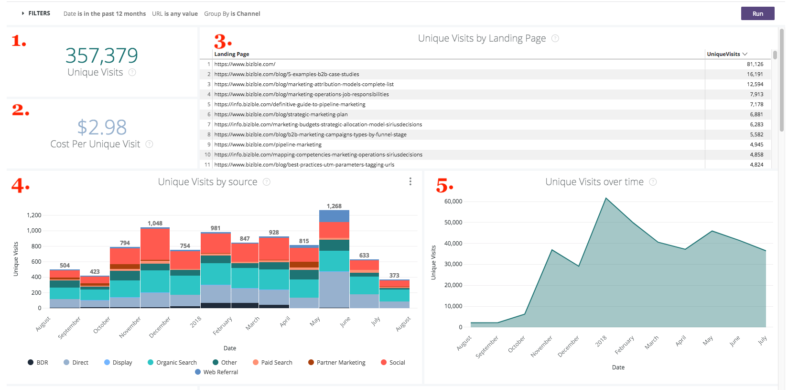
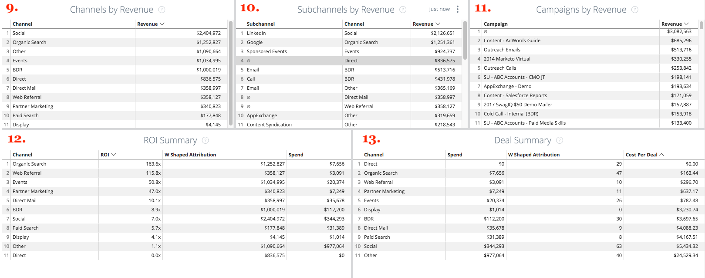

# 穿透钻取 {#drill-throughs}

的 [!DNL Marketo Measure Discover] 体验允许客户深入查看他们最关心的数据集。 在整个过程中采取某些措施 [!DNL Marketo Measure Discover]，客户可以单击某个图块并浏览有关该量度的更多信息。

下面是功能板和图块列表，其中包含穿透钻取以及用户在穿透钻取时应该期望的体验。 请记住，在穿透钻取时，功能板中的全局过滤器会一直保留。

## 概述 {#overview}

**收入**

定义：通过条形图和表格按月统计总收入。 从那里可以深入到单个月份，或者按周、日或时间逐月分发。

**收入（图表）**

定义：通过条形图和表格按月统计总收入。 由于父图块已经是条形图，因此深入到“显示详细信息”将仅显示一个月。

_深入：按月划分的总收入按周或日期划分。_

**支出**

定义：通过条形图和表格按月统计总支出。 从那里可以深入到单个月份，或者按周、日或时间逐月分发。

**交易**

定义：通过条形图和表格按月列出的交易总数。 从那里可以深入到单个月份，或者按周、日或时间逐月分发。

**管道收入**

定义：通过条形图和表格按月列出的管道收入总额。 从那里可以深入到单个月份，或者按周、日或时间逐月分发。

**ROI摘要**

定义：通过条形图和表格，按月列出每个渠道的总收入或支出。 从那里，可以在该行中钻取一个月，或者按周、日或时间逐个划分。

**每笔交易成本**

定义：总支出除以交易总数，提供获得成功机会所需的平均成本。 从那里，可以在该行中钻取一个月，或者按周、日或时间逐个划分。

**按收入划分的渠道**

定义：通过条形图和表格按月列出每个渠道的总收入。 从那里，可以在该行中钻取一个月，或者按周、日或时间逐个划分。

**按收入划分的子渠道**

定义：通过条形图和表格按月列出每个子渠道的总收入。 从那里，可以在该行中钻取一个月，或者按周、日或时间逐个划分。

**按收入划分的促销活动**

定义：通过条形图和表格，按月列出每个营销活动的总收入。 从那里，可以在该行中钻取一个月，或者按周、日或时间逐个划分。

**交易摘要**

定义：通过条形图和表格，按月列出每个渠道的总支出或交易计数。 从那里，可以在该行中钻取一个月，或者按周、日或时间逐个划分。

## 增长 {#growth}

**总收入**

定义：通过条形图和表格按月统计总收入。 从那里可以深入到单个月份，或者按周、日或时间逐月分发。

**随时间推移的收入**

定义：通过条形图和表格按月统计总收入。 由于父图块已是图表，因此深入到“显示详细信息”将仅显示一个月。

_按月划分的总收入按周或日期划分。_

**总交易**

定义：通过条形图和表格按月列出的交易总数。 从那里可以深入到单个月份，或者按周、日或时间逐月分发。

**随时间推移的交易**

定义：通过条形图和表格按月列出的交易总数。 由于父图块已是图表，因此深入到“显示详细信息”将仅显示一个月。

_按月划分的按周或日期划分的交易总数。_

**管道总收入**

定义：通过条形图和表格按月列出的管道收入总额。 从那里可以深入到单个月份，或者按周、日或时间逐月分发。

**一段时间内的管道收入**

定义：通过条形图和表格按月列出的管道收入总额。 由于父图块已是图表，因此深入到“显示详细信息”将仅显示一个月。

_按月划分的管道收入总额按周或日期划分。_

**总商机**

定义：通过条形图和表格按月统计潜在客户总数。 从那里可以深入到单个月份，或者按周、日或时间逐月分发。

**随时间推移的商机**

定义：通过条形图和表格按月统计潜在客户总数。 由于父图块已是图表，因此深入到“显示详细信息”将仅显示一个月。

_按月划分的潜在客户总数按周或日期划分。_

**联系人总数**

定义：通过条形图和表格按月显示联系人总数。 从那里可以深入到单个月份，或者按周、日或时间逐月分发。

**一段时间内的联系人**

定义：通过条形图和表格按月显示联系人总数。 由于父图块已是图表，因此深入到“显示详细信息”将仅显示一个月。

_按月划分的联系人总数按周或日期划分。_

**总机会**

定义：通过条形图和表格按月列出总商机。 从那里可以深入到单个月份，或者按周、日或时间逐月分发。

**随着时间的推移，机会**

定义：通过条形图和表格按月列出总商机。 由于父图块已是图表，因此深入到“显示详细信息”将仅显示一个月。

_按月划分的总机会按周或日期划分。_

**独特访问量**

定义：通过条形图和表格按月查看页面总数。 从那里可以深入到单个月份，或者按周、日或时间逐月分发。

**特定时段内的独特访问量**

定义：显示特定时间段内趋势的独特访问总数。 使用按过滤器分组可按渠道、子渠道、促销活动、帐户、广告组、广告、广告商、创意、关键字、版面和网站更改堆栈。 如果禁用此功能，则显示为空。

**访问次数**

定义：通过条形图和表格按月的网站访问总数。 从那里可以深入到单个月份，或者按周、日或时间逐月分发。

**一段时间内的访问量**

定义：跟踪的显示特定时间段内趋势的网站访问总数。 使用按过滤器分组可按渠道、子渠道、促销活动、帐户、广告组、广告、广告商、创意、关键字、版面和网站更改堆栈。 如果禁用此功能，则显示为空。

**Forms**

定义：通过条形图和表格按月提交的表单总数。 从那里可以深入到单个月份，或者按周、日或时间逐月分发。

**Forms随时间的推移**

定义：提交的表单总数，显示特定时间段内的趋势。 使用按过滤器分组可按渠道、子渠道、促销活动、帐户、广告组、广告、广告商、创意、关键字、版面和网站更改堆栈。 如果禁用此功能，则显示为空。

## 支出 {#spend}

**支出**

定义：通过条形图和表格按月统计总支出。 从那里可以深入到单个月份，或者按周、日或时间逐月分发。

**支出（图表）**

定义：通过条形图和表格按月统计总支出。 由于父图块已是图表，因此深入到“显示详细信息”将仅显示一个月。

_按月划分的总支出，按周、日期或时间划分。 花时间是可能的，因为 [!DNL Marketo Measure] 从我们的广告连接中下载实际花费的每分钟数。_

**按渠道支出**

定义：通过条形图和表格，按月列出每个渠道的总支出。 从那里，可以在该行中钻取一个月，或者按周、日或时间逐个划分。

**按子渠道支出**

定义：通过条形图和表格按月列出每个子渠道的总支出。 从那里，可以在该行中钻取一个月，或者按周、日或时间逐个划分。

**按促销活动支出**

定义：通过条形图和表格按月列出每个营销活动的总支出。 从那里，可以在该行中钻取一个月，或者按周、日或时间逐个划分。

## 销售速度 {#sales-velocity}

**周转率（天）**

定义：从首次匿名接触到机会结束，机会在其销售周期中的平均天数。

**积极机会**

定义：任何Open Opportunity的总机会数，这意味着它不是Closed Lost或Closed Won。

**交易规模**

定义：Closed Won机会的平均金额。

**获胜率**

定义：已结束的韩元机会总数除以已结束的韩元和已结束的韩元机会总数。

**按渠道划分的机会周转率**

定义：Opportunity在每个阶段的周期中所处的平均天数，按营销渠道分组并显示进入下一个阶段所花费的时间。 此处显示的阶段是里程碑阶段(FT、LC、OC)和自定义阶段。

**按渠道划分的前置速度**

定义：在潜在客户转换为联系人/机会/金额之前，在每个阶段处于其周期中的平均天数，按营销渠道分组并显示进入下一个阶段所花费的时间。 此处显示的阶段是里程碑阶段(FT、LC)和自定义阶段。

**平均机会周转率**

定义：Opportunity在每个阶段的周期中的平均天数，显示进入下一个阶段所花费的时间。 此处显示的阶段是里程碑阶段(FT、LC、OC)和自定义阶段。 此处的数字反映了“渠道”图表中“机会周转率”中每个阶段的时间。

**平均潜在客户周转率**

定义：潜在客户在转换为联系人/机会/金额之前处于每个阶段的周期中的平均天数，显示进入下一个阶段所花费的时间。 此处显示的阶段是里程碑阶段(FT、LC)和自定义阶段。 此处的数字反映了通过渠道图表得出的潜在客户周转率中每个阶段的时间。

**随着时间的推移，机会周转率**

定义：Opportunity在每个阶段的周期中出现的平均天数，并随时间推移呈现趋势。

**随时间推移的商机周转率**

定义：潜在客户在每个阶段处于其周期中的平均天数，以及一段时间内的趋势。

## 基于帐户的营销 {#account-based-marketing}

**总收入**

定义：通过条形图和表格按月统计总收入。 从那里可以深入到单个月份，或者按周、日或时间逐月分发。

**管道总收入**

定义：通过条形图和表格按月列出的管道收入总额。 从那里可以深入到单个月份，或者按周、日或时间逐月分发。

**匹配的潜在客户**

定义：成功匹配到帐户的潜在客户总数。

**触及的帐户**

定义：接收任何接触点的帐户总数。

**触及的机遇**

定义：Opportunity Id及其对应的帐户ID列表

**接触的联系人**

定义：联系人ID及其相应帐户ID的列表

**随时间变化的接触点（图表）**

定义：选定月份的接触点列表。

_按周、日期或时间划分的接触点数。_

**随时间变化的帐户（图表）**

定义：选定月份的帐户ID列表。

_按周、日期或时间划分的帐户数。_

## Web分析 {#web-analytics}

**独特访问量**

定义：通过条形图和表格按月列出的独特网站访问总数。 从那里可以深入到单个月份，或者按周、日或时间逐月分发。

**每次独特访问的成本**

定义：总支出除以独特访问总数。 从那里可以深入到单个月份，或者按周、日或时间逐月分发。

**按登陆页面的独特访问量**

定义：基于每个URL独特访客数的登陆页面列表。

**按来源的独特访问量**

定义：查看网站独特访客的来源。

**一段时间内的独特访问量**

定义：跟踪的独特访问总数，显示特定时间范围内的趋势。

**访问次数**

定义：通过条形图和表格按月的网站访问总数。 从那里可以深入到单个月份，或者按周、日或时间逐月分发。

**每次访问成本**

定义：总支出除以总访问量。

**按登陆页面的访问量**

定义：基于每个URL访问次数的登陆页面列表。

**按来源的访问量**

定义：您网站的访客来源。 可以按渠道、子渠道、促销活动、帐户、广告组、广告、广告商、创意、关键词、版面和网站进行更改。

**一段时间内的访问量**

定义：跟踪的访问总数，显示特定时间段内的趋势。 从那里可以深入到单个月份，或者按周、日或时间逐月分发。

**页面查看次数**

定义：通过条形图和表格按月查看页面总数。 从那里可以深入到单个月份，或者按周、日或时间逐月分发。

**每页查看成本**

定义：总支出除以跟踪的页面查看总数。

**按URL划分的页面查看次数**

定义：基于每个URL的页面查看次数的页面URL列表。

**一段时间内的页面查看次数**

定义：通过条形图和表格按月查看页面总数。 由于父图块已是图表，因此深入到“显示详细信息”将仅显示一个月。

_按月划分的页面查看总数按周、日期或时间划分。_

**Forms特定时段**

定义：跟踪的表单总数，显示特定时间段内的趋势。

**Forms**

定义：通过条形图和表格按月提交的表单总数。 从那里可以深入到单个月份，或者按周、日或时间逐月分发。

**每表单成本**

定义：总支出除以提交的表单总数。

**由表单URL提交表单**

定义：基于每个URL上提交的编号的表单URL列表。

**按登陆页面列出的潜在客户**

定义：根据每个登陆页面生成的潜在客户数量确定的登陆页面列表。

**按表单URL列出的潜在客户**

定义：基于每个URL中生成的潜在客户数量的表单URL列表。

## CMO {#cmo}

**收入**

定义：通过条形图和表格按月统计总收入。 从那里可以深入到单个月份，或者按周、日或时间逐月分发。

**收入（图表）**

定义：通过条形图和表格按月统计总收入。 由于父图块已经是条形图，因此深入到“显示详细信息”将仅显示一个月。

_按月划分的总收入按周或日期划分。_

**支出**

定义：通过条形图和表格按月统计总支出。 从那里可以深入到单个月份，或者按周、日或时间逐月分发。

**ROI**

定义：来自总收入和总支出的计算投资回报（基于归因模型）。

**交易**

定义：通过条形图和表格按月列出的交易总数。 从那里可以深入到单个月份，或者按周、日或时间逐月分发。

**每笔交易成本**

定义：总支出除以交易总数，提供获得一个成功机会所需的平均成本。

**管道收入**

定义：通过条形图和表格按月列出的管道收入总额。 从那里可以深入到单个月份，或者按周、日或时间逐月分发。

**交易规模**

定义：已结业务机会的平均金额。

**按收入划分的渠道**

定义：通过条形图和表格按月列出每个渠道的总收入。 从那里，可以在该行中钻取一个月，或者按周、日或时间逐个划分。

**按收入划分的子渠道**

定义：通过条形图和表格按月列出每个子渠道的总收入。 从那里，可以在该行中钻取一个月，或者按周、日或时间逐个划分。

**按收入划分的促销活动**

定义：通过条形图和表格，按月列出每个营销活动的总收入。 从那里，可以在该行中钻取一个月，或者按周、日或时间逐个划分。

**ROI摘要**

定义：通过条形图和表格，按月列出每个渠道的总收入或支出。 从那里，可以在该行中钻取一个月，或者按周、日或时间逐个划分。

**交易摘要**

定义：通过条形图和表格，按月列出每个渠道的总支出或交易计数。 从那里，可以在该行中钻取一个月，或者按周、日或时间逐个划分。

## 内容营销 {#content-marketing}

**总收入**

定义：通过条形图和表格按月统计总收入。 从那里可以深入到单个月份，或者按周、日或时间逐月分发。

**按收入划分的登陆页面**

定义：通过条形图和表格从每个登陆页面获得的总收入。 从那里，可以在该行中钻取一个月，或者按周、日或时间逐个划分。

**管道总收入**

定义：通过条形图和表格按月列出的管道收入总额。 从那里可以深入到单个月份，或者按周、日或时间逐月分发。

**按管道收入划分的登陆页面**

定义：通过条形图和表格从每个登陆页面获得的管道总收入。 从那里，可以在该行中钻取一个月，或者按周、日或时间逐个划分。

**总机会**

定义：通过条形图和表格按月列出的机会总数。 从那里可以深入到单个月份，或者按周、日或时间逐月分发。

**按机会计数的登陆页面**

定义：通过条形图和表格从每个登陆页面获得的总商机数。 从那里，可以在该行中钻取一个月，或者按周、日或时间逐个划分。

**共计Forms**

定义：通过条形图和表格按月列出的表单总数。 从那里可以深入到单个月份，或者按周、日或时间逐月分发。

**按表单提交的排名最前的表单URL**

定义：通过条形图和表格从每个表单URL获得的表单总数。 从那里，可以在该行中钻取一个月，或者按周、日或时间逐个划分。

**按渠道划分的表单URL**

定义：通过条形图和表格从表单URL按月提交的表单总数。 从那里，可以在该行中钻取一个月，或者按周、日或时间逐个划分。

**独特访问量**

定义：跟踪的所有已知访客和匿名访客的独特网站访问总数。 深入查看按月跟踪的独特网站访问量。

**按独特访问量划分的热门登陆页面**

定义：基于每个登陆页面独特访问次数的登陆页面列表。 深入查看按月对选定URL的独特访问量。

**访问次数**

定义：跟踪的所有已知访客和匿名访客的网站访问总数。 深入查看按月跟踪的网站访问量。

**按访问量划分的热门登陆页面**

定义：根据每个登陆页面的初始访问次数确定的登陆页面列表。 进一步查看按月访问选定URL的情况。

**总商机**

定义：通过条形图和表格按月列出的潜在客户总数。 从那里可以深入到单个月份，或者按周、日或时间逐月分发。

**按潜在客户计数的登陆页面**

定义：通过条形图和表格从每个登陆页面获得的潜在客户总数。 从那里，可以在该行中钻取一个月，或者按周、日或时间逐个划分。

## 付费媒体 {#paid-media}

**展示次数**

定义：通过条形图和表格按月显示总次数。 从那里可以深入到单个月份，或者按周、日或时间逐月分发。

**CPM**

定义：已投放展示次数的总支出除以总展示次数。

**点击次数**

定义：通过条形图和表格按月的总点击次数。 从那里可以深入到单个月份，或者按周、日或时间逐月分发。

**CPC**

定义：跟踪的点击总支出除以总点击量。

**潜在客户**

定义：基于归因模型的潜在客户总数。

**CPL**

定义：潜在客户的总支出除以总点击量，从而提供CPL比率。

**访问次数**

定义：通过条形图和表格按月的网站访问总数。 从那里可以深入到单个月份，或者按周、日或时间逐月分发。

**页面查看次数**

定义：通过条形图和表格按月查看页面总数。 从那里可以深入到单个月份，或者按周、日或时间逐月分发。

**营销活动摘要**

定义：营销活动列表基于每个营销活动的收入/支出/交易/商机数，按基于所选归因模型的最高值排序。

**广告摘要**

定义：基于所选归因模型，基于每个广告的收入/管道收入/支出/交易/商机数量的广告列表。

**关键词摘要**

定义：基于所选归因模型，每个关键词的关键词列表，其基础是收入/管道收入/支出/交易/商机数量。

**按ROI划分的促销活动**

定义：根据每个促销活动的计算ROI（按最高ROI排序）的促销活动列表。 深入查看所选营销活动的收入或月支出。

**按ROI划分的广告**

定义：基于每个广告的计算ROI的广告列表，按最高ROI排序。 深入查看所选广告的收入或月份支出。

**按ROI划分的关键词**

定义：基于每个关键词的计算ROI的关键词列表，按最高ROI排序。 深入查看所选关键词的收入或月支出。
