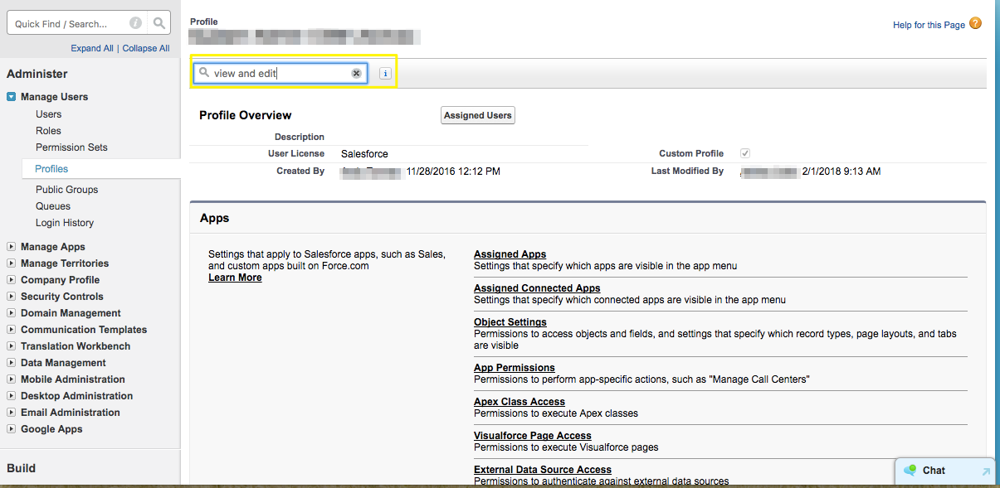

# 启用编辑已转换潜在客户的权限 {#enabling-the-permission-to-edit-converted-leads}

了解如何启用在 [!DNL Salesforce]. [!DNL Marketo Measure] 能够在Salesforce中将数据推送到各种对象。 在推送到潜在客户时，我们发现在某些情况下，我们可能需要重新推送到已转换的潜在客户记录。 要将数据推送到这些记录，我们所连接的用户必须具有在用户档案级别查看和编辑已转换潜在客户的权限。

1. 转到 [!UICONTROL Setup] 并展开 [!UICONTROL Manage Users] 分组以选择用户档案。

   

1. 选择我们通过连接的用户的配置文件。

1. 搜索查看和编辑已转换的潜在客户的权限。

   

1. 选中方框，可启用查看和编辑已转换潜在客户的权限。

   

你完蛋了！
