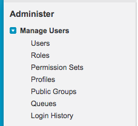

# 启用该权限以编辑已转换的潜在客户 {#enabling-the-permission-to-edit-converted-leads}

了解如何启用权限以编辑[!DNL Salesforce]中转换的潜在客户记录。 [!DNL Marketo Measure]能够将数据推送到Salesforce中的各种对象。 在推送到潜在客户时，我们发现，在某些情况下，我们可能需要重新推送到已转换的潜在客户记录。 为了将数据推送到这些记录，我们连接到的用户必须具有在用户档案级别查看和编辑已转化商机的权限。

1. 转到[!UICONTROL Setup]并展开[!UICONTROL Manage Users]分组以选择配置文件。

   

1. 选择我们连接到的用户的配置文件。

1. 搜索查看和编辑已转化商机的权限。

   

1. 选中方框，可启用查看和编辑已转化商机的权限。

   

你完蛋了！
