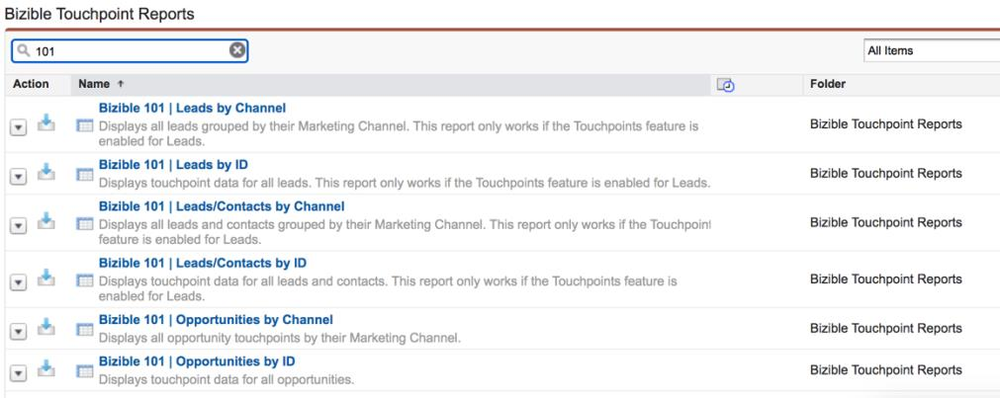

# [!DNL Marketo Measure] 101报表概述 {#marketo-measure-101-reports-overview}

>[!NOTE]
>
>您可能会看到指定“[!DNL Marketo Measure]“ ”，但仍会在您的CRM中看到“Bizible”。 我们正在努力更新该版本，并且该品牌重命名将很快地反映在您的CRM中。

全部 [!DNL Marketo Measure] 客户使用 [!DNL Marketo Measure] 和 [!DNL Salesforce] 有权访问其SFDC实例中的“买方接触点报表”文件夹。 此文件夹包含许多预建报表，可帮助您开始使用购买者接触点数据进行报告。

虽然其中许多报告已经确立了具体的报告目标，但有6个“_[!DNL Marketo Measure]101..._“由三种主要报表类型代表，这些类型涵盖了大多数报表需求。

* 具有买方接触点的潜在客户
* [!DNL Marketo Measure] 具有买方接触点的人员
* 具有机会的购买者归因接触点

这些报表为您提供任何 [!DNL Marketo Measure] 要创建的相关报表。 我们鼓励所有新老客户在探索营销归因问题时，从这些报表开始。 下面将列出6个“_[!DNL Marketo Measure]101..._“ ”报告。

_如果找不到“买方接触点报表”文件夹或“_[!DNL Marketo Measure] 101..._“ ”报告，请联系以寻求帮助。_

**具有买方接触点的潜在客户** |以下两个变体，报告潜在客户及其购买者接触点。 尽管它们使用相同的基本报表类型，但是它们会按不同的量度（商机ID与营销渠道）进行分组，以提供两个关键的数据视图。 此报表类型专为漏斗报表而设计，非常适合于探索潜在客户如何参与营销工作。 在进行任何自定义之前，以下两个报表会显示以下内容：

**[!DNL Marketo Measure]101:按渠道划分的潜在客户** |营销渠道如何影响潜在客户的创建及其他参与的高级视图。
**[!DNL Marketo Measure]101:按ID划分的潜在客户** |此报表显示潜在客户故事，并且是一个更精细的报表，显示每个潜在客户及其相关的购买者接触点。

**与买方接触点的潜在客户/联系人** |这些报表通常称为 [!DNL Marketo Measure] 人员报告。 他们使用 [!DNL Marketo Measure] 自定义对象 _[!DNL Marketo Measure]人员_ 与上述报表中的Lead对象相反。

的 [!DNL Marketo Measure] “人员对象”将“潜在客户”和“联系人”对象关联在一起。 开箱即用， [!DNL Salesforce] 不提供使用同一报表中的潜在客户和联系人对象创建报表的选项。 通过使用人员的唯一标识符、电子邮件、 [!DNL Marketo Measure] 人员可以在同一报表中报告与潜在客户和联系相关的买方接触点。 此报表类型非常适合在您的 [!DNL Marketo Measure] 帐户设置，因为它是接触点报表中最包含的级别。

以下两个报表变体使用相同的报表类型，但按不同的量度(人员ID（电子邮件）与营销渠道)进行分组。 这些是漏斗报表的顶部/中部，当您想要了解潜在客户和联系人如何参与营销工作时，这些报表非常有用。 在进行任何自定义之前，以下两个报表会显示以下内容：

**[!DNL Marketo Measure]101:按渠道列出的潜在客户/联系人** |关于营销渠道如何影响潜在客户或联系人的创建及其他工作的高级视图。 当想要了解营销渠道中的总体参与情况，以及哪些营销渠道在您的Salesforce实例中推动了新名称时，此报表非常适合。
**[!DNL Marketo Measure]101:按ID列出的潜在客户/联系人** |这会显示每个 [!DNL Marketo Measure] 人员的故事，是一个更加精细的报表，可显示每个人及其购买者接触点，而无论接触点是在商机还是作为联系人时发生。

**具有买方归因接触点的机会** |最后两个“_[!DNL Marketo Measure]101..._“报表是漏斗报表的底部，显示与Opportunity相关的Builer Attribution接触点数据。 这些报告的关键区别在于，它们是基于 _买方归因接触点_ 与Opportunity和Opportunity级别数据（如收入）相关。 当您想要报告Opportunity或归因收入时，应使用此报表类型。 下面两个报表使用相同的报表类型，但是它们按不同的量度（“机会ID”与“营销渠道”）进行分组。 在进行任何自定义之前，以下两个报表会显示以下内容：

**[!DNL Marketo Measure]101:按渠道划分的机会** |深入了解您的营销渠道如何影响和提升您的Opportunity中的归因收入。
**[!DNL Marketo Measure]101:按ID划分的商机** |此粒度报表版本向您展示Opportunity的完整历程。 在此报表中，您可以通过各种归因模型查看与Opportunity关联的每个Buyer Attribution接触点及其归因收入。

这被认为是对待“_[!DNL Marketo Measure]101..._“ ”作为模板报告，以满足您的报告需求。 从上述报表之一开始，将可以节省您的时间，并确保您使用与 [!DNL Marketo Measure] 数据。 每次对“”进行自定义时，始终确保“另存为”_[!DNL Marketo Measure]101..._“模板”，以保留报表的原始变体。

“购买者接触点报表”文件夹旨在帮助您开始使用 [!DNL Marketo Measure] 报表，对于可操作的报表，您需要自定义这些报表，以便根据您的报表需求量身定制。 您需要添加必要的过滤器，以确保报表中的记录（及其相关接触点）与您的报表目标保持一致。

在您熟悉&#x200B;_[!DNL Marketo Measure]101..._“ ”报表中，您可能希望从自定义报表类型重新创建报表，以满足更多自定义报表需求。 创建 [[!DNL Marketo Measure] 自定义报表类型](/help/marketo-measure-salesforce-reporting/new-report-types/creating-custom-marketo-measure-report-types.md) 允许您提取可在其他CRM报表中常用的自定义字段。 这将帮助您 [!DNL Marketo Measure] 向下一级报告！
