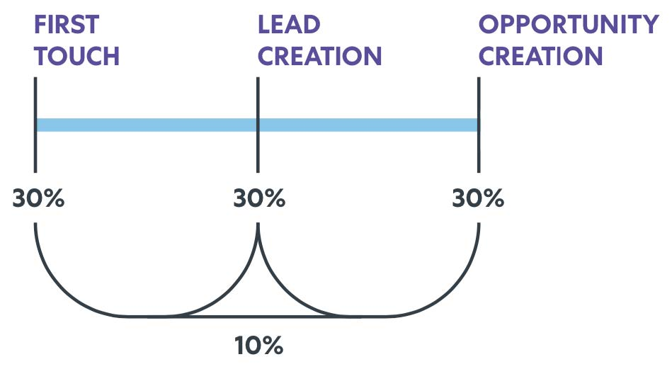
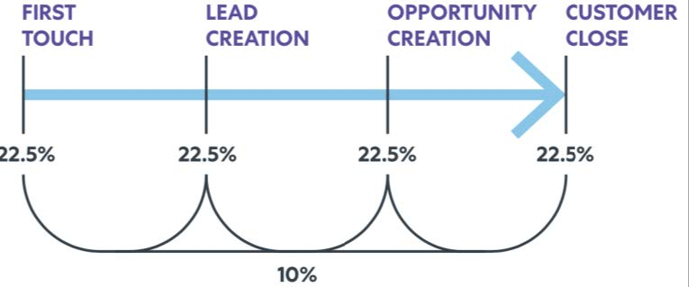

# [!DNL Marketo Measure]报告指南 {#marketo-measure-reporting-guide}

>[!NOTE]
>您可能会在文档中看到指定“[!DNL Marketo Measure]”的说明，但仍可在CRM中看到“Bizible”。 我们正在努力更新品牌，并且品牌重塑很快将会反映在您的CRM中。

在构建[!DNL Marketo Measure]报表之前，最重要的是确认您的[!DNL Marketo Measure]帐户设置已审核和配置，以确保报表中的数据准确并反映您业务的特性。 此外，报告项目如果遵循结构化流程，效果最佳。 来自[!DNL Marketo Measure]Perkuto[的](https://perkuto.com/){target="_blank"}高级用户、倡导者和合作伙伴贾斯汀·诺里斯对[如何在 [!DNL Marketo Measure]](https://perkuto.com/blog/turning-attribution-data-into-actionable-insights/){target="_blank"}中处理报告进行了专业总结：

**建立目标**：“第一个要问的问题是‘我们为什么要测量？’ [Forrester Research](https://go.forrester.com/)的Lori Wizdo在[Marketo网络研讨会](https://www.marketo.com/webinars/beyond-revenue-performance-real-kpis-of-b2b-marketing/){target="_blank"}中做出了精辟的总结。 据她所说，“我们衡量是证明或验证一个决策或营销的价值，还是为了做得更好（流程改进）。” 我们还认为，良好衡量方法产生的见解也为营销规划过程提供了投入和指导。

在开始之前，必须非常清楚您的目标、您试图回答的问题或您试图解决的问题。 你想讲什么故事？ 结果将做出哪些决策？ 这些基本面因素往往没有得到妥善的考虑，导致所有相关方都感到失望。”

**报告设计**：“接下来，您需要设计报告并确定它将包含的特定维度、量度和数据集。 一种常见做法是为业务用户提供他们要求的确切内容，只是让他们仍然觉得他们的需求没有得到满足。 这是因为企业用户实际查找的insight并不总是包含在他们请求的报表中。 优秀的分析师（或戴分析师帽子的MOPS人员）将提出澄清的问题，建立通用定义（“那么，您真正的意思是铅？”），甚至可以绘制最终报告的视觉草图，以确保一致性。 只有到那时，你才知道自己有一系列明确的要求，因此才会建立报告。”

**报告生成**：“开始生成后，经常遇到障碍或死胡同。 例如，您可能会发现您缺少基本的数据点，或者您的对象未按所需的方式链接。 要解决这些问题，我认为理解报告“机器”中“暗藏着”发生的事情也很关键。 这种流畅的操作可让您快速评估报告请求并评估其是否可实现（并在不可实现时更轻松地设计创意解决方案）。”

让我们深入了解[!DNL Marketo Measure]归因报表计算机运行的驱动因素。

## Buyer Touchpoint对象(CRM) {#buyer-touchpoint-objects-crm}

在最高级别，有两个基于两个不同Buyer Touchpoint对象的报表类别：这些类别确定要报告的[!DNL Marketo Measure]数据类型：与&#x200B;_个人_&#x200B;相关的数据，或与&#x200B;_机会_&#x200B;相关的数据。

1. **买方接触点** (BT)/个人/总参与度

   * 通常用于“funnel顶部”(TOFU)指标以及与&#x200B;_个人_（潜在客户、联系人、[!DNL Marketo Measure]个人）相关的报表
   * BT用于了解与&#x200B;**人员**相关的所有营销互动，因为它们包含每个人的完整接触点历史记录。 提醒一下，这些接触点是在CRM中为匿名的首次接触、潜在客户创建接触以及您选择从中同步的任何后续表单提交或接触点创建的
离线营销活动或活动。

1. **买方归因接触点** (BAT)/机会/客户级别/收入

   * 常用于“funnel中间和/或底部”（MOFU和BOFU）指标以及与&#x200B;_机会_&#x200B;相关的报表。
   * BAT表示连接到&#x200B;**机会**&#x200B;的所有人员的相关接触点（通过机会联系人角色或通过共享帐户ID，具体取决于您的设置）。 与仅与人员相关的BT不同，BAT还可以与&#x200B;**收入**&#x200B;相关联。 因此，您将使用BAT来回答与机会相关的问题，包括已打开或关闭的机会的数量，或者管道价值和赢得的收入。

>[!NOTE]
>BAT是从BT创建的。 基本上，跟踪是通过BT在个人级别开始的。 在客户上创建Opportunity后，同一客户下所有联系人的BT都将被引用，并有资格创建与Opportunity相关的BAT，因此您将需要根据尝试回答的问题来使用其中一个：与“人员”指标相关的问题(BT报表)，或与“Opportunity”指标相关的问题(BAT报表)

支持文章： [买方接触点和买方归因接触点之间的差异](/help/configuration-and-setup/getting-started-with-marketo-measure/difference-between-buyer-touchpoints-and-buyer-attribution-touchpoints.md#configuration-and-setup){target="_blank"}

## Buyer Touchpoint (BT) {#buyer-touchpoint-bt}

Buyer Touchpoint (BT)是用于跟踪用户与您的营销资料进行的每次营销交互的对象。 每个人的（潜在客户/联系人/[!DNL Marketo Measure]人员）历程将由其相关的BT表示。 在[!DNL Marketo Measure]中，个人历程包括：

1. 此人最初是如何与我们的品牌互动的？ （首次联系或&#x200B;_英尺_）
1. 此人如何转化/被认识/成为潜在客户？ （潜在客户创建或&#x200B;_LC_）
1. 此人在成为Lead后还如何与我们的品牌和营销材料进行交互？ (_PostLC_)

买方接触点用于回答与&#x200B;_人员_&#x200B;相关的问题（“人员”由CRM中的潜在客户或联系人表示），例如潜在客户/联系人生成或客户获取指标，而不是与机会相关的指标。 例如：

* 哪些渠道提供的潜在客户最多？
* 哪些渠道创建新Lead的成本高低不一？
* 我的潜在客户/联系人与什么内容接触？
* 特定标题、角色和角色的营销故事是什么？
* 哪些渠道推动MQL或其他潜在客户/联系人状态？

首先，公司需要知道，“我的潜在客户/联系人来自何处？” 从历史上看，答案是仅有一个一维的值(例如Lead Source)。 但是，如上#1和#2中所述，我们知道Lead在成为Lead的历程中可以有多个接触点。 通过Buyer Touchpoint，我们可以将insight纳入表示商机的生成方式的两项最重要的交互中：即他们的首次联系和他们的商机创建联系。 买方接触点也是&#x200B;_多维度_，这意味着它们承载了大量营销数据，主要是人员来自何处（营销渠道）以及人员参与的内容（内容）。

为基于人员的量度提供最佳insight的[归因模型](/help/introduction-to-marketo-measure/overview-resources/marketo-measure-attribution-models.md){target="_blank"}包括：

* **首次联系** — 商机的首次联系(FT)获得100%的归因点数
* **潜在客户创建** - 100%归因点数归因于潜在客户创建触点(LC)
* **U形** — 多点接触方法，40%的点数归于英国《金融时报》，40%的点数归于信用证

<table>
 <tbody>
  <tr>
   <td></td>
   <td>U形模型旨在将点数分给任何概括了Lead如何成为Lead的买方接触点。 虽然也可以报告这些潜在客户的后续接触点来了解其他参与(Post LC)，但它们不属于<strong>潜在客户创建历程</strong>，因此它们不会在FT、LC或U型模型中获得任何归因点数。

&#42;最常见的是，U形归因反映了FT和LC之间的平均50/50拆分。 如果Lead在与首次接触相同的会话中发生转化，则单个接触点将同时表示FT和LC接触点位置。 因此，将100%归因归于单个接触点。</td>
</tr>
 </tbody>
</table>

这些模型高度重视早期交互并置于funnel参与度之上。 推荐使用U型归因模型，因为它同时影响FT和LC接触点，确保将点数分配给任何影响Lead创建的接触。 但是，如果您希望更详细地了解潜在客户历程中的这些特定部分，则可以从首次联系和潜在客户创建联系模型中获取其他insight。

## 使用Buyer Touchpoint (BT)的推荐报表 {#recommended-reports-using-the-buyer-touchpoint-bt}

1. **个具有买方接触点的潜在客户**

**1.1 | 按营销渠道**&#x200B;显示的新潜在客户

按“营销渠道”字段汇总潜在客户的Buyer Touchpoint数据是反映哪些渠道/策略正在影响新潜在客户创建的最高级别视图。 将此报表的结构设置为“Date Type”=“Created Date”，以确保在报表中建立“新潜在客户（当在CRM中创建该潜在客户时）的同类群组。

<table>
 <tbody>
  <tr>
   <td>问题</td>
   <td>哪些营销渠道正在影响销售线索的创建？</td>
  </tr>
  <tr>
   <td>报告类型</td>
   <td>潜在客户和购买者接触点(CRM) 
   量度：潜在客户（[!DNL Marketo Measure]个发现）</td>
  </tr>
  <tr>
   <td>日期字段/日期类型</td>
   <td>商机创建日期(CRM) /创建日期（发现）</td>
  </tr>
  <tr>
   <td>Date Range</td>
   <td><i>选择所需的日期范围</i></td>
  </tr>
  <tr>
   <td>组/Dimension</td>
   <td>营销渠道</td>
  </tr>
  <tr>
   <td>最佳模型</td>
   <td>首次联系，潜在客户创建，<strong>U型</strong> 
   *对CRM报表中的“计数”字段求和（计数 — 首次联系、计数 — 商机创建、计数 — U型）</td>
  </tr>
 </tbody>
</table>

>[!TIP]
>对于任何“具有买方接触点的潜在客户”报表类型，首先自定义标题为“[!DNL Marketo Measure] 101”的预建报表 | 按渠道列出的潜在客户。 此报告现成可用，它是一个很好的沙盒，已按照上表所述预先构建，可以快速自定义以满足更具体的报告需求。

**1.2 | 按营销活动显示的新潜在客户（或更细粒度的洞察）**

要将insight更细粒度添加到“按营销渠道列出的新潜在客户”报表(1.1)中汇总的数据中，请在促销活动级别添加其他摘要。 这样，您不仅能够了解“营销渠道”是什么在推动新商机的创建，而且更具体地说，这些渠道中的哪些促销活动表现最佳：

<table>
 <tbody>
  <tr>
   <td>问题</td>
   <td>哪些<i>营销活动</i>正在影响潜在客户创建？</td>
  </tr>
  <tr>
   <td>报告类型</td>
   <td>潜在客户和购买者接触点(CRM) 
   量度：潜在客户（[!DNL Marketo Measure]个发现）</td>
  </tr>
  <tr>
   <td>日期字段/日期类型</td>
   <td>商机创建日期(CRM) /创建日期（发现）</td>
  </tr>
  <tr>
   <td>Date Range</td>
   <td><i>选择所需的日期范围</i></td>
  </tr>
  <tr>
   <td>组/Dimension</td>
   <td>广告营销活动名称(CRM)</td>
  </tr>
  <tr>
   <td>最佳模型</td>
   <td>首次联系，潜在客户创建，<strong>U型</strong> 
   *对CRM报表中的“计数”字段求和（计数 — 首次联系、计数 — 商机创建、计数 — U型）</td>
  </tr>
 </tbody>
</table>

>[!TIP]
>通过使用insight对象中的其他可用字段来汇总报告，获得更精细的Buyer Touchpoint。 为此，可设置其他分组(CRM)或维度（发现）。 根据渠道（可能代表您的角色），除了您希望获得insight的营销活动级别之外，还可能会有其他详细信息。 让我们深入了解“付费搜索”，如下表所示……

<table>
 <tbody>
  <tr>
   <td>问题</td>
   <td>哪些<i>关键字</i>影响销售线索的创建？</td>
  </tr>
  <tr>
   <td>报告类型</td>
   <td>潜在客户和购买者接触点(CRM) 
   量度：潜在客户（[!DNL Marketo Measure]个发现）</td>
  </tr>
  <tr>
   <td>过滤器</td>
   <td>营销渠道=付费搜索</td>
  </tr>
  <tr>
   <td>日期字段/日期类型</td>
   <td>商机创建日期(CRM) /创建日期（发现）</td>
  </tr>
  <tr>
   <td>Date Range</td>
   <td><i>选择所需的日期范围</i></td>
  </tr>
  <tr>
   <td>组/Dimension</td>
   <td>关键字文本(CRM)/关键字（发现）</td>
  </tr>
  <tr>
   <td>最佳模型</td>
   <td>首次联系，潜在客户创建，<strong>U型</strong> 
   *对CRM报表中的“计数”字段求和（计数 — 首次联系、计数 — 商机创建、计数 — U型）</td>
  </tr>
 </tbody>
</table>

粒度的级别可能因渠道而异。 推荐的方法是问问自己，“那么‘渠道X’呢？我想了解更多细节吗？” 付费搜索经理还可能对其他维度感兴趣，例如：

* 广告营销活动名称
* 广告内容
* 广告组

但是，事件经理可能更感兴趣的是，哪些特定事件或哪些类型的事件对创建线索的影响最大：

* 广告促销活动名称/Salesforce促销活动=特定事件
* Medium =营销活动“类型”

**提醒**：可能需要将其他筛选器添加到上述或以下列出的任何报表变体中。 这些过滤器将特定于您的组织，并且可能是您的营销运营或销售运营团队可以提供的建议。 组织在所有报表中运行相同的过滤器以确保报表尽可能干净和准确并不罕见。 常见示例包括：

* 从测试中过滤掉任何内部记录，通常按电子邮件地址
* 根据可能特定于您的业务部门的特定“记录类型”进行筛选

**1.3 | 按内容显示的新潜在客户（仅限CRM报告）**

<table>
 <tbody>
  <tr>
   <td>问题</td>
   <td>哪些<i>内容</i>影响潜在客户创建？</td>
  </tr>
  <tr>
   <td>报告类型</td>
   <td>潜在客户和买方接触点(CRM)</td>
  </tr>
  <tr>
   <td>日期字段</td>
   <td>商机创建日期</td>
  </tr>
  <tr>
   <td>Date Range</td>
   <td><i>选择所需的日期范围</i></td>
  </tr>
  <tr>
   <td>组/Dimension</td>
   <td>登陆页面 
   表单URL</td>
  </tr>
  <tr>
   <td>最佳模型</td>
   <td>首次联系，潜在客户创建，<strong>U型</strong> </td>
  </tr>
 </tbody>
</table>

**提醒**：用于报告数字内容/资产的两个主要字段是“登陆页面”和“表单URL”。 如果潜在客户在他们“登陆”的同一页面（登陆页面）上转化（提交表单），_但是_，这两个值可能相同，有时这些值是不同的。 例如，潜在客户可以单击Facebook上将其带到您网站某个页面的链接（这就是“登陆页面”值）。 然后，潜在客户可能会离开该页面，继续其在网站上的会话，并最终在另一个页面（表单URL）上提交表单。 这将在单个接触点中概述，该接触点代表潜在客户来自何处（营销渠道）、将他们带到网站的内容（登陆页面）以及他们最终下载的内容（表单URL）。 “表单URL”还是用于报告与可下载内容无关的其他表单（如“联系我们”或“演示请求”表单）的转到字段。

>[!TIP]
>通过其他筛选器将insight纳入特定的“内容”中
> 过滤方式：“登陆页面”包含（例如）：
>   * /博客
>   * /电子书
>   * /网络研讨会
> 或：“表单URL”包含（例如）
>   * /contact
>   * /demo

在funnel的任何部分进行报告时，基于“内容”的报表可提供巨大价值，但是，它们最常用于funnel顶部，以将额外的insight提供给潜在客户初始参与。 考虑到“有机搜索”往往是推动初始参与度最强的渠道(FT)，因此没有那么多的“促销活动”级别的数据。

基于“内容”的报表非常适用于让insight了解在更高级别的营销渠道中推动销售线索的因素，在本例中为“免费搜索”。

**1.4 | 给定日期范围**&#x200B;内的潜在客户参与总数

<table>
 <tbody>
  <tr>
   <td>问题</td>
   <td>哪些营销渠道在过去（周/月/季度）具有最多<i>总商机参与度</i>？</td>
  </tr>
  <tr>
   <td>报告类型</td>
   <td>潜在客户和购买者接触点(CRM) 
   量度：潜在客户（[!DNL Marketo Measure]个发现）</td>
  </tr>
  <tr>
   <td>日期字段/日期类型</td>
   <td>接触点日期</td>
  </tr>
  <tr>
   <td>Date Range</td>
   <td><i>选择所需的日期范围</i></td>
  </tr>
  <tr>
   <td>组/Dimension</td>
   <td>营销渠道（或更细粒度）</td>
  </tr>
  <tr>
   <td>最佳模型*</td>
   <td>*此报表不是关于使用归因模型测量潜在客户来自何处，而是关于潜在客户创建接触之后的<i>总接触点数（参与量）</i>（包括这些接触点数）。 接触点的总记录数将反映哪些渠道的Lead参与度最高。</td>
  </tr>
 </tbody>
</table>

**提醒**：将您的报表基于“接触点日期”是了解特定日期范围内的营销表现的最好方法。 “接触点日期”构建报表的方式是，归因不仅与渠道、营销活动或内容相关，而且还显示发生接触点的时间。 这是了解在特定时间点发生的营销参与的最有效方法，也是衡量营销影响与同时投入的营销支出相比的推荐方法。 建议在执行任何营销支出或ROI分析时这样做（请参阅5.1）。

**2. 具有买方接触点的营销合格潜在客户**

其中一个最常见的报告不仅侧重于新的潜在客户或潜在客户级别的参与，而且更具体地说，集中在“营销合格潜在客户”(MQL)上。 在报告MQL时，有几种不同的方法，具体取决于您有权访问的[!DNL Marketo Measure]特性和功能。

**2.1 | 按渠道（多点接触）列出的营销合格潜在客户**

这种衡量营销对影响MQL的影响的方法本质上是“营销渠道的新潜在客户”(1.1)报表的延续，但附加标准是，要衡量的潜在客户更具体地是MQL。 此处仍建议使用U形归因模型来识别哪些营销渠道和内容正在生成潜在客户，这些潜在客户随后&#x200B;_可能_&#x200B;成为MQL：

<table>
 <tbody>
  <tr>
   <td>问题</td>
   <td>哪些营销渠道最能生成成为<i>MQL</i>的新潜在客户？</td>
  </tr>
  <tr>
   <td>报告类型</td>
   <td>潜在客户和购买者接触点(CRM) 
   量度：潜在客户（[!DNL Marketo Measure]个发现）</td>
  </tr>
  <tr>
   <td>过滤器</td>
   <td>MQL = true* 
   *<i>MQL的定义可能因组织而异。 请确保使用与其他基于MQL的报表相同的字段来筛选[!DNL Marketo Measure]报表的MQL。 需要以相同方式创建区段筛选器，以报告[!DNL Marketo Measure] Discover.</i>中的MQL</td>
  </tr>
  <tr>
   <td>日期字段/日期类型</td>
   <td>如果CRM中不包含“MQL日期”，则CRM报表中也可以使用MQL日期（或等效日期）/创建日期（[!DNL Marketo Measure]发现）  <i>潜在客户创建日期。 请务必牢记您在其中使用的日期字段定义了同类群组数据集。</i></td>
  </tr>
  <tr>
   <td>Date Range</td>
   <td><i>选择所需的日期范围</i></td>
  </tr>
  <tr>
   <td>组/Dimension</td>
   <td>营销渠道</td>
  </tr>
  <tr>
   <td>最佳模型</td>
   <td>首次联系，潜在客户创建，<strong>U型</strong> 
   对CRM报表中的“计数”字段求和（计数 — 首次联系、计数 — 商机创建、计数 — U型）</td>
  </tr>
 </tbody>
</table>

**2.2 | 按渠道营销合格的潜在客户（单次接触，仅限CRM）**

衡量营销对影响MQL的影响的方法更侧重于确定哪个&#x200B;_单个接触点_&#x200B;是潜在客户达到MQL之前的最后一次接触。

>[!NOTE]
>要运行此报表，需要使用“MQL”的“潜在客户状态”值来定义MQL阶段以进行跟踪(Funnel Stage)。 如果未通过“潜在客户状态”字段跟踪MQL，则需要具有自定义阶段功能的自定义归因模型，才能在[!DNL Marketo Measure]帐户设置中构建自定义“MQL”阶段。

<table>
 <tbody>
  <tr>
   <td>问题</td>
   <td>哪些营销渠道在推动潜在客户达到MQL状态方面最强？</td>
  </tr>
  <tr>
   <td>报告类型</td>
   <td>潜在客户和购买者接触点(CRM) 
   <i>此报表只能在CRM报表中使用。 无法筛选[!DNL Marketo Measure] Discover</i>中的某些“接触点位置”值</td>
  </tr>
  <tr>
   <td>过滤器</td>
   <td><strong>接触点位置包含“MQL”</strong></td>
  </tr>
  <tr>
   <td>日期字段/日期类型</td>
   <td>MQL日期（或等效日期）</td>
  </tr>
  <tr>
   <td>Date Range</td>
   <td><i>选择所需的日期范围</i></td>
  </tr>
  <tr>
   <td>组/Dimension</td>
   <td>营销渠道</td>
  </tr>
  <tr>
   <td>最佳模型</td>
   <td><i>由于此报表是在单个接触点上筛选的，因此潜在客户级别的归因模型并不相关。 与“Lead Engagement Report”(1.4)一样，此处也将使用接触点记录数来了解哪些渠道最强（每个Lead只能有一个MQL接触点）。</i></td>
  </tr>
 </tbody>
</table>

>[!TIP]
>浏览其他组或维度，以将更多的insight获取到MQL中。 正如在其他“具有购买者接触点的潜在客户”报表中所述，Buyer Touchpoint提供的粒度比营销渠道要精细得多。 基于内容的报告也可以与以上任一MQL报告相结合，以更好地了解什么内容最能影响MQL。

**3. [!DNL MARKETO MEASURE]个具有购买者接触点的人员**

Salesforce中有第三个自定义[!DNL Marketo Measure]对象，在报告人员相关指标时非常有用：**人员(BP)[!DNL Marketo Measure]**。 BP解决了如何在同一报告中同时表示Lead和Contacts信息的老问题。 它统一与“人员”相关的所有BT（[!DNL Marketo Measure]人员的ID是他们的电子邮件地址）。 无论他们是作为潜在客户还是作为联系人存在，BP都作为桥接对象，帮助报告跨越潜在客户和联系人，并在生成关于人员的更复杂报告方面非常有用。

[!DNL Marketo Measure]人员仅与其中一个接触点对象Buyer Touchpoint (BT)相关。 这意味着它不能用于Opportunity或收入相关的指标。 “[!DNL Marketo Measure]人员和购买者接触点”报告类型非常有助于了解&#x200B;_总参与度_，因为它会更具体地显示所有BT，无论BT是否与潜在客户或联系人相关。 例如，如果您有一个用于跟踪事件的Salesforce Campaign，则CRM Campaign中可能会有以潜在客户或联系人存在的营销活动成员。 无论如何，[!DNL Marketo Measure]都将为营销活动成员创建接触点，但如果不使用[!DNL Marketo Measure]人员，标准Salesforce报告将需要两个单独的报告来了解您从事件中拥有的&#x200B;_个（共_&#x200B;个）接触点：一个是“具有买方接触点的潜在客户”，另一个是“具有买方接触点的联系人”。 下面列出了一些其他[!DNL Marketo Measure]人员型报告用例：

**3.1 [!DNL Marketo Measure]已下载&#39;ebooks&#39;或&#39;whitepapers&#39; （下载总数）的人员**

此报表与潜在客户级别基于“内容”的报表相同。 但是，如果资产处于封闭状态，则使用[!DNL Marketo Measure]人员报表将有助于了解总的&#x200B;_下载次数_，而不是测量每段内容可归因的Lead数量（接触点总数表示下载次数/表单提交次数）。

<table>
 <tbody>
  <tr>
   <td>问题</td>
   <td>有多少人下载了特定资源？</td>
  </tr>
  <tr>
   <td>报告类型</td>
   <td>[!DNL Marketo Measure] 人员和买方接触点(CRM)</td>
  </tr>
  <tr>
   <td>过滤器</td>
   <td>“表单URL”包含（例如） 
   <li>/电子书</li>
   <li>/whitepaper</li>
   <i>上述筛选值仅为示例。 实际值将基于每个组织的URL结构。</i></td>
  </tr>
  <tr>
   <td>日期字段/日期类型</td>
   <td>接触点日期<i>（何时下载了资产）</i></td>
  </tr>
  <tr>
   <td>Date Range</td>
   <td><i>选择所需的日期范围</i></td>
  </tr>
  <tr>
   <td>组/Dimension</td>
   <td>表单URL</td>
  </tr>
  <tr>
   <td>最佳模型</td>
   <td>此报表不是关于测量潜在客户或联系人来自归因模型的位置，而是关于潜在客户创建接触之后的<i>总接触点数（参与度量）</i>（包括这些接触点数）。 通过此报告，我们希望了解总参与的<i>数量</i>。 接触点总记录数将反映哪些资源的下载次数最多。</td>
  </tr>
 </tbody>
</table>

>[!TIP]
>对于任何“具有[!DNL Marketo Measure]名人员的潜在客户”报告类型，首先要自定义标题为“**[!DNL Marketo Measure]101”的预建报告 | 按渠道**&#39;列出的潜在客户/联系人。 此报告现成可用，是一个非常好的[!DNL Marketo Measure]人员型沙盒。 它已经预先构建，可以快速定制，以满足更具体的报告需求。

>[!TIP]
>您可以使用此报表从insight对象中获取Buyer Touchpoint任何营销维度的总参与度，而不仅仅是示例中所述的内容下载。 可改为按“营销渠道”或“广告促销活动名称”等维度对报告进行分组或筛选，以最好地了解数据库中潜在客户和联系人的总参与度。 将报表中的过滤器或分组更改为零以包含由接触点对象中的其他字段表示的其他维度。

**3.2 [!DNL Marketo Measure]已注册事件（仅限CRM）的人员**

_此报表仅适用于注册表单托管在[!DNL Marketo Measure]能够进行数字跟踪的网站上的情况。_

<table>
 <tbody>
  <tr>
   <td>问题</td>
   <td>哪些营销渠道在推动我的活动注册？</td>
  </tr>
  <tr>
   <td>报告类型</td>
   <td>[!DNL Marketo Measure] 人员和买方接触点(CRM)</td>
  </tr>
  <tr>
   <td>过滤器</td>
   <td>“表单URL”包含（例如） 
   <li>/event</li>
   <i>上述筛选值仅为示例。 实际值将基于每个组织的URL结构。</i></td>
  </tr>
  <tr>
   <td>日期字段/日期类型</td>
   <td>接触点日期<i>（提交注册表单时）</i></td>
  </tr>
  <tr>
   <td>Date Range</td>
   <td><i>选择所需的日期范围</i></td>
  </tr>
  <tr>
   <td>组/Dimension</td>
   <td>表单URL 
   营销渠道</td>
  </tr>
  <tr>
   <td>最佳模型</td>
   <td>此报表不是关于测量潜在客户或联系人来自归因模型的位置，而是关于潜在客户创建接触之后的<i>总接触点数（注册数）</i>（包括这些接触点数）。 我们希望通过此报告了解insight促成活动注册的因素。 每个“营销渠道”的接触点总记录数将反映哪些渠道产生的注册次数最多。</td>
  </tr>
 </tbody>
</table>

此报表的主要特点是Buyer Touchpoint数据还将提供营销渠道数据。 虽然您已注册活动的人数约为insight人数，但此报表还将向insight提供哪些数字营销渠道、来源和/或促销活动将人们吸引到您的网站来注册活动。

>[!TIP]
>如果您希望在网络研讨会注册或按需网络研讨会下载（如果它们是封闭资产）中获取insight，也可以采用相同的方法。 唯一的区别是，如果这些表单托管在您的网站的独特页面上，则“表单URL”中的过滤器值相同。 然而，目标是一样的。 它回答了以下问题：“我的营销渠道中哪些渠道的注册次数/按需下载次数最多。

**3.3 [!DNL Marketo Measure]个人具有买方接触点（接触点验证）**

考虑到[!DNL Marketo Measure]人员允许我们在单个报表中报告所有接触点，因此，它是验证数据时使用的理想报表类型。 我们希望确保不会忽略任何可能会显示“营销渠道”配置中出现问题的接触点（有关配置“营销渠道”的更多信息，请参阅下面链接的支持文章）。

* [在线自定义渠道设置](/help/channel-tracking-and-setup/online-channels/online-custom-channel-setup.md){target="_blank"}
* [脱机自定义渠道设置](/help/channel-tracking-and-setup/offline-channels/offline-custom-channel-setup.md){target="_blank"}

基本上，接触点数据将反映[!DNL Marketo Measure]所跟踪的内容，并且可以审核以确保您的配置与基于以下各项的输入相匹配： UTM参数值、反向链接页面或促销活动类型。 如果接触点数据与您的配置不匹配，则可能需要调整某些内容。 在“营销渠道”设置之外，您可以查看接触点数据，以确定哪些接触点可能需要[隐藏](/help/advanced-marketo-measure-features/touchpoint-settings/touchpoint-removal-and-touchpoint-suppression.md)或[分段](/help/advanced-marketo-measure-features/segmentation/custom-segmentation.md){target="_blank"}。 如果可能，建议在每个月或季度末审核您在“[!DNL Marketo Measure]人员和购买者接触点”报表中的接触点数据。 这将确保您的归因尽可能准确。 “[!DNL Marketo Measure] 101 | 现成可用的按渠道列出的潜在客户/联系人报告是一个非常好的起点。 请包含下列字段（如果尚未包含），以查看一些最关键的配置：

* **营销渠道** — 路径= Marketing Channel.Subchannel （[!DNL Marketo Measure]中设置的值）
* **接触点Source** = utm_source
* **Medium** = utm_medium （在线接触点）或CRM Campaign Type （离线接触点）
* **反向链接页面**（使用了“联机渠道”配置）
* **登陆页面 — 原始**（使用了“在线渠道”配置）也是设置“接触点设置”选项卡中用于接触点抑制的常见输入
* **表单URL** （在“设置”的“接触点设置”选项卡中用于接触点抑制的常用输入）

**BUYER ATTRIBUTION TOUCHPOINT (BAT)**

Buyer Attribution Touchpoints (BAT)表示与Opportunity连接的所有联系人的相关接触点（通过Opportunity Contact Roles或通过共享帐户ID，具体取决于您的设置）。 与BT（主要与人员相关）不同，BAT可以与收入相关。 因此，您将使用BAT来回答与商机相关的问题，主要是打开&#x200B;_商机/管道收入_&#x200B;和关闭赢得了&#x200B;_商机/交易/收入_。 在与联系人相同的帐户下创建Opportunity后，就会通过联系人的BT记录创建BAT(BT不会转换为BAT)。 只是引用BT数据来创建其他记录(即随后与Opportunity相关的BAT)。

Buyer Attribution Touchpoint允许我们在funnel中更深入地衡量营销影响。 _您要测量的funnel的深度可由各种多点接触归因模型表示_。

考虑到最佳可得技术与Opportunity的主要关系，它们被用来回答以下问题：

* 我的哪些营销工作影响了最多的机会？
* 我的每个营销渠道可产生多少新管道收入？
* 上个季度，我的哪些营销活动实现了最大的ROI？

为基于Opportunity的量度提供最佳insight的[归因模型](/help/introduction-to-marketo-measure/overview-resources/marketo-measure-attribution-models.md){target="_blank"}包括：

**W型** — “_管道模型_”。 W形模型中包含三个里程碑接触点。 在此模型中，FT、LC和OC接触点分别归因于30%的归因点数。 其余10%均归于在三个里程碑接触点之间发生的任何中间接触点。

<table>
 <tbody>
  <tr>
   <td></td>
   <td>此模型基本上总结了新Opportunity的历程，该历程通常与生成新的Pipeline Revenue是同义词。

   

   在寻求衡量营销对新机会或生成的新管道的影响时，建议使用W形模型。</td>
  </tr>
 </tbody>
</table>

**完整路径** — “_Closed赢取模型_”。 该模型包括四个里程碑接触点：FT、LC、OC和Closed。 每个客户都有22.5%的Opportunity积分，其余10%平均分配给中间接触人员。

<table>
 <tbody>
  <tr>
   <td></td>
   <td>此模型基本上总结了已结束的已结束的已结束交易的历程，该历程通常与已结束的已结束的已结束的已结束收入/预订同义。

   

   在寻求衡量营销对已结束的获胜交易或已结束的获胜收入的影响时，建议使用完整路径模型。</td>
  </tr>
 </tbody>
</table>

此模型基本上总结了已结束的已结束的已结束交易的历程，该历程通常与已结束的已结束的已结束的已结束收入/预订同义。

在寻求衡量营销对已结束的获胜交易或已结束的获胜收入的影响时，建议使用完整路径模型。

**自定义** - [!DNL Marketo Measure]还提供自定义归因模型，允许用户选择要在其模型中包含的接触点或自定义阶段。 此外，用户可以控制归因到这些接触点和阶段的归因点数的百分比。 根据自定义模型的设置，它最适合用于衡量Opportunities和Pipeline或Deals和Closed Won Revenue。 在报表中使用它时，请记住这一点。

>[!NOTE]
>自定义归因模型是一项未向所有客户提供的附加功能。 请联系Adobe客户团队（您的客户经理）以了解有关如何将此功能添加到您帐户的更多信息。

通常，营销人员需要知道，“我的机会来自哪里？” 与商机级别报告类似，以前，回答此问题的是单个一维值(例如Primary Campaign Source)。 但是，我们知道，开发一个Opportunity要比开发单个联系人的单个接触点多得多。 通常，有多个来自不同渠道和多个利益相关者的接触点可影响机会的创建。 通过[!DNL Marketo Measure]，我们可以显示客户的所有接触点，以最好地了解Opportunity的来源。 但是，除此之外，我们可以继续找出在创建Opportunity之后以及到Opportunity关闭之前发生的任何接触点。 这样，我们不仅可以采用多接触方法来了解Opportunity的来源，还可以了解什么影响它结束并最终代表已结束的赢利。 这使insight可以问一些不同的问题，如“营销对影响交易完成的影响是什么？”、“什么营销在推动已结束的赢利？” 最终，“我的哪些营销工作可实现最大的ROI？”

## 使用BUYER ATTRIBUTION TOUCHPOINT (BAT)的推荐报表 {#recommended-reports-using-the-buyer-attribution-touchpoint}

**4.1 | 按营销渠道显示的新机会**

按“营销渠道”字段汇总您的OpportunitiesBuyer Attribution Touchpoint数据是最高级别的视图，它显示了哪些渠道/策略正在影响新Opportunity的创建。 将此报告结构为“Date Type”=“Opportunity Created Date” ，这样可以确保我们还能根据您的CRM中实际创建Opportunity的时间来总结此报告。 这些接触点可能来自之前的某个时间，但它们仍将与在定义的日期范围内创建的Opportunity相关，因此它们会获得归因点数，因为它们被视为影响Opportunity。

<table>
 <tbody>
  <tr>
   <td>问题</td>
   <td>哪些<i>营销渠道</i>正在影响机会创建？</td>
  </tr>
  <tr>
   <td>报告类型</td>
   <td>具有商机的买方归因接触点(CRM) 
   量度：机会（[!DNL Marketo Measure]发现）</td>
  </tr>
  <tr>
   <td>过滤器</td>
   <td>
   <li>Opportunity Stage* <i>(可选，具体取决于您可能希望限制在报告中的特定Opportunity。 例如，您可能只想报告仍与“打开”机会相关联的BAT)</i></li>
   <li>机会类型（通常筛选某些机会，即“新业务”而非<i>所有</i>机会）</li> 
   *在[!DNL Marketo Measure]发现中应使用“机会类型”的区段过滤器</td>
  </tr>
  <tr>
   <td>日期字段/日期类型</td>
   <td>机会创建日期(CRM) /创建日期（发现）</td>
  </tr>
  <tr>
   <td>Date Range</td>
   <td><i>选择所需的日期范围</i></td>
  </tr>
  <tr>
   <td>组/Dimension</td>
   <td>营销渠道</td>
  </tr>
  <tr>
   <td>最佳模型</td>
   <td><strong>W型</strong> 
   对CRM报表中的“W型”字段求和（计数 — W型、收入 — W型）</td>
  </tr>
 </tbody>
</table>

>[!TIP]
>对于任何“具有机会的买方归因接触点”报表类型，从自定义标题为“[!DNL Marketo Measure] 101”的预建报表开始 | 渠道销售机会&#39;。 此报表是现成可用的，是一个很好的沙盒，如上表中所述，已预先构建，可以快速自定义以满足更具体的报表需求（报表使用现成的完整路径模型，因此请确保自定义报表以包含任何其他归因模型，在本例中为W形模型）。

>[!TIP]
>在了解应归因多少货币时，还将使用上述报告。 在使用BAT在Opportunity级别进行报告时，需要总结两个关键指标：货币（Opportunity的数量）和Opportunity记录本身。 在上面的示例中，我们更具体地衡量了未结的商机和新的管道收入。

>[!TIP]
>通过使用insight对象中的其他可用字段来汇总报告，获得更精细的Buyer Attribution Touchpoint。 此操作方式与在Lead级别使用Buyer Touchpoints (1.2)时相同。 做法是添加其他分组(CRM)或维度（发现）。 根据渠道（可能代表您的角色），除了您希望在其中获得更多insight的营销活动级别之外，还可能会有其他详细信息。 让我们深入了解下面的“付费搜索”：

<table>
 <tbody>
  <tr>
   <td>问题</td>
   <td>我的付费搜索广告中的哪些<i>关键字</i>产生的管道收入最多？
</td>
  </tr>
  <tr>
   <td>报告类型</td>
   <td>具有商机的买方归因接触点(CRM) 
   量度：机会（[!DNL Marketo Measure]发现）</td>
  </tr>
  <tr>
   <td>过滤器</td>
   <td>
   <li>营销渠道=付费搜索</li>
   <li>Opportunity Stage* <i>(可选，具体取决于您可能希望限制在报告中的特定Opportunity。 此示例基于在[!DNL Marketo Measure]中由表示潜在收入/打开管道的“打开”机会定义的管道收入)</i></li>
   <li>机会类型（通常筛选某些机会，即“新业务”而非<i>所有</i>机会）</li> 
   *在[!DNL Marketo Measure]发现中应使用“机会类型”的区段过滤器</td>
  </tr>
  <tr>
   <td>日期字段/日期类型</td>
   <td>机会创建日期</td>
  </tr>
  <tr>
   <td>Date Range</td>
   <td><i>选择所需的日期范围</i></td>
  </tr>
  <tr>
   <td>组/Dimension</td>
   <td>关键字文本(CRM) 
   关键词（发现）</td>
  </tr>
  <tr>
   <td>最佳模型</td>
   <td><strong>W型</strong> 
   对CRM报表中的“W型”字段求和（计数 — W型、收入 — W型）</td>
  </tr>
 </tbody>
</table>

**4.2 | 按营销渠道显示的交易**

此报表基本上与第一个Buyer Attribution Touchpoint示例(4.1)相同，只是指标现在已从未结机会更改为已结成功交易。 量度应始终为告知使用哪个归因模型的量。 考虑到我们现在正在查看已完成的成功交易及其相关的BAT，我们应使用代表整个购买者历程（交易）的模型。 这可确保在购买者旅程中的任何营销接触跟踪都会获得归因点数：

<table>
 <tbody>
  <tr>
   <td>问题</td>
   <td>哪些<i>营销渠道</i>正在影响要结束的交易？</td>
  </tr>
  <tr>
   <td>报告类型</td>
   <td>具有商机的买方归因接触点(CRM) 
   量度：交易（[!DNL Marketo Measure]发现）</td>
  </tr>
  <tr>
   <td>过滤器</td>
   <td>
   <li>Opportunity Stage （<i>只有Closed Won Opportunes应位于报告</i>中）或，</li>
   <li>赢得的机会=真</li>
   <li>Opportunity Type （通常根据特定机会进行筛选，即“New Business”，而不是所有Opportunity） 
   </td>
  </tr>
  <tr>
   <td>日期字段/日期类型</td>
   <td>商机结束日期</td>
  </tr>
  <tr>
   <td>Date Range</td>
   <td><i>选择所需的日期范围</i></td>
  </tr>
  <tr>
   <td>组/Dimension</td>
   <td>营销渠道</td>
  </tr>
  <tr>
   <td>最佳模型</td>
   <td><strong>完整路径</strong> 
   对CRM报表中的“完整路径”字段求和（计数 — 完整路径、收入 — 完整路径）</td>
  </tr>
 </tbody>
</table>

**提醒**：请务必记住过滤要包含在基于BAT的报表中的特定机会，尤其是当涉及“未完成机会和管道收入”与“交易和已完成的成功收入”时。 这通常通过“Opportunity Stage”过滤器来完成（“Opportunity Won” = true/false过滤器在这里也可以非常有用）。

>[!MORELIKETHIS]
>
>[新发现仪表板指南](/help/marketo-measure-discover-ui/dashboards/new-discover-dashboard-guide.md){target="_blank"}
