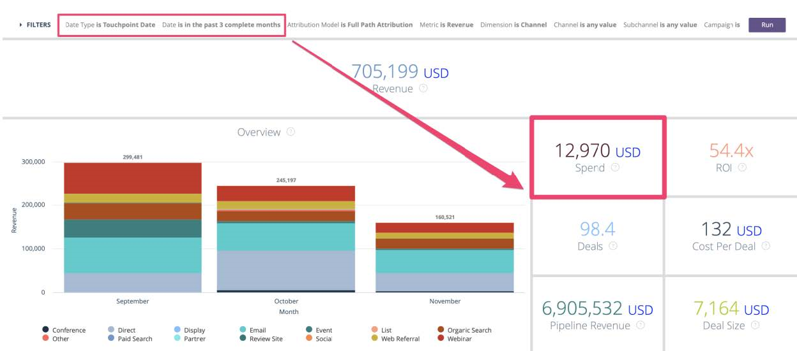

# [!DNL Marketo Measure] 报表指南 {#marketo-measure-reporting-guide}

>[!NOTE]
>
>您可能会看到指定“[!DNL Marketo Measure]“ ”，但仍会在您的CRM中看到“Bizible”。 我们正在努力更新该版本，并且该品牌重命名将很快地反映在您的CRM中。

在构建 [!DNL Marketo Measure] 报告，确认 [!DNL Marketo Measure] 帐户设置已进行审核和配置，以确保报表中的数据准确无误，并反映您业务的具体情况。 此外，报告项目在遵循结构化流程时效果最佳。 贾斯汀·诺里斯， [!DNL Marketo Measure] 来自 [佩尔库托](https://perkuto.com/) 专业总结 [如何在 [!DNL Marketo Measure]](https://perkuto.com/blog/turning-attribution-data-into-actionable-insights/):

**建立目标**:“首先要问的问题是‘我们为什么要衡量？ Lori Wizdo的 [Forrester Research](https://go.forrester.com/) 很好地概括了 [Marketo网络研讨会](https://www.marketo.com/webinars/beyond-revenue-performance-real-kpis-of-b2b-marketing/). 据她说，“我们采取措施来证明或验证一项决策或营销价值，或改善（流程改进）。” 我们还补充说，良好衡量的洞察也为营销规划过程提供投入和指导。

所以在你开始之前，必须明确你的目标，你试图回答的问题，或者你试图解决的问题。 你想讲什么故事？ 结果会做出哪些决定？ 这些基本面因素往往被人们误以为是，导致所有相关方都感到沮丧。”

**报表设计**:“接下来，您需要设计报表并确定报表将包含的特定维度、量度和数据集。 一种常见的体验是向业务用户提供他们所要求的内容，只是让他们仍然感到自己的需求没有得到满足。 这是因为业务用户实际正在查找的洞察并非总是包含在他们请求的报表中。 一位好的分析师（或一位拥有分析师的MOPS人员）将提出澄清问题，建立共同的定义（“那么，你真正的意思是领导？”），甚至勾勒出最终报告的视觉画面，以确保一致。 只有这样，您才能构建报告，因为您知道自己有一套可靠的要求。”

**报表生成**:“一旦你去建筑，遇到路障或死胡同的情况并不罕见。 例如，您可能会发现您缺少基本数据点，或者您的对象没有以您需要的方式链接。 为了解决这些问题，我还认为，了解报告“机器”中“机壳下”正在发生的情况至关重要。 这种流利性将使您能够快速确定报告请求的大小，并评估它是否可实现（如果不能，则更容易设计出创意解决方案）。”

让我们看看“引擎盖下”，以更好地了解是什么让 [!DNL Marketo Measure] 归因报表计算机运行。

## 买方接触点对象(CRM) {#buyer-touchpoint-objects-crm}

在最高级别，根据两个不同的买方接触点对象，有两个报表类别：这些类别决定了 [!DNL Marketo Measure] 要报告的数据包括：与 _个人_，或与 _机会_.

1. **买方接触点** (BT)/个人/总参与度

   * 通常用于“漏斗顶部”(TOFU)量度和与 _个人_ (潜在客户、联系人、 [!DNL Marketo Measure] 人员)
   * BT用于了解与 **人员**，因为它们包含每个人的完整接触点历史记录。 提醒一下，这些接触点是在CRM中为匿名的首次联系、潜在客户创建联系以及您选择从离线营销活动或活动同步的任何后续表单提交或接触点创建的。

1. **买方归因接触点** (BAT)/机会/帐户级别/收入

   * 通常用于“漏斗的中间和/或底部”（MOFU和BOFU）量度以及与 _机会_.
   * BAT代表与 **机会** （通过Opportunity Contact Roles或通过共享的帐户ID，具体取决于您的设置）。 与仅与人相关的BT不同，BAT也可以与 **收入**. 因此，您将使用BAT来回答与业务机会相关的问题，包括已打开或关闭的业务机会数量，或获得的管道价值和收入。

>[!NOTE]
>
>BAT是由BT创建的。 基本上，跟踪从单个级别通过BT开始。 在Account上创建Opportunity后，将引用同一Account下Contacts中的所有BT，并有资格创建与Opportunity相关的BAT，因此您将希望使用一个或另一个，具体取决于您尝试回答的问题：与“人员”量度（BT报表）相关的问题，或与“机会”量度（BAT报表）相关的问题

支持文章： [买方接触点与买方归因接触点之间的差异](/help/configuration-and-setup/getting-started-with-marketo-measure/difference-between-buyer-touchpoints-and-buyer-attribution-touchpoints.md#configuration-and-setup)

## 买方接触点(BT) {#buyer-touchpoint-bt}

买方接触点(BT)是用于跟踪某人与您的营销材料进行的每次营销互动的对象。 每个人(潜在客户/联系人/[!DNL Marketo Measure] 人员)历程将由其相关的BT来表示。 在 [!DNL Marketo Measure]，个人历程包括：

1. 这个人是如何首次与我们的品牌互动的？ (首次联系或 _FT_)
1. 此人是如何转化/成为已知/成为潜在客户的？ (商机创建或 _LC_)
1. 此人自成为潜在客户以来，还是如何与我们的品牌和营销材料进行交互的？ (_PostLC_)

买方接触点用于回答与 _人员_ （“人员”由CRM中的潜在客户或联系人表示），例如商机/联系人生成或客户获取量度，而不是与商机相关的量度。 例如：

* 哪些渠道提供的商机最多？
* 哪些渠道创建新潜在客户的成本较高或较低？
* 我的潜在客户/联系人与哪些内容互动？
* 特定标题、角色、角色的营销故事是什么？
* 哪些渠道驱动MQL或其他潜在客户/联系人状态？

公司首先需要知道，“我的潜在客户/联系人来自哪里？”。 过去，我们会使用单维值（例如，潜在客户源）来回答这个问题。 但是，如上文#1和#2中所述，我们知道潜在客户在成为潜在客户的历程中可能具有多个接触点。 通过买方接触点，我们可以深入了解两个最关键的交互，这些交互表示商机的生成方式：首次联系和潜在客户创建联系。 买方接触点也 _多维_ 这意味着它们包含大量营销数据，主要是人员来自何处（营销渠道）以及参与其中的人员（内容）。

的 [归因模型](/help/introduction-to-marketo-measure/overview-resources/marketo-measure-attribution-models.md) 对基于人员的量度提供最佳分析包括：

* **首次接触**  — 将100%的点数归因到“首次接触”(FT)
* **商机创建**  — 将100%的归因点数归因到潜在客户创建联系(LC)
* **U型**  — 多触点方式，40%的点数归英国《金融时报》，40%点数归信给信用证

<table> 
 <tbody>
  <tr>
   <td></td> 
   <td>U形模型旨在为任何买方接触点提供点数，这些接触点汇总了潜在客户如何成为潜在客户。 虽然也可以报告这些潜在客户的后续接触点以了解其他参与情况(Post LC)，但它们不属于 <strong>商机创建历程</strong> 因此，他们在FT、LC或U型模型中没有获得任何归因点数。

&#42;最常见的是，U型归因反映了FT和LC之50/50的偶数拆分。 如果潜在客户在与首次接触相同的会话中进行转化，则单个接触点将同时表示FT和LC接触点位置。 因此，100%的归因将分配给单个接触点。</td>
</tr>
 </tbody>
</table>

这些模型重点强调了早期交互和漏斗参与度的最高。 U型归因是推荐的模型，因为它在FT和LC接触点中都会考虑因素，确保将点数分给影响Lead创建的任何接触点。 但是，如果您希望更详细地了解潜在客户历程的这些特定部分，则可以从首次联系和潜在客户创建联系模型中获得更多洞察。

## 使用买方接触点(BT)的推荐报表 {#recommended-reports-using-the-buyer-touchpoint-bt}

1. **具有买方接触点的潜在客户**

**1.1 |按营销渠道划分的新潜在客户**

按字段“营销渠道”汇总潜在客户的购买者接触点数据是最高级别的视图，它表示哪些渠道/策略正在影响新潜在客户的创建过程。 围绕“日期类型”=“创建日期”构建此报表时，可确保在报表中建立“净新潜在客户”同类群组（在CRM中创建潜在客户时）。

<table> 
 <tbody>
  <tr>
   <td>问题</td> 
   <td>哪些营销渠道会影响Lead的创建过程？</td> 
  </tr>
  <tr>
   <td>报表类型</td> 
   <td>潜在客户和购买者接触点(CRM) 
   量度：潜在客户([!DNL Marketo Measure] Discover)</td> 
  </tr>
  <tr>
   <td>日期字段/日期类型</td> 
   <td>潜在客户创建日期(CRM)/创建日期(Discover)</td> 
  </tr>
  <tr>
   <td>日期范围</td> 
   <td><i>选择所需日期范围</i></td> 
  </tr>
  <tr>
   <td>组/Dimension</td> 
   <td>营销渠道</td> 
  </tr>
  <tr>
   <td>最佳模型</td> 
   <td>首次联系、商机创建、 <strong>U型</strong> 
   *对CRM报表中的“计数”字段求和（计数 — 首次联系、计数 — 商机创建、计数 — U型）</td> 
  </tr>
 </tbody>
</table>

>[!TIP]
>
>对于任何“具有买方接触点的潜在客户”报表类型，首先应自定义标题为“[!DNL Marketo Measure] 101 |按渠道划分的潜在客户&#39;。 此报表是开箱即用的，是一个按上表所述预先构建的绝佳沙盒，可快速自定义以满足更具体的报告需求。

**1.2 |按促销活动划分的新潜在客户（或更多粒度分析）**

如需对“按营销渠道划分的新潜在客户”报表(1.1)中汇总的数据进行更细的分析，请在营销活动级别添加其他摘要。 这样，您不仅可以了解哪些“营销渠道”正在推动新潜在客户的创建，更具体地说，这些渠道中的哪些促销活动效果最佳：

<table> 
 <tbody>
  <tr>
   <td>问题</td> 
   <td>什么 <i>营销活动</i> 是否会影响Lead的创造？</td> 
  </tr>
  <tr>
   <td>报表类型</td> 
   <td>潜在客户和购买者接触点(CRM) 
   量度：潜在客户([!DNL Marketo Measure] Discover)</td> 
  </tr>
  <tr>
   <td>日期字段/日期类型</td> 
   <td>潜在客户创建日期(CRM)/创建日期(Discover)</td> 
  </tr>
  <tr>
   <td>日期范围</td> 
   <td><i>选择所需日期范围</i></td> 
  </tr>
  <tr>
   <td>组/Dimension</td> 
   <td>广告促销活动名称(CRM)</td> 
  </tr>
  <tr>
   <td>最佳模型</td> 
   <td>首次联系、商机创建、 <strong>U型</strong> 
   *对CRM报表中的“计数”字段求和（计数 — 首次联系、计数 — 商机创建、计数 — U型）</td> 
  </tr>
 </tbody>
</table>

>[!TIP]
>
>通过使用买方接触点对象中的其他可用字段汇总报表，获取更详细的洞察信息。 为此，请设置其他分组(CRM)或维度(Discover)。 根据渠道（可能代表您的角色），可能会有超出营销活动级别的其他详细信息，以便您深入了解。 让我们深入研究“付费搜索”，例如下表中的……

<table> 
 <tbody>
  <tr>
   <td>问题</td> 
   <td>什么 <i>关键词</i> 是否会影响Lead的创造？</td> 
  </tr>
  <tr>
   <td>报表类型</td> 
   <td>潜在客户和购买者接触点(CRM) 
   量度：潜在客户([!DNL Marketo Measure] Discover)</td> 
  </tr>
  <tr>
   <td>过滤器</td> 
   <td>营销渠道=付费搜索</td> 
  </tr>
  <tr>
   <td>日期字段/日期类型</td> 
   <td>潜在客户创建日期(CRM)/创建日期(Discover)</td> 
  </tr>
  <tr>
   <td>日期范围</td> 
   <td><i>选择所需日期范围</i></td> 
  </tr>
  <tr>
   <td>组/Dimension</td> 
   <td>关键词文本(CRM)/关键词(Discover)</td> 
  </tr>
  <tr>
   <td>最佳模型</td> 
   <td>首次联系、商机创建、 <strong>U型</strong> 
   *对CRM报表中的“计数”字段求和（计数 — 首次联系、计数 — 商机创建、计数 — U型）</td> 
  </tr>
 </tbody>
</table>

粒度级别可能因渠道而异。 推荐的方法是问自己，“我希望更详细地了解‘渠道X’呢？” 付费搜索管理者还可能对其他维度感兴趣，例如：

* 广告促销活动名称
* 广告内容
* 广告组

但是，事件管理器可能更感兴趣的是哪些特定事件或哪些类型的事件对创建的潜在客户影响最大：

* 广告促销活动名称/ Salesforce促销活动=特定事件
* 媒介=促销活动“类型”

**提醒**:可能需要向上述或下面概述的任何报表变体中添加其他过滤器。 这些过滤器将特定于您的组织，并且是营销运营或销售运营团队可以提供建议的过滤器。 组织在所有报表中运行相同的过滤器，以确保报表尽可能清晰准确，这种情况并不罕见。 常见示例包括：

* 从测试中过滤掉任何内部记录（通常按电子邮件地址）
* 根据特定于您的业务部门的特定“记录类型”进行过滤

**1.3 |按内容划分的新潜在客户（仅限CRM报表）**

<table> 
 <tbody>
  <tr>
   <td>问题</td> 
   <td>什么 <i>内容</i> 是否会影响Lead的创造？</td> 
  </tr>
  <tr>
   <td>报表类型</td> 
   <td>潜在客户和购买者接触点(CRM)</td> 
  </tr>
  <tr>
   <td>日期字段</td> 
   <td>潜在客户创建日期</td> 
  </tr>
  <tr>
   <td>日期范围</td> 
   <td><i>选择所需日期范围</i></td> 
  </tr>
  <tr>
   <td>组/Dimension</td> 
   <td>登陆页面  
   表单URL</td> 
  </tr>
  <tr>
   <td>最佳模型</td> 
   <td>首次联系、商机创建、 <strong>U型</strong> </td> 
  </tr>
 </tbody>
</table>

**提醒**:用于报告数字内容/资产的两个主要字段是“登陆页面”和“表单URL”。 如果潜在客户在其“登陆”（登陆页面）的同一页面上转化（提交表单），则这两个值可能相同。 _hatter_，有时这些值会不同。 例如，潜在客户可以单击Facebook上的链接，以将他们转到您网站的某个页面（这将是“登陆页面”值）。 然后，潜在客户可以离开该页面，在网站上继续其会话，并最终在另一个页面（表单URL）上提交表单。 这将在单个接触点中进行汇总，以表示潜在客户的来源（营销渠道）、将他们带到网站的内容（登陆页面）以及他们最终下载的内容（表单URL）。 “表单URL”还是用于报告与可下载内容（如“联系我们”或“演示请求”表单）无关的其他表单的首选字段。

>[!TIP]
>
>通过其他过滤器深入了解特定的“内容”
>
>* 过滤依据：“登陆页面”包含（例如）：
   >   * /blog
   >   * /ebook
   >   * /网络研讨会
>
>* 或：“表单URL”包含（例如）
   >   * /contact
   >   * /demo

基于“内容”的报表在报告漏斗的任何部分时都会非常有用，但最常用的报表位于漏斗顶部，可提供有关潜在客户初始参与的更多分析。 考虑到“自然搜索”往往是促进初始参与度(FT)的最强渠道，“促销活动”级别的数据并不多。

基于“内容”的报表非常有助于深入了解哪些因素促使更高级别的营销渠道（在本例中为“自然搜索”）中具体地推动潜在客户。

**1.4 |给定日期范围内的潜在客户参与总数**

<table> 
 <tbody>
  <tr>
   <td>问题</td> 
   <td>哪些营销渠道拥有最多 <i>总商机参与度</i> 过去（周/月/季度）？</td> 
  </tr>
  <tr>
   <td>报表类型</td> 
   <td>潜在客户和购买者接触点(CRM)  
   量度：潜在客户([!DNL Marketo Measure] Discover)</td> 
  </tr>
  <tr>
   <td>日期字段/日期类型</td> 
   <td>接触点日期</td> 
  </tr>
  <tr>
   <td>日期范围</td> 
   <td><i>选择所需日期范围</i></td> 
  </tr>
  <tr>
   <td>组/Dimension</td> 
   <td>营销渠道（或更精细）</td> 
  </tr>
  <tr>
   <td>最佳模型*</td> 
   <td>*此报表不是关于通过归因模型衡量潜在客户的来源，而是关于 <i>接触点总数（参与量）</i>，包括“潜在客户创建联系”之后的受众。 接触点的总记录计数将反映哪些渠道的潜在客户参与率最高。</td> 
  </tr>
 </tbody>
</table>

**提醒**:在“接触点日期”之前生成报表，是了解特定日期范围内营销效果的最反映方式。 “接触点日期”在构建报表时，其归因不仅与渠道、营销活动或内容相关，还会显示接触点发生的时间。 这是了解营销参与在特定时间点发生的情况的最有效方法，也是衡量营销影响的推荐方法，因为它与同时投资的营销支出相比。 在进行任何营销支出或ROI分析时，建议使用此方法（请参阅5.1）。

**2. 具有购买者接触点的营销合格潜在客户**

最常见的报表之一不仅侧重于新的潜在客户或潜在客户级别参与，而且更具体地说是“营销合格的潜在客户”(MQL)。 在报告MQL时，根据 [!DNL Marketo Measure] 功能。

**2.1 |按渠道划分的营销合格潜在客户（多接触）**

这种衡量营销对影响MQL的影响的方法本质上是“通过营销渠道添加新的潜在客户”(1.1)报表的延续，但还附加了一些标准，即要测量的潜在客户更具体地是MQL。 此处仍建议使用U型归因模型来识别哪些营销渠道和内容会生成随后会生成的潜在客户 _可能_ 要成为MQL，请执行以下操作：

<table> 
 <tbody>
  <tr>
   <td>问题</td> 
   <td>哪些营销渠道最擅长生成新的商机 <i>MQL</i>?</td> 
  </tr>
  <tr>
   <td>报表类型</td> 
   <td>潜在客户和购买者接触点(CRM)  
   量度：潜在客户([!DNL Marketo Measure] Discover)</td> 
  </tr>
  <tr>
   <td>过滤器</td> 
   <td>MQL = true* 
   *<i>MQL的定义方式可能因组织而异。 确保 [!DNL Marketo Measure] 会使用与其他基于MQL的报表相同的字段过滤MQL的报表。 需要以与 [!DNL Marketo Measure] 发现。</i></td> 
  </tr>
  <tr>
   <td>日期字段/日期类型</td> 
   <td>MQL日期（或等效日期）/创建日期([!DNL Marketo Measure] Discover)  <i>如果CRM中不包含“MQL日期”选项，则还可以在CRM报表中使用潜在客户创建日期。 请务必记住您在其中使用的日期字段定义同类数据集。</i></td> 
  </tr>
  <tr>
   <td>日期范围</td> 
   <td><i>选择所需日期范围</i></td> 
  </tr>
  <tr>
   <td>组/Dimension</td> 
   <td>营销渠道</td> 
  </tr>
  <tr>
   <td>最佳模型</td> 
   <td>首次联系、商机创建、 <strong>U型</strong>  
   对CRM报表中的“计数”字段求和（计数 — 首次联系、计数 — 商机创建、计数 — U型）</td> 
  </tr>
 </tbody>
</table>

**2.2 |按渠道划分的营销合格潜在客户（仅限单次接触，CRM）**

这种衡量营销对MQL影响的方法更注重于确定 _单一接触点_ 是潜在客户到达MQL之前的最后一次联系。

>[!NOTE]
>
>要运行此报表，需要“MQL”的“潜在客户状态”值来定义MQL阶段以用于跟踪目的（漏斗阶段）。 如果未通过“潜在客户状态”字段跟踪MQL，则需要具有自定义阶段功能的自定义归因模型，才能在 [!DNL Marketo Measure] 帐户设置。

<table> 
 <tbody>
  <tr>
   <td>问题</td> 
   <td>哪些营销渠道在推送潜在客户达到MQL状态方面最强？</td> 
  </tr>
  <tr>
   <td>报表类型</td> 
   <td>潜在客户和购买者接触点(CRM) 
   <i>此报表只能在CRM报表中使用。 无法过滤 [!DNL Marketo Measure] Discover</i></td> 
  </tr>
  <tr>
   <td>过滤器</td> 
   <td><strong>接触点位置包含“MQL”</strong></td> 
  </tr>
  <tr>
   <td>日期字段/日期类型</td> 
   <td>MQL日期（或等效项）</td> 
  </tr>
  <tr>
   <td>日期范围</td> 
   <td><i>选择所需日期范围</i></td> 
  </tr>
  <tr>
   <td>组/Dimension</td> 
   <td>营销渠道</td> 
  </tr>
  <tr>
   <td>最佳模型</td> 
   <td><i>由于此报表是在单个接触点上过滤的，因此潜在客户级别归因模型没有那么相关。 与“潜在客户参与报表”(1.4)一样，此处将利用接触点记录数来了解哪些渠道最强（每个潜在客户将只有一个MQL接触点）。</i></td> 
  </tr>
 </tbody>
</table>

>[!TIP]
>
>浏览其他分组或维度，以进一步了解MQL。 如其他“具有购买者接触点的潜在客户”报表中所述，购买者接触点提供的粒度比营销渠道大得多。 基于“内容”的报表还可以与上述任一MQL报表结合使用，以更好地了解哪些内容对MQL有最佳影响。

**3. [!DNL MARKETO MEASURE] 具有买方接触点的人**

第三种习俗 [!DNL Marketo Measure] 对象，在报告与人员相关的量度时非常有用： **the [!DNL Marketo Measure] 人员(BP)**. 该BP解决了如何在同一报表中同时表示潜在客户和联系人信息的古老问题。 它将与“人员”( [!DNL Marketo Measure] 人员ID是其电子邮件地址)。 无论它们是作为潜在客户还是作为联系人存在，BP都会充当桥梁对象，帮助报表跨越潜在客户和联系人，并在生成更复杂的人员报告时非常有用。

的 [!DNL Marketo Measure] 人员仅与其中一个接触点对象(即买方接触点(BT))相关。 这意味着它不能用于与Opportunity或收入相关的量度。 A `[!DNL Marketo Measure] 人员和采购员接触点的报表类型非常有助于了解 _总参与度_ 因为它显示所有BT，无论BT与引线或接触有关，都更具体。 例如 — 如果您使用Salesforce促销活动来跟踪事件，则CRM促销活动中的促销活动成员可能以潜在客户或联系人的身份存在。 [!DNL Marketo Measure] 将为营销活动成员创建接触点，但没有 [!DNL Marketo Measure] 人员，标准Salesforce报表将需要两个单独的报表来了解有多少个 _总计_ 您在事件中的接触点：一个是“与买方接触点的潜在客户”，另一个是“与买方接触点的联系”。 其他几个 [!DNL Marketo Measure] 以下列出了基于人员的报告用例：

**3.1 [!DNL Marketo Measure] 已下载“电子书”或“白皮书”（总下载量）的人员**

此报表与潜在客户级别的基于“内容”的报表相同。 但是，不是使用 [!DNL Marketo Measure] 人员报表有助于了解总数 _下载次数_ 如果资产已设置门限（接触点总数将表示下载/表单提交的总数）。

<table> 
 <tbody>
  <tr>
   <td>问题</td> 
   <td>有多少人下载了特定资产？</td> 
  </tr>
  <tr>
   <td>报表类型</td> 
   <td>[!DNL Marketo Measure] 人员和购买者接触点(CRM)</td> 
  </tr>
  <tr>
   <td>过滤器</td> 
   <td>“表单URL”包含（例如） 
   <li>/ebook</li>
   <li>/白皮书</li>
   <i>上述过滤器值仅为示例。 实际值将基于每个组织的URL结构。</i></td> 
  </tr>
  <tr>
   <td>日期字段/日期类型</td> 
   <td>接触点日期 <i>（资产何时下载）</i></td> 
  </tr>
  <tr>
   <td>日期范围</td> 
   <td><i>选择所需日期范围</i></td> 
  </tr>
  <tr>
   <td>组/Dimension</td> 
   <td>表单URL</td> 
  </tr>
  <tr>
   <td>最佳模型</td> 
   <td>此报表不是关于通过归因模型来衡量潜在客户或联系人的来源，而是关于 <i>接触点总数（参与量）</i>，包括“潜在客户创建联系”之后的受众。 通过这份报告，我们希望了解 <i>总参与量</i>. 接触点的总记录计数将反映下载次数最多的资产。</td> 
  </tr>
 </tbody>
</table>

>[!TIP]
>
>对于任何 [!DNL Marketo Measure] 人员报表类型，首先自定义标题为“**[!DNL Marketo Measure]101 |按渠道划分的潜在客户/联系人**&#39;。 此报表现成可用，非常出色 [!DNL Marketo Measure] 基于人员的沙箱。 它是预建的，可以快速自定义以满足更具体的报告需求。

>[!TIP]
>
>您可以使用此报表从购买者接触点对象深入了解任何营销维度的总参与度，而不仅仅是示例中展示的内容下载。 相反，可以按“营销渠道”或“广告促销活动名称”等维度对报表进行分组或过滤，以便更好地了解数据库中潜在客户和联系人的参与总数。 只需将报表中的过滤器或分组更改为专门用于接触点对象中由其他字段表示的其他维度。

**3.2 [!DNL Marketo Measure] 已注册事件的人员（仅限CRM）**

_仅当注册表单托管在您的网站(这些网站 [!DNL Marketo Measure] 能够进行数字跟踪。_

<table> 
 <tbody>
  <tr>
   <td>问题</td> 
   <td>哪些营销渠道可推动我的事件注册？</td> 
  </tr>
  <tr>
   <td>报表类型</td> 
   <td>[!DNL Marketo Measure] 人员和购买者接触点(CRM)</td> 
  </tr>
  <tr>
   <td>过滤器</td> 
   <td>“表单URL”包含（例如） 
   <li>/事件</li>
   <i>上述过滤器值仅为示例。 实际值将基于每个组织的URL结构。</i></td> 
  </tr>
  <tr>
   <td>日期字段/日期类型</td> 
   <td>接触点日期 <i>（提交登记表时）</i></td> 
  </tr>
  <tr>
   <td>日期范围</td> 
   <td><i>选择所需日期范围</i></td> 
  </tr>
  <tr>
   <td>组/Dimension</td> 
   <td>表单URL 
   营销渠道</td> 
  </tr>
  <tr>
   <td>最佳模型</td> 
   <td>此报表不是关于通过归因模型来衡量潜在客户或联系人的来源，而是关于 <i>接触点总数（注册数）</i>，包括“潜在客户创建联系”之后的受众。 通过此报表，我们希望深入了解哪些因素会促进事件注册。 每个“营销渠道”的接触点总记录计数将反映哪些渠道的注册量最多。</td> 
  </tr>
 </tbody>
</table>

此报表的关键收获是，买方接触点数据还将提供营销渠道数据。 虽然您已经对为您的事件注册的人数有了深入了解，但此报表还将提供有关数字营销渠道、来源和/或营销活动将用户引至您的网站以注册该事件的分析。

>[!TIP]
>
>在查找网络研讨会注册或可能是按需网络研讨会下载（如果它们是封闭式资产）的洞察信息时，也可以采用同样的方法。 如果这些表单托管在您网站的独特页面上，则唯一的区别是“表单URL”中的过滤器值。 但目标是相同的。 它回答了以下问题：“我的哪些营销渠道在网络研讨会下载中的注册次数/按需次数最多。

**3.3 [!DNL Marketo Measure] 具有买方接触点的人员（接触点验证）**

考虑 [!DNL Marketo Measure] “人员”允许我们在一个报表中报告所有接触点，这是您在验证数据时理想的报表类型。 我们希望确保我们不会忽略任何可能显示“营销渠道”配置中某个问题的接触点（请参阅下面链接的支持文章，以了解有关配置“营销渠道”的更多信息）。

* [在线自定义渠道设置](/help/channel-tracking-and-setup/online-channels/online-custom-channel-setup.md)
* [脱机自定义渠道设置](/help/channel-tracking-and-setup/offline-channels/offline-custom-channel-setup.md)

基本上，接触点数据将反映 [!DNL Marketo Measure] 并且可以进行审核，以确保您的配置根据以下内容匹配输入：UTM参数值、引荐页面或促销活动类型。 如果接触点数据与您的配置不匹配，则最可能需要调整某些内容。 除了“营销渠道”设置之外，您还可以查看接触点数据以确定可能需要哪些接触点 [抑制](/help/advanced-marketo-measure-features/touchpoint-settings/touchpoint-removal-and-touchpoint-suppression.md) 或 [分段](/help/advanced-marketo-measure-features/segmentation/custom-segmentation.md). 建议在“[!DNL Marketo Measure] 人员和采购员接触点报表（如果可能）。 这将确保您的归因尽可能准确。 &#39;[!DNL Marketo Measure] 101 |现成可用的“按渠道划分的潜在客户/联系人”报表是一个很好的入手点。 如果尚未包含以下字段来查看一些最关键的配置片段，请包括这些字段：

* **营销渠道**  — 路径=营销渠道。子渠道(在 [!DNL Marketo Measure])
* **接触点源** = utm_source
* **中** = utm_medium（在线接触点）或CRM促销活动类型（离线接触点）
* **反向链接页面** （使用“在线渠道”配置）
* **登陆页面 — 原始** （使用“在线渠道”配置）也是“设置”的“接触点设置”选项卡中用于触点抑制的常用输入)
* **表单URL** （在“设置”的“接触点设置”选项卡中，用于显示接触点隐藏的常用输入）

**买方归因接触点(BAT)**

买方归因接触点(BAT)代表与Opportunity连接的所有联系人的相关接触点（通过Opportunity Contact Roles或通过共享帐户ID，具体取决于您的设置）。 与BT（主要与人员有关）不同，BAT可与收入关联。 因此，您将使用BAT来回答与机会相关的问题，主要是开放式 _机会/管道收入_ 和闭门的韩元 _商机/交易/收入_. 一旦在与联系人相同的帐户下创建了Opportunity（BT不会转换为BAT），就会通过联系人的BT记录创建BAT。 BT数据仅用于创建附加记录，即随后与Opportunity相关的BAT)。

“购买者归因接触点”允许我们在漏斗中更深入地衡量营销的影响。 _要测量的漏斗深度可以由各种多接触归因模型来表示_.

考虑到BAT与Opportunity的主要关系，它们被用来回答诸如：

* 我的哪些营销工作对Opportunity的影响最大？
* 我可以将每个营销渠道的新管道收入归因到多少？
* 我的哪些营销活动上季度的ROI最高？

的 [归因模型](/help/introduction-to-marketo-measure/overview-resources/marketo-measure-attribution-models.md) 对基于机会的量度提供最佳分析包括：

**W形**  — “_管道模型_&#39;。 W型模型中包含三个里程碑接触点。 在此模型中，FT、LC和OC接触点均归因于归因点数的30%。 其余10%均归因于三个里程碑接触点之间发生的任何中间接触点。

<table> 
 <tbody>
  <tr>
   <td></td> 
   <td>此模型基本上总结了新Opportunity的旅程，该新Opportunity通常与新Pipeline Revenue的生成同义。

   

   当想要衡量营销对新Opportunity或生成的新管道的影响时，建议使用W型模型。</td> 
  </tr>
 </tbody>
</table>

**完整路径**  — “_闭式Won模型_&#39;。 此模型包括四个里程碑接触点：英国《金融时报》、LC、OC和Closed。 每个Opportunity分得22.5%的点数，其余10%的点数在中间接触中平均分配。

<table> 
 <tbody>
  <tr>
   <td></td> 
   <td>此模型基本上总结了已完成交易的历程，该历程通常与已完成的收入/预订同义。

   

   当要衡量营销对已结赢取交易或已结赢取收入的影响时，建议使用完整路径模型。</td> 
  </tr>
 </tbody>
</table>

此模型基本上总结了已完成交易的历程，该历程通常与已完成的收入/预订同义。

当要衡量营销对已结赢取交易或已结赢取收入的影响时，建议使用完整路径模型。

**自定义** - [!DNL Marketo Measure] 此外，还提供了自定义归因模型，允许用户选择要包含在其模型中的接触点或自定义阶段。 此外，用户还可以控制归因到这些接触点和阶段的归因点数百分比。 根据自定义模型的设置，它最适合用于测量Opportunity和Pipeline OR、Deals和Closed Won Revenue。 在报表中使用时，请牢记这一点。

>[!NOTE]
>
>自定义归因模型是并非所有客户都可用的一项附加功能。 请联系您的客户成功经理，以详细了解如何将此功能添加到您的帐户。

通常，营销人员需要知道“我的机会来自哪里？”。 与“潜在客户”级别报表类似，该问题过去通过单个一维值（例如，主要促销活动来源）来回答。 但是，我们知道，与单个联系人中的单个接触点相比，在开发Opportunity方面投入的资源要多得多。 通常，来自不同渠道和多个利益相关方的多个接触点会影响Opportunity的创建。 使用 [!DNL Marketo Measure]，我们可以显示帐户中的所有接触点，以便最好地了解Opportunity的来源。 但是，除此之外，我们可以继续显示在Opportunity创建之后发生的任何接触点，直至Opportunity关闭为止。 这样，我们不仅可以采用多接触方法来了解Opportunity的来源，而且还可以了解Opportunity在完成并最终代表已结束的赢得收入方面有哪些影响。 这可以深入了解不同的问题，例如“营销对影响交易的影响是什么？”、“什么营销驱动了已结交易赢得收入？” 最终，“我的哪些营销工作的投资回报率最高？”

## 使用买方归因接触点(BAT)的推荐报表 {#recommended-reports-using-the-buyer-attribution-touchpoint}

**4.1 |按营销渠道划分的新机会**

按字段“营销渠道”汇总您的机会的购买者归因接触点数据是最高级别的视图，它表示哪些渠道/策略正在影响新机会的创建过程。 围绕“日期类型” = “业务机会创建日期”构建此报表，可确保我们还根据在您的CRM中实际创建业务机会的时间来总结此报表。 接触点可能是在之前的某个时间开始的，但它们仍将与已在定义的日期范围内创建的Opportunity相关，因此在被确认为影响Opportunity时会获得归因点数。

<table> 
 <tbody>
  <tr>
   <td>问题</td> 
   <td>什么 <i>营销渠道</i> 是否在创造机会？</td> 
  </tr>
  <tr>
   <td>报表类型</td> 
   <td>具有机会的购买者归因接触点(CRM)  
   量度：机会([!DNL Marketo Measure] Discover)</td> 
  </tr>
  <tr>
   <td>过滤器</td> 
   <td>
   <li>机会阶段* <i>(可选，具体取决于您可能希望限制到报表的特定Opportunity。 例如，您可能只想报告仍仅与“Open”Opportunity关联的BAT)</i></li>
   <li>Opportunity Type(通常在以下特定Opportunity上筛选：“新业务”，而不是 <i>全部</i> 机会)</li> 
   *应在 [!DNL Marketo Measure] Discover</td> 
  </tr>
  <tr>
   <td>日期字段/日期类型</td> 
   <td>机会创建日期(CRM)/创建日期(Discover)</td> 
  </tr>
  <tr>
   <td>日期范围</td> 
   <td><i>选择所需日期范围</i></td> 
  </tr>
  <tr>
   <td>组/Dimension</td> 
   <td>营销渠道</td> 
  </tr>
  <tr>
   <td>最佳模型</td> 
   <td><strong>W形</strong> 
   对CRM报表中的“W型”字段求和（计数 — W型、收入 — W型）</td> 
  </tr>
 </tbody>
</table>

>[!TIP]
>
>对于任何“具有机会的买方归因接触点”报表类型，首先自定义标题为“[!DNL Marketo Measure] 101 |按渠道列出的机会’。 此报表是现成可用的，是如上表中所述预先构建的一个大型沙盒，可根据更具体的报表需求快速进行自定义(报表使用现成的完整路径模型，因此请务必自定义报表以包含任何其他归因模型（在本例中为W型模型）。

>[!TIP]
>
>上述报告还将用于了解还应归因多少货币。 使用BAT在机会级别报告时，可以概括以下两个关键量度：货币（Opportunity的金额）和Opportunity记录本身。 在上例中，我们更明确地测量了未结的Opportunity和新的Pipeline收入。

>[!TIP]
>
>通过从购买者归因接触点对象中将报表与其他可用字段一起汇总，获取更加精细的洞察信息。 此操作方式与在销售线索级别与买方接触点(1.2)相同。 通过添加其他分组(CRM)或维度(Discover)来执行此操作。 根据渠道（可能代表您的角色），可能会有超出营销活动级别的其他详细信息，您希望在该级别获得更多洞察。 让我们深入研究下面的“付费搜索”：

<table> 
 <tbody>
  <tr>
   <td>问题</td> 
   <td>其中 <i>关键词</i> 我的付费搜索广告产生的管道收入最多？
</td> 
  </tr>
  <tr>
   <td>报表类型</td> 
   <td>具有机会的购买者归因接触点(CRM)  
   量度：机会([!DNL Marketo Measure] Discover)</td> 
  </tr>
  <tr>
   <td>过滤器</td> 
   <td>
   <li>营销渠道=付费搜索</li>
   <li>机会阶段* <i>(可选，具体取决于您可能希望限制到报表的特定Opportunity。 此示例基于在 [!DNL Marketo Measure] 按“Open”Opportunity（代表潜在收入/Open Pipeline）</i></li>
   <li>Opportunity Type(通常在以下特定Opportunity上筛选：“新业务”，而不是 <i>全部</i> 机会)</li> 
   *应在 [!DNL Marketo Measure] Discover</td> 
  </tr>
  <tr>
   <td>日期字段/日期类型</td> 
   <td>机会创建日期</td> 
  </tr>
  <tr>
   <td>日期范围</td> 
   <td><i>选择所需日期范围</i></td> 
  </tr>
  <tr>
   <td>组/Dimension</td> 
   <td>关键词文本(CRM)  
   关键词(Discover)</td> 
  </tr>
  <tr>
   <td>最佳模型</td> 
   <td><strong>W形</strong> 
   对CRM报表中的“W型”字段求和（计数 — W型、收入 — W型）</td> 
  </tr>
 </tbody>
</table>

**4.2 |按营销渠道划分的交易**

此报表与第一个“购买者归因接触点”示例(4.1)基本相同，不同之处在于此量度现已从打开的Opportunity更改为结束的成功交易。 量度应始终是通知要使用的归因模型的量度。 考虑到我们现在正在查看已完成的成功交易及其相关的BAT，我们应使用一个表示整个买方历程（交易）的模型。 这可确保在购买者历程期间的任何营销接触跟踪都会收到归因点数：

<table> 
 <tbody>
  <tr>
   <td>问题</td> 
   <td>什么 <i>营销渠道</i> 是否影响交易完成？</td> 
  </tr>
  <tr>
   <td>报表类型</td> 
   <td>具有机会的购买者归因接触点(CRM)  
   量度：交易([!DNL Marketo Measure] Discover)</td> 
  </tr>
  <tr>
   <td>过滤器</td> 
   <td>
   <li>机会阶段(<i>只应在报表中报告已结束的成功机会</i>)或</li>
   <li>赢得的机会= True</li>
   <li>Opportunity Type(通常在以下特定Opportunity上筛选：“新业务”（而不是所有机会） 
   </td> 
  </tr>
  <tr>
   <td>日期字段/日期类型</td> 
   <td>机会结束日期</td> 
  </tr>
  <tr>
   <td>日期范围</td> 
   <td><i>选择所需日期范围</i></td> 
  </tr>
  <tr>
   <td>组/Dimension</td> 
   <td>营销渠道</td> 
  </tr>
  <tr>
   <td>最佳模型</td> 
   <td><strong>完整路径</strong> 
   对CRM报表中的“完整路径”字段求和（计数 — 完整路径、收入 — 完整路径）</td> 
  </tr>
 </tbody>
</table>

**提醒**:切记要筛选要包含在基于BAT的报表中的特定Opportunity，尤其是当它与“交易和收盘赢得了收入”。 这通常通过“Opportunity Stage”过滤器（“Opportunity Won” = true/false过滤器在此也非常有用）来完成。

**5. ROI([!DNL Marketo Measure] 仅限Discover)**

的 [!DNL Marketo Measure] Discover功能板使用 [!DNL Marketo Measure] 归因数据。 这些汇总功能板提供关键营销支出和ROI数据，这些数据在您的CRM报表中不可用。 此预建环境使您能够根据ROI数据查看营销绩效，从而做出与营销相关的可操作决策。

>[!TIP]
>
>当您遇到与ROI、支出或成本相关的问题时， [!DNL Marketo Measure] Discover将是最佳的报告位置！

的 [!DNL Marketo Measure] Discover功能板由买方接触点和买方归因接触点数据以及关键CRM数据组成。 中CRM报表和报表的主要区别在于 [!DNL Marketo Measure] Discover中的接触点数据以“汇总”方式显示，并按维度（营销渠道、营销活动等）进行汇总 与随后可汇总的单个接触点记录相反。 [!DNL Marketo Measure] Discover非常了解您的哪些工作正在对潜在客户、Opp、Deals产生最大影响，以及应将多少收入归因于这些工作。 在我们通过各种归因模型计算归因收入后（建议使用完整路径来归因已结的赢取收入/预订量），我们便可以根据在同一维度（营销渠道、子渠道或营销活动）中花费的量来测量归因收入。 这样我们就可以 **ROI**.

>[!TIP]
>
>在Discover中报告时要记住的最重要的一点是，您要使用哪种数据类型进行过滤。 日期类型将指示哪个数据集 [!DNL Marketo Measure] 正在各种图块中使用。

* **接触点日期**:显示指定时间范围内具有“接触点日期”的相关数据
* **创建日期**:显示在指定的时间范围内具有“创建日期”的相关数据
* **结束日期**:显示在指定的时间范围内具有“关闭日期”的相关数据

报告 [!DNL Marketo Measure] Discover中，建议使用“日期类型”=“接触点日期”。 为厘定每笔投资之回报，我们需要确保收益归于作出投资当日。 “日期类型”=“接触点日期”可确保报表的结构采用这种方式，而不是在创建Opportunity（创建日期）或关闭（关闭日期）时。 让我们更仔细地看看：

下面重点介绍的过滤器对于 [!DNL Marketo Measure] （您很可能会在“概述”、“CMO”或“ROI”展示板中设置这些过滤器）：

**5.1 | “概述”展示板中的ROI**

“日期”范围不仅可设置接收归因的接触点同类群组（按接触点日期），还可定义“支出”拼贴或列表示的范围。
[!DNL Marketo Measure] 只需查看“日期”范围即可确定总支出，或在营销渠道、子渠道或营销活动级别花费的金额。请参阅下文：

上面的屏幕截图显示了过去3个完整月内的营销支出数据。 在此示例中，所有渠道均花费了12,970美元。 此数字由营销支出数据组成 [!DNL Marketo Measure] 与您任何连接的广告帐户(Google AdWords、Bing Ads、Facebook Ads、LinkedIn、DoubleClick)的集成，以及您帐户中已上传或从CRM中的Campaign记录自动提取的任何其他营销支出。 此示例还显示在同一日期范围内发生的接触点（绿色框）中，还可以将多少结束的“收入”归因于多少接触点。 ROI的计算方式如下：来自同一日期范围内投资之接触点应占收益：

**提醒**: [!DNL Marketo Measure] 将“收入”定义为“已结束的成功收入或预订”，并将“管道收入”定义为 _来自未结业务机会的开放/潜在收入_.

上述ROI报表的另一个重要收获是红框中表示的“管道收入”。 这意味着，从过去3个完整月投资的12,970美元来看，我们目前将705,199美元的“收入”归因于已结束的“收入”，但我们也将6,905,532美元的公开潜在收入（“管道收入”）归因于同一投资所创造的接触点！ 我们希望看到的是一段时间内“Pipeline Revenue”关闭的一部分，为“Revenue”数字提供投资，因此，ROI数字会随着时间而增加。 “支出”数字是固定的，因为我们无法及时返回以在过去3个完整月中花费更多。 这是在任何ROI报表中使用“接触点日期”的“日期类型”的重要性：它定义了&#x200B;**我**)，并确保&#x200B;**R**)收入归因归因于来自投资的相同接触点（每花一美元，赚多少钱？）。

>[!TIP]
>
>在您知道营销支出数据完整准确的营销渠道、子渠道和/或营销活动中进行过滤。 以上示例适用于所有营销渠道，但如果某些渠道未上传相关的营销支出数据，则ROI报表可能会不准确。 请参阅以下示例，此次在“ROI”展示板中，该展示板侧重于“付费搜索”营销渠道中的促销活动，该渠道通过集成具有非常精细的营销支出数据。

