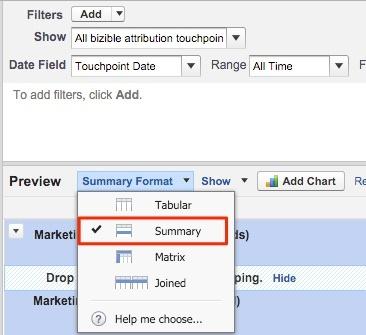
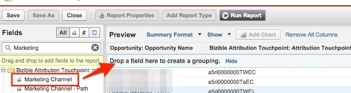

# 按营销渠道列出的机会 {#opportunities-by-marketing-channel}

此报表会显示营销渠道产生的机会数量；它包含您的所有机会。 但是，您可以筛选此报表以分析特定类型的机会。

1. 单击Salesforce中的&#x200B;**[!UICONTROL Reports]**&#x200B;选项卡并选择&#x200B;**[!UICONTROL New Report]**。

1. 在“Bizible归因”中的快速查找类型中，选择&#x200B;**[!UICONTROL Bizible Attribution Touchpoint with Opportunity]**&#x200B;报表类型，然后选择&#x200B;**[!UICONTROL Create]**。

   

1. 从报表顶部开始，显示&#x200B;**[!UICONTROL All Bizible Attribution Touchpoints]**，并根据要报告的时间范围调整日期字段。 在我们的示例中，我们一直都在查看。 此外，将报告格式从[!UICONTROL Tabular]更改为&#x200B;**[!UICONTROL Summary]**。

   

1. 现在，我们将向报告添加字段。 在左侧的快速查找中，键入“Marketing Channel”并将其添加到报表中的摘要分组。

   

1. 现在，运行报告并分析！

   这是按营销渠道汇总的“机会”报表。 此报告侧重于所有Opp，但可以随时根据商机的阶段/类型进行筛选。 此外，您可以随意添加任何要报告的字段。

>[!MORELIKETHIS]
>
>[[!DNL Marketo Measure] 教程： Stock SFDC报告](https://experienceleague.adobe.com/en/docs/marketo-measure-learn/tutorials/onboarding/marketo-measure-102/stock-salesforce-reports){target="_blank"}
