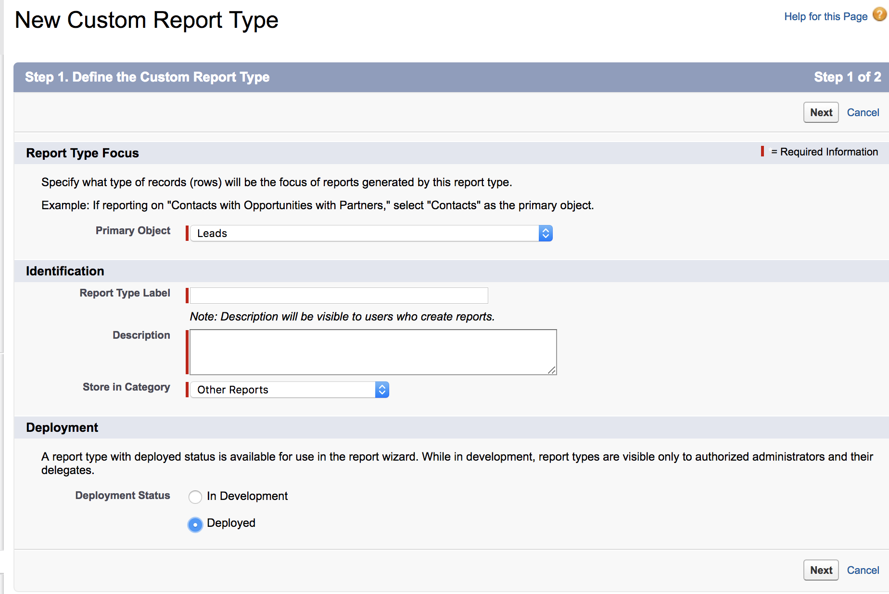

# 创建自定义 [!DNL Marketo Measure] 报表类型 {#creating-custom-marketo-measure-report-types}

>[!NOTE]
>
>您可能会看到说明“[!DNL Marketo Measure]”已添加到我们的文档中，但仍会看到“[!DNL Bizible]”（在您的CRM中）。 我们正在努力更新品牌，并且品牌重塑很快将会反映在您的CRM中。

了解如何创建自定义 [!DNL Marketo Measure] [!DNL Salesforce] 报表类型。 我们建议创建三种不同的报表类型：具有买方接触点的潜在客户（自定义）、 [!DNL Marketo Measure] 具有买方接触点（自定义）的人员，具有买方归因接触点（自定义）的商机。

## 具有买方接触点的潜在客户（自定义） {#leads-with-buyer-touchpoints-custom}

1. 转到 **[!UICONTROL Setup]** > **[!UICONTROL Build]** > **[!UICONTROL Report Types]** > **[!UICONTROL New Custom Report Types]**.

   

1. 定义自定义报表类型。

   * [!UICONTROL Report Type Focus] > [!UICONTROL [!UICONTROL Primary Object]]：潜在客户
   * 标识> [!UICONTROL Report Type Label]：具有买方接触点的潜在客户（自定义）
   * [!UICONTROL Store in Category]：其他报表
   * [!UICONTROL Deployment] > [!UICONTROL Deployment Status]：已部署

   

1. 定义对象关系。

   * 将Lead对象(A)与 [!DNL Marketo Measure] 人员对象(B)，然后是买方接触点对象(C)
   * 请确保&quot;[!UICONTROL Each A/B record must have at least one B/C]已选择“记录”
   * [!UICONTROL Save]

   

## [!DNL Marketo Measure] 具有买方接触点的人员（自定义） {#marketo-measure-person-with-buyer-touchpoints-custom}

1. 转到 **[!UICONTROL Setup]** > **[!UICONTROL Build]** > **[!UICONTROL Report Types]** > **[!UICONTROL New Custom Report Types]**.

   

1. 定义自定义报表类型。

   * [!UICONTROL Report Type Focus] > [!UICONTROL Primary Object]： [!DNL Marketo Measure] 人员
   * [!UICONTROL Identification] > [!UICONTROL Report Type Label]： [!DNL Marketo Measure] 具有买方接触点的人员（自定义）
   * [!UICONTROL Store in Category]：其他报表
   * [!UICONTROL Deployment] > [!UICONTROL Deployment Status]：已部署

   

1. 定义对象关系。

   * 关联 [!DNL Marketo Measure] 人员对象(A)与购买者接触点对象(B)
   * 请确保&quot;[!UICONTROL Each A record must have at least one B]已选择“记录”
   * [!UICONTROL Save]

   

## 具有买方归因接触点的商机（自定义） {#opportunities-with-buyer-attribution-touchpoint-custom}

1. 转到 **[!UICONTROL Setup]** > **[!UICONTROL Build]** > **[!UICONTROL Report Types]** > **[!UICONTROL New Custom Report Types]**.

   

1. 定义自定义报表类型。

   * [!UICONTROL Report Type Focus] > [!UICONTROL Primary Object]: 机会
   * [!UICONTROL Identification] > [!UICONTROL Report Type Label]：通过买方归因接触点发现商机（自定义）
   * [!UICONTROL Store in Category]：其他报表
   * [!UICONTROL Deployment] > [!UICONTROL Deployment Status]：已部署

   

1. 定义对象关系。

   * 将机会对象(A)关联到买方归因接触点对象(B)
   * 请确保&quot;[!UICONTROL Each A record must have at least one B]已选择“记录”
   * [!UICONTROL Save]

   

## 将自定义字段添加到自定义报表类型 {#adding-custom-fields-to-custom-report-types}

1. 创建报告后，您将被重定向到报告类型的概述。 单击 **[!UICONTROL Edit Layout]**.

   

1. 确保要添加到报表的自定义字段显示在字段布局属性部分中。 如果您希望添加任何其他字段，请使用&quot;[!UICONTROL Add fields related via lookup]”选项。

   
