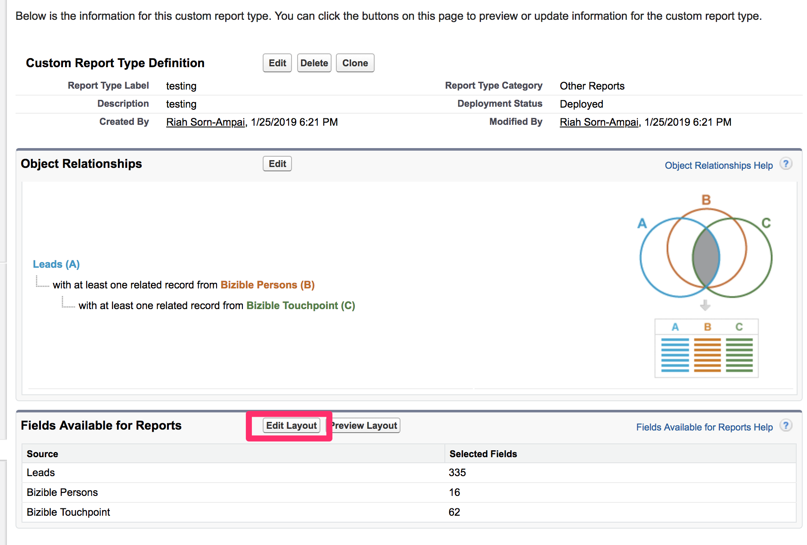

# 创建自定义 [!DNL Marketo Measure] 报表类型 {#creating-custom-marketo-measure-report-types}

>[!NOTE]
>
>您可能会看到指定“[!DNL Marketo Measure]“ ”，但仍请参阅“[!DNL Bizible]”。 我们正在努力更新该版本，并且该品牌重命名将很快地反映在您的CRM中。

了解如何创建自定义 [!DNL Marketo Measure] [!DNL Salesforce] 报表类型。 我们建议创建三种不同的报表类型：具有购买者接触点（自定义）的潜在客户， [!DNL Marketo Measure] 具有购买者接触点（自定义）的人员，具有购买者归因接触点（自定义）的机会。

## 具有买方接触点的潜在客户（自定义） {#leads-with-buyer-touchpoints-custom}

1. 转到 **[!UICONTROL Setup]** > **[!UICONTROL Build]** > **[!UICONTROL Report Types]** > **[!UICONTROL New Custom Report Types]**.

   

1. 定义自定义报表类型。

   * [!UICONTROL Report Type Focus] > [!UICONTROL [!UICONTROL Primary Object]]:商机
   * 标识> [!UICONTROL Report Type Label]:具有买方接触点的潜在客户（自定义）
   * [!UICONTROL Store in Category]:其他报表
   * [!UICONTROL Deployment] > [!UICONTROL Deployment Status]:已部署

   

1. 定义对象关系。

   * 将潜在客户对象(A)与 [!DNL Marketo Measure] 人员对象(B)，然后到买方接触点对象(C)
   * 确保“[!UICONTROL Each A/B record must have at least one B/C]&quot;记录已选定
   * [!UICONTROL Save]

   

## [!DNL Marketo Measure] 具有买方接触点的人员（自定义） {#marketo-measure-person-with-buyer-touchpoints-custom}

1. 转到 **[!UICONTROL Setup]** > **[!UICONTROL Build]** > **[!UICONTROL Report Types]** > **[!UICONTROL New Custom Report Types]**.

   

1. 定义自定义报表类型。

   * [!UICONTROL Report Type Focus] > [!UICONTROL Primary Object]: [!DNL Marketo Measure] 人员
   * [!UICONTROL Identification] > [!UICONTROL Report Type Label]: [!DNL Marketo Measure] 具有买方接触点的人员（自定义）
   * [!UICONTROL Store in Category]:其他报表
   * [!UICONTROL Deployment] > [!UICONTROL Deployment Status]:已部署

   

1. 定义对象关系。

   * 关联 [!DNL Marketo Measure] 人员对象(A)到买方接触点对象(B)
   * 确保“[!UICONTROL Each A record must have at least one B]&quot;记录已选定
   * [!UICONTROL Save]

   

## 具有买方归因接触点的商机（自定义） {#opportunities-with-buyer-attribution-touchpoint-custom}

1. 转到 **[!UICONTROL Setup]** > **[!UICONTROL Build]** > **[!UICONTROL Report Types]** > **[!UICONTROL New Custom Report Types]**.

   

1. 定义自定义报表类型。

   * [!UICONTROL Report Type Focus] > [!UICONTROL Primary Object]: 机会
   * [!UICONTROL Identification] > [!UICONTROL Report Type Label]:具有买方归因接触点的商机（自定义）
   * [!UICONTROL Store in Category]:其他报表
   * [!UICONTROL Deployment] > [!UICONTROL Deployment Status]:已部署

   

1. 定义对象关系。

   * 将Opportunity对象(A)与买方归因接触点对象(B)关联
   * 确保“[!UICONTROL Each A record must have at least one B]&quot;记录已选定
   * [!UICONTROL Save]

   

## 向自定义报表类型添加自定义字段 {#adding-custom-fields-to-custom-report-types}

1. 创建报表后，您将被重定向到报表类型的概述。 单击 **[!UICONTROL Edit Layout]**.

   

1. 确保要添加到报表的自定义字段显示在字段布局属性部分中。 如果要添加任何其他字段，请使用“[!UICONTROL Add fields related via lookup]“ ”选项。

   
