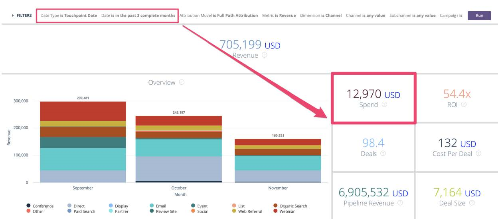

# 报告有无买方归因接触点的商机 {#reporting-on-opportunities-with-or-without-buyer-attribution-touchpoints}

>[!NOTE]
>
>您可能会在文档中看到指定“[!DNL Marketo Measure]”的说明，但仍可在CRM中看到“Bizible”。 我们正在努力更新品牌，并且品牌重塑很快将会反映在您的CRM中。

创建一个新的报表类型，以包含所有具有或不具有采购员归因接触点的业务机会。

1. 转到 **[!UICONTROL Setup]** > **[!UICONTROL Create]** > **[!UICONTROL Report Types]**。

   

1. 选择 **[!UICONTROL New Custom Report Type]**。

   

1. 将主对象设置为“[!UICONTROL Opportunities]”。

   * 将报表类型标签命名为：“具有或不具有采购员归因的业务机会”。
   * 对报表类型名称使用相同的命名。 在描述输入中，“具有或不具有买方归因接触点的商机。”
   * 将报告保存在“[!UICONTROL Other]”中，并将报告设置为“[!UICONTROL Deployed]”。

   

1. 从那里，您将将Opportunities对象链接到Buyer Attribution接触点对象。 确保您选择按钮“A”记录可能具有也可能不具有相关“B”记录。 完成后，单击 **[!UICONTROL Save]**。

   

>[!MORELIKETHIS]
>
>[[!DNL Marketo Measure] 教程：其他SFDC报告](https://experienceleague.adobe.com/en/docs/marketo-measure-learn/tutorials/onboarding/marketo-measure-102/addtional-salesforce-reports)
