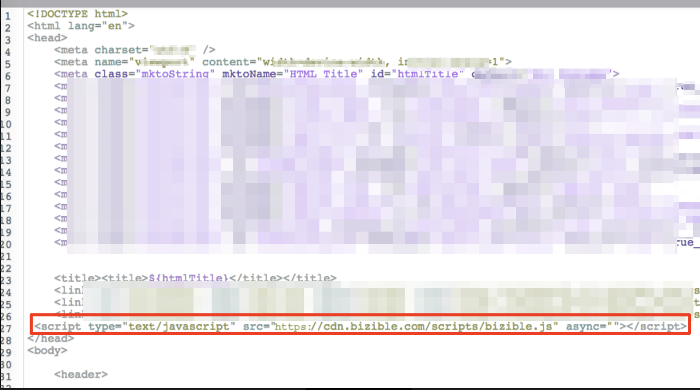

# 将[!DNL Marketo Measure]添加到Marketo登录页面 {#adding-marketo-measure-to-marketo-landing-pages}

了解如何向[!DNL Marketo Engage]登陆页面添加跟踪，因为它们需要额外的处理。 登录页和[!DNL Marketo Engage]表单本身都必须有[!DNL Marketo Measure]JavaScript。 为此，您需要按照以下说明将[!DNL Marketo Measure] JavaScript加载到[!DNL Marketo Engage]中。

>[!NOTE]
>
>如果要通过标签管理提供程序（如[!DNL Google Tag Manager]）部署JavaScript，则无需手动将[!DNL Marketo Measure] JS添加到[!DNL Marketo Engage]。

## 如何将[!DNL Marketo Measure]脚本添加到[!DNL Marketo Engage]登陆页面 {#how-to-add-marketo-measure-script-to-marketo-engage-landing-pages}

1. 登录到您的[!DNL Marketo Engage]帐户。
1. 选择您的登陆页面并单击&#x200B;**[!UICONTROL Edit Draft]**。
1. 拖入HTML元素。
1. 在[!UICONTROL head]部分输入[!DNL Marketo Measure]JavaScript：

   ``

以下屏幕快照中的示例

1. 单击&#x200B;**[!UICONTROL Save]**。

   

## 其他说明 {#additional-notes}

* 您可能已具有其他跟踪代码片段，如[!DNL Google Analytics]代码。 这没有任何问题，请确保用分号`;`和单个空格分隔它们。 下面是这样的一个示例：

`; `

* 您可能使用了多个登陆页面模板，请务必将代码添加到所有包含表单的模板中。

* 有时，在编辑登陆页面的模板时，必须重新批准登陆页面由使用的页面。 本文介绍[如何批量批准](https://experienceleague.adobe.com/docs/marketo/using/product-docs/demand-generation/landing-pages/landing-page-actions/approve-multiple-landing-pages-at-once.html){target="_blank"}。
