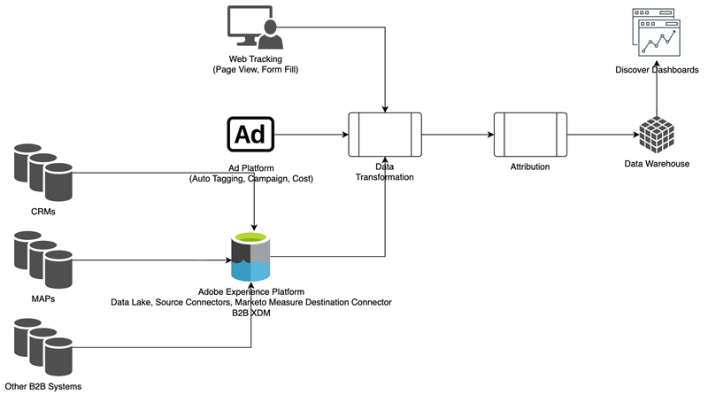

# [!DNL Marketo Measure] Ultimate概述 {#marketo-measure-ultimate-overview}

[!DNL Marketo Measure]（以前为 Bizible）使营销人员能够洞察哪些营销工作在为公司增加收入以及使投资回报率最大化方面最有效。[!DNL Marketo Measure]是一款营销归因解决方案，可自动跟踪和报告渠道效果，让您能够洞悉哪些渠道产生的客户参与度最高，并允许您相应地优化营销支出。

[!DNL Marketo Measure Ultimate]包含其他功能：

* 从几乎任何数据源和多个相同类型的数据源进行摄取，以引入所有数据来进行归因。
   * 可与几乎任何CRM一起使用，而不仅仅是Salesforce和Dynamics。
   * 将多个CRM实例和/或MAP实例连接到一个[!DNL Marketo Measure]实例。
   * 引入第三方网络研讨会注册和参与数据。

* 通过字段映射和转换功能，以极大的灵活性转换您的数据，确保正确的数据形状。

* 通过所包含的数据仓库使归因分析可用于外部应用程序，以将这些分析集成到您的工作流中。 更精细的结果数据和基于BI的报表，包括Snowflake Data Warehouse，后者提供对精细结果数据的访问，以及使用任何BI工具进行分析和报表的功能。

* 与RTCDP（B2B或B2P版本）集成，为RTCDP客户(如RTCDP和[!DNL Marketo Measure])提供集成的B2B归因解决方案，二者均通过集中式Adobe Experience Platform (AEP)数据工作。

**[!DNL Marketo Measure]层1-3**

**[!DNL Marketo Measure Ultimate]**

## [!DNL Marketo Measure Ultimate]的新增功能 {#whats-new-in-marketo-measure-ultimate}

**通过AEP导入B2B数据**

营销人员应通过AEP引入其B2B数据（例如，客户、机会、联系人、潜在客户、营销活动、营销活动成员、活动）。 Ultimate不再提供直接CRM和Marketo Engage连接。 营销人员继续通过直接连接引入广告平台数据，并通过[!DNL Marketo Measure] javascript跟踪Web活动。

**默认货币设置**

[!DNL Marketo Measure Ultimate]将默认货币设置为USD，直到用户更改它。 设置新的默认货币可更新数据，而无需重新处理。 只要所选货币以目标ISO代码的形式存在，就无需提交兑换率。

**[!DNL Marketo Measure Ultimate]沙盒**

必须先将[!DNL Marketo Measure Ultimate]实例映射到AEP沙盒，然后才能在AEP中创建[!DNL Marketo Measure]目标数据流。

>[!NOTE]
>必须将[!DNL Marketo Measure Ultimate]生产实例映射到AEP生产沙盒，必须将[!DNL Marketo Measure Ultimate]开发人员实例映射到AEP开发人员沙盒。

一旦保存了沙盒映射选择，您就无法在应用程序中更改它。 要更改它，请联系[Marketo支持](https://nation.marketo.com/t5/support/ct-p/Support){target="_blank"}。

来自给定数据源的给定实体（例如，帐户）的数据只能进入一个数据集。 每个数据集只能包含在一个数据流中。 违规会在运行时停止数据流。

**阶段映射**

所有[!DNL Marketo Measure Ultimate]规则都特定于数据集。 必须为所有数据集和所有选定的阶段创建阶段映射规则。

有六个内置阶段：

* 潜在客户丢失
* 潜在客户打开
* 商机已转化
* 机会丢失
* 机会打开
* 赢得的机会

“丢失”、“赢得”和“已转换”部分不允许自定义阶段。 但是，可以通过更新映射规则将Source数据映射到内置的“丢失/赢得/已转换”阶段。

只能为“打开”部分定义自定义阶段。
我们不再在阶段映射上自动包含CRM阶段。

四个内置阶段必须使用规则进行映射(另外两个阶段（Lead Lost和Lead Converted是可选的）：

* 潜在客户打开
* 机会丢失
* 机会打开
* 赢得的机会

规则条件特定于数据集。 必须为所有数据集和所有阶段（“潜在客户丢失”和“潜在客户已转化”除外）创建阶段映射规则。

funnel与回旋镖与自定义模型无选择项。 为funnel、自转帐和自定义模型选择所有阶段。 我们支持的阶段数量存在限制：15个自定义阶段加6个内置阶段。

Campaign成员接触点规则和活动接触点规则特定于数据集。

归因接触点不会写入CRM，因为Ultimate没有直接CRM连接。

[!DNL Marketo Measure] ABM ML服务（商机帐户匹配和预测参与度分数）不适用于[!DNL Marketo Measure Ultimate]。 RT-CDP B2B edition中免费包含此类服务。

## 限制 {#limitations}

* 有限字段可用于数据转换规则。
* 现有第1/2/3层用户没有迁移路径。 需要新的实施，但我们会帮助从现有实例迁移跟踪的Web活动数据。

>[!MORELIKETHIS]
> [Marketo Measure Ultimate目标](https://experienceleague.adobe.com/docs/experience-platform/destinations/catalog/adobe/marketo-measure-ultimate.html?lang=zh-Hans){target="_blank"}
> [视频： Marketo Measure Ultimate概述](https://experienceleague.adobe.com/zh-hans/docs/marketo-measure-learn/tutorials/marketo-measure-ultimate/overview){target="_blank"}
