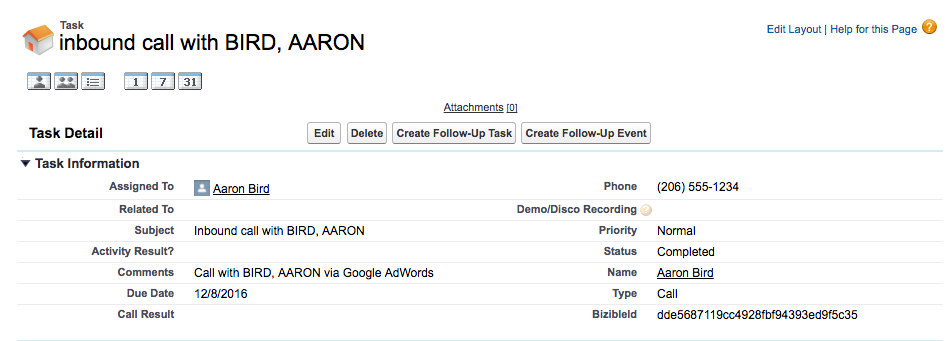

# 调用跟踪集成 {#call-tracking-integration}

我们的集成 [!DNL CallTrackingMetrics] 旨在将Web会话与电话呼叫合并。 电话通话被视为向提交的表单 [!DNL Marketo Measure]. 它将Web会话的点数计入在内，否则该会话仅被视为Web访问，因为没有实际提交表单。

## 呼叫跟踪说明 {#call-tracking-explained}

一般而言，“呼叫跟踪”是来自以下公司的产品 [!DNL CallTrackingMetrics]， [!DNL DiaglogTech]， [!DNL Invoca]，或 [!DNL CallRail]，仅举几例。 根据用户来自的不同营销渠道或营销活动，向用户显示独特的电话号码。 这允许营销人员查看这些渠道或营销活动的执行情况。

## 之前和之后 {#before-and-after}

请查看下面的流程图，了解如何 [!DNL Marketo Measure] 用于处理电话呼叫，但未与CallTrackingMetrics集成。 发生的电话被取消跟踪，因此它被视为网络会话，没有为其创建接触点。 直到下一次用户完成表单访问时，接触点才会最终填充。

通过集成，您可以看到Web会话实际上与电话绑定。 下一个表单填充最终是PostLC触控，并且仍在历程中受到跟踪。

## 工作原理 {#how-it-works}

CallTrackingMetrics必须在其末端执行一些开发工作才能使其正常工作。 通过使用它们放置在网站上的Javascript，CallTrackingMetrics可以从以下位置获取_biz_uid： [!DNL Marketo Measure] Cookie。 此&quot;[!DNL BizibleId]“”随后将由CallTrackingMetrics存储。

当访客访问您的网站并拨打电话时，CallTrackingMetrics负责将这些数据推送到 [!DNL Salesforce]  通常， [!DNL Salesforce Task] 创建，用于填充电话号码、主题、类型等数据，现在， [!DNL BizibleId]

此 [!DNL BizibleId] 是随6.7及更高版本的 [!DNL Marketo Measure] 营销归因包。

以下是一个任务记录的示例，该记录具有 [!DNL BizibleId] 已填充。

时间 [!DNL Marketo Measure] 查找具有已知任务记录 [!DNL BizibleId] 已填充的值， [!DNL Marketo Measure] 可以使用相同的将用户映射到一个Web会话 [!DNL BizibleId] 并将该会话归因于电话呼叫而不是Web访问。

## 接触点 {#the-touchpoint}

时间 [!DNL Marketo Measure] 可以导入/下载任务，我们将在Web会话中处理该详细信息。 在大多数情况下，可以将其与反向链接或广告合并。 在下面的示例中，访客通过付费Google广告找到业务并致电。

此 [!UICONTROL Touchpoint] “Call”类型是从上方的屏幕快照中提取，在创建任务时该类型也由CallTrackingMetrics填充。

## 报告 {#reporting}

接触点类型值 [!DNL Marketo Measure] 通常推送是Web Visit、Web Form或Web Chat，但对于CallTrackingMetrics接触点，接触点类型将为“电话呼叫”。 这有助于营销人员查看哪些渠道吸引的电话次数最多，并为他们的组织创造收入。

## 常见问题 {#faq}

**为什么我的接触点类型为Web访问？**

“接触点类型”是从Task.Type字段中填充的。 如果Task.Type字段为空， [!DNL Marketo Measure] 会自动将接触点类型设置为Web访问。 填充Task.Type字段后 [!DNL Marketo Measure] 将读取该值并相应地填充接触点类型。

**接触点通过电话填充哪些其他字段？**

“接触点类型”和“媒介”都将包含从Task.Type中提取的数据。 所有其他数据点都将从Web跟踪和JavaScript数据中提取。

**为什么此电话不与Web会话关联？**

首先，检查任务以确保存在 [!DNL BizibleId] 已填充。 如果没有值，我们将不会也不会为其创建接触点。 这将需要使用CallTrackingMetrics升级。

如果存在值，请注意，我们只认为所有Web会话为30分钟。 如果某个Google广告是在中午12:17（网站上的会话开始）点击，但直到下午1:05才出现电话呼叫，则不会合并Web会话和电话呼叫。 相反， [!DNL Marketo Measure] 将创建一个单独的 [!DNL Salesforce Task] 用于跟踪电话呼叫的接触点，但不具有任何Web会话数据。

## 伙伴关系 {#partnerships}

[!DNL Marketo Measure] 目前有一个官方的呼叫跟踪合作伙伴，该合作伙伴与我们一起经历了“官方”集成过程，其中包括联合营销和产品培训。 一个合作伙伴是CallTrackingMetrics。
