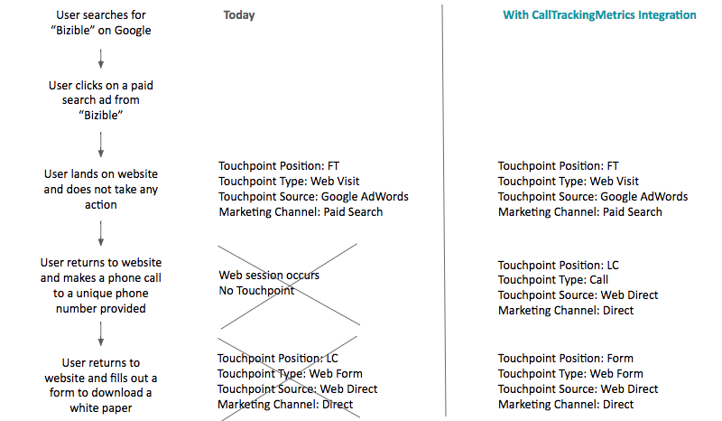

# 调用跟踪集成 {#call-tracking-integration}

我们与 [!DNL CallTrackingMetrics] 用于将web会话与电话呼叫合并。 电话呼叫会被视为提交到的表单 [!DNL Marketo Measure]. 它将点数分给一个Web会话，否则该会话将仅被视为一次Web访问，因为实际上没有提交表单。

## 呼叫跟踪说明 {#call-tracking-explained}

一般而言，“呼叫跟踪”是来自公司的产品，例如 [!DNL CallTrackingMetrics], [!DNL DiaglogTech], [!DNL Invoca]或 [!DNL CallRail]，以举几个例子。 根据用户来自的不同营销渠道或营销活动，向用户显示独特电话号码。 这样，营销人员便可以了解这些渠道或营销策划的效果。

## 之前和之后 {#before-and-after}

请查看下面的流程图，了解如何 [!DNL Marketo Measure] 用于处理电话呼叫，而不与CallTrackingMetrics集成。 发生的电话呼叫未被跟踪，因此它被视为Web会话，未为其创建接触点。 直到用户完成表单的下次访问时，接触点才最终填充。

通过集成，您可以看到Web会话实际上已绑定到电话呼叫。 下一个表单填充最终是PostLC接触，并且仍在历程中进行跟踪。

## 工作原理 {#how-it-works}

CallTrackingMetrics必须在其末尾执行一些开发工作，才能使其正常工作。 使用网站上放置的Javascript， CallTrackingMetrics可以从 [!DNL Marketo Measure] cookie。 此“[!DNL BizibleId]“ ”，则由CallTrackingMetrics存储。

当访客访问您的网站并拨打电话时， CallTrackingMetrics会将该数据推送到 [!DNL Salesforce]  通常， [!DNL Salesforce Task] 创建时，将填充电话号码、主题、类型等数据，现在， [!DNL BizibleId]

的 [!DNL BizibleId] 是随版本6.7及更高版本安装的字段 [!DNL Marketo Measure] 营销归因包。

以下是使用 [!DNL BizibleId] 已填充。

When [!DNL Marketo Measure] 查找具有已知 [!DNL BizibleId] 值填充， [!DNL Marketo Measure] 可以将该用户映射到具有该用户的Web会话 [!DNL BizibleId] 并将该会话归因于电话呼叫，而不是web访问。

## 接触点 {#the-touchpoint}

When [!DNL Marketo Measure] 可以导入/下载任务，我们会处理该详细信息以及web会话。 在大多数情况下，它可以与反向链接或广告合并。 在以下示例中，访客通过付费Google广告找到了该业务，并打了电话。

的 [!UICONTROL Touchpoint] 类型“调用”是从任务中提取的，从上面的屏幕截图中提取，在创建任务时，该屏幕截图也由CallTrackingMetrics填充。

## 报表 {#reporting}

接触点类型值，其中 [!DNL Marketo Measure] 推送通常是Web访问、Web窗体或Web聊天，但对于CallTrackingMetrics接触点，接触点类型将是电话呼叫。 这有助于营销人员了解哪些渠道最常拨打电话，并为其组织创收。

## 常见问题解答 {#faq}

**为什么我的接触点类型是Web访问？**

接触点类型从Task.Type字段填充。 如果Task.Type字段为空 [!DNL Marketo Measure] 将“接触点类型”自动设置为“Web访问”。 填充Task.Type字段后 [!DNL Marketo Measure] 将读取该值并相应地填充接触点类型。

**接触点会从电话中填充哪些其他字段？**

接触点类型和媒介将包含从Task.Type中提取的数据。 所有其他数据点均从Web跟踪和Javascript数据中提取。

**为什么此电话呼叫未绑定到Web会话？**

首先，检查任务以确保 [!DNL BizibleId] 已填充。 如果没有值，则我们将不会也无法为其创建接触点。 这需要通过CallTrackingMetrics呈报。

如果存在值，请注意，我们仅将所有Web会话视为30分钟。 如果在中午12:17（网站会话开始时）点击了Google广告，但直到下午1:05才发生电话呼叫，则我们不会合并Web会话和电话呼叫。 相反， [!DNL Marketo Measure] 将创建单独的 [!DNL Salesforce Task] 用于跟踪电话呼叫的接触点，但没有任何web会话数据。

## 伙伴关系 {#partnerships}

[!DNL Marketo Measure] 目前有一个正式的呼叫跟踪合作伙伴，该合作伙伴已与我们完成“正式”集成流程，其中包括联合营销和产品培训。 这个合作伙伴是CallTrackingMetrics。
