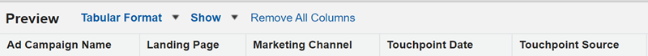
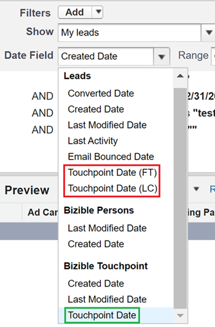

# 发行说明：2023年 {#release-notes-2023}

有关2023版的所有新增功能和更新功能，请参阅下文。

## 第4季度发行 {#q4-release}

 

**Web流量仪表板**

所有客户现在都可以访问重新设计的[Web流量仪表板](/help/marketo-measure-discover-ui/web-traffic-dashboard.md){target="_blank"}。 该功能板提供了您网站访客交互的完整概述。 您可以分析量度，例如每个URL的独特访客计数、整体访问、页面查看次数以及来自特定表单URL或登陆页面的表单提交次数。 您还可以跟踪每月流量趋势并识别高性能付费媒体，这有助于您优化策略以最大限度地创造收入。

新的预建仪表板集计划分阶段推出，在年底之前结束。

>[!NOTE]
>虽然当前功能板将在2024年3月之前弃用，但在此之前，您可以同时使用这两个版本，以确保顺利过渡。

**IP地址数据移除**

我们将从长期存储中删除IP地址数据，以确保数据隐私合规。 目前，以下Snowflake表和视图包含IP地址，我们计划删除此数据并添加新的地理位置信息：

<table style="width:400px">
<thead>
  <tr>
    <th style="width:50%">表格</th>
    <th>视图</th>
  </tr>
</thead>
<tbody>
  <tr>
    <td>CUSTOMER_AB_TESTS</td>
    <td>BIZ_CUSTOMER_AB_TESTS</td>
  </tr>
  <tr>
    <td>CUSTOMER_EVENTS</td>
    <td>BIZ_CUSTOMER_EVENTS</td>
  </tr>
  <tr>
    <td>FORM_SUBMIT</td>
    <td>BIZ_FORM_SUBMIT</td>
  </tr>
  <tr>
    <td>展示次数</td>
    <td>商业展示(_I)</td>
  </tr>
  <tr>
    <td>PAGE_VIEWS</td>
    <td>BIZ_PAGE_VIEWS</td>
  </tr>
  <tr>
    <td>会话</td>
    <td>商业会话(_S)</td>
  </tr>
  <tr>
    <td>WEB_HOST_MAPPINGS</td>
    <td>BIZ_WEB_HOST_MAPPINGS</td>
  </tr>
</tbody>
</table>

* 从现在开始，我们将下载国家/地区代码、城市名称和地区代码，而不是国家/地区名称、城市名称和地区名称。
* 在处理所有历史Web活动期间，可能会出现不同记录中的位置信息不一致的情况。 这些不一致可能包括存在IP地址但没有地理位置详细信息、更新了地理位置信息但没有IP地址，或国家或地区名称和代码的混合。
* _&#x200B;**此混合数据期预计为2023年1月4日至2023年2月29日。**&#x200B;_

**URL表中的页面标题数据**

除Web数据表外，[数据仓库](/help/data-warehouse/data-warehouse-schema.md){target="_blank"}中的URL表现在还将包含页面标题字段。

请注意，URL表中的页面标题可能并不总是与其他Web表中的页面标题匹配。 URL表将具有最新的页面标题。 如果在Web活动发生后URL的标题发生了更改，则它与URL表中的标题不匹配。

**发现仪表板重新设计**

所有Marketo Measure用户都将体验我们重新设计的应用程序内仪表板，这些仪表板将增强的可用性与附加价值相结合。 我们还引进了新的指标，如“实现的投资回报率”，该指标考虑了营销投资和购买B2B进入市场之间的典型延迟。

这套新的预建仪表板计划分批推出，从10月的第一周开始，年底之前结束。 这些新功能板、产品内信息和文档链接将自动显示在您的实例中。

* [新发现仪表板指南](/help/marketo-measure-discover-ui/new-discover-dashboard-guide.md){target="_blank"}
* [了解仪表板基础知识](/help/marketo-measure-discover-ui/discover-dashboard-basics.md){target="_blank"}
* [收入概览仪表板](/help/marketo-measure-discover-ui/revenue-overview-dashboard.md){target="_blank"}
* [已归因的收入仪表板](/help/marketo-measure-discover-ui/attributed-revenue-dashboard.md){target="_blank"}
* [ROI仪表板](/help/marketo-measure-discover-ui/roi-dashboard.md){target="_blank"}
* [Passport Dashboard](/help/marketo-measure-discover-ui/passport-dashboard.md){target="_blank"}

>[!NOTE]
>虽然当前功能板将在2024年3月之前弃用，但在此之前，您可以同时使用这两个版本，以确保顺利过渡。

### 弃用 {#deprecations}

 

#### Salesforce字段弃用

我们将逐步停止将导出作业导出到Lead/Contact对象，以简化集成并消除导出到Salesforce标准对象的需要。 下面列出的非规范化字段也将弃用，因为客户可以从其接触点对象获取相同的数据。 _&#x200B;**弃用的时间线为2024年6月。**&#x200B;_

<table style="width:350px">
<tbody>
  <tr>
    <td>bizible2__Ad_Campaign_Name_FT__c</td>
  </tr>
  <tr>
    <td>bizible2__Ad_Campaign_Name_LC__c</td>
  </tr>
  <tr>
    <td>bizible2__Landing_Page_FT__c</td>
  </tr>
  <tr>
    <td>bizible2__Landing_Page_LC__c</td>
  </tr>
  <tr>
    <td>bizible2__Touchpoint_Date_FT__c</td>
  </tr>
  <tr>
    <td>bizible2__Touchpoint_Date_LC__c</td>
  </tr>
  <tr>
    <td>bizible2__Touchpoint_Source_FT__c</td>
  </tr>
  <tr>
    <td>bizible2__Touchpoint_Source_LC__c</td>
  </tr>
  <tr>
    <td>bizible2__Marketing_Channel_FT__c</td>
  </tr>
  <tr>
    <td>bizible2__Marketing_Channel_LC__c</td>
  </tr>
</tbody>
</table>

以下字段包含有关接触点和归因接触点对象的相同信息：

* bizible2__Ad_Campaign_Name__c
* bizible2__Landing_Page__c
* bizible2__Marketing_Channel__c
* bizible2__Touchpoint_Date__c
* bizible2__Touchpoint_Source__c

**必需的操作**

* 为具有或不具有接触点的潜在客户和联系人创建新的报告类型。

具有接触点的潜在客户/联系人的

* 创建报告，这些报告捕获利用已删除字段的任何现有报告的功能。 在此过程中，您需要更改报告中的字段，如下所示：

* 删除Lead/Contact FT/LC字段：

* 添加接触点字段：

* “接触点位置”过滤器以及任何使用FT/LC字段（包括“日期”字段）的过滤器，都应更新如下：

* 删除任何利用从Lead/Contact对象中删除的字段不再引用这些字段的现有报告。

 

#### Dynamics包相关

* 若要保持与Dynamics的连接，请安装我们的最新包版本v6.12。将不再支持旧版本`(<v6.12)`。 此更新可优化历史记录的创建，以减少存储用量。

* 将弃用带RefreshToken的过时OAuth方法。 请参阅[本指南](/help/marketo-measure-and-dynamics/oauth-with-azure-active-directory-for-dynamics-crm.md){target="_blank"}，了解如何更新您的凭据，以遵循Microsoft使用ClientSecret的最佳实践。

#### “custom_properties”字段

在我们的数据仓库中，“custom_properties”字段一直用作存储固定架构未涵盖的其他数据点。 此字段以JSON格式存储，其使用受限，并且其与SQL查询的集成可能会很复杂，从而影响性能。 鉴于这些因素，我们决定弃用此字段。 此更改将主要影响Azure表存储中的数据处理层以及导出到数据仓库的数据。

### 即将发生什么？ {#q4-whats-coming}

 

**应用程序内自定义报告**

Marketo Measure客户将首次能够在应用程序中创建和保存自己的报表。 这将在预建功能板于2024年初发布后进行。

 

## 第2季度发行 {#q2-release}

 

* **Salesforce包合并**

我们正在将所有Salesforce包合并到单个全面的包中，以改进用户体验并简化使用。 V1、V2_EXT和Reporting程序包将在下一季度停用。 新的产品包中整合了所有以前的功能，允许更高效地跟踪和更深入的客户洞察。

已安装V2软件包的客户必须将其更新到新的统一版本。

我们添加了两个新字段以增强您的报告功能：

* form_name：此字段现在可在BT/BAT对象中使用，它使用户能够根据表单名称创建报表。
* user_touchpoint_id：此字段允许用户创建具有独特用户接触点计数的报表。

[本文](/help/configuration-and-setup/marketo-measure-and-salesforce/salesforce-package-consolidation.md){target="_blank"}包含有关从旧版报表包重新创建报表和功能板的指南。

* **Salesforce API版本更新**

所有Apex类的Salesforce API版本（包括UserActivityContext类）均已更新为支持的版本。 (31.0 - 57.0)

* **新包安装**

可以在此找到新的统一包安装链接[&#128279;](https://login.salesforce.com/packaging/installPackage.apexp?p0=04t1P000000VY6Z){target="_blank"}

### 即将发生什么？ {#q2-whats-coming}

 

**IP地址存储中的更改**

出于隐私考虑，我们将不再将IP地址存储在系统中。 我们将继续标识和存储IP地址的地理位置，但格式会发生变化（例如，从“美国”更改为“美国”）。
